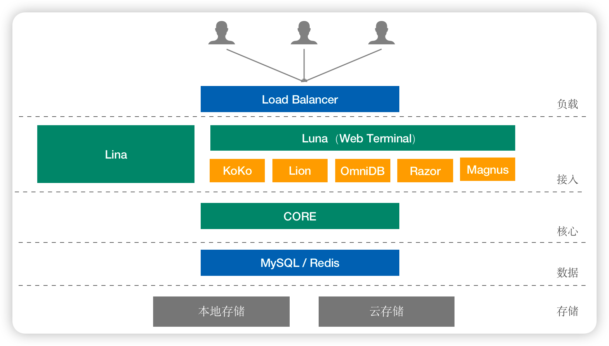

# 系统架构
## 1 应用架构
!!! tip ""
    - JumpServer 应用架构图如下：

## 2 组件说明
!!! tip ""  

    - Core 组件是 JumpServer 的核心组件，其他组件依赖此组件启动。

    - Koko 是服务于类 Unix 系统平台的组件，通过 ssh 协议提供连接 Unix 资产能力。

    - Lion 是服务于 Windows 系统平台的组件，用于 Web 端访问 Windows 资产。

    - Omnidb 是服务于数据库的组件，用于可视化界面纳管数据库。

    - Celery 处理异步任务的组件，用于执行 JumpServer 相关的自动化任务。

    - Magnus 是服务于数据库的组件，用于通过客户端代理访问数据库。

## 3 逻辑架构
!!! tip "详见 [源码部署](../02_jms_install/source_install/requirements.md)"