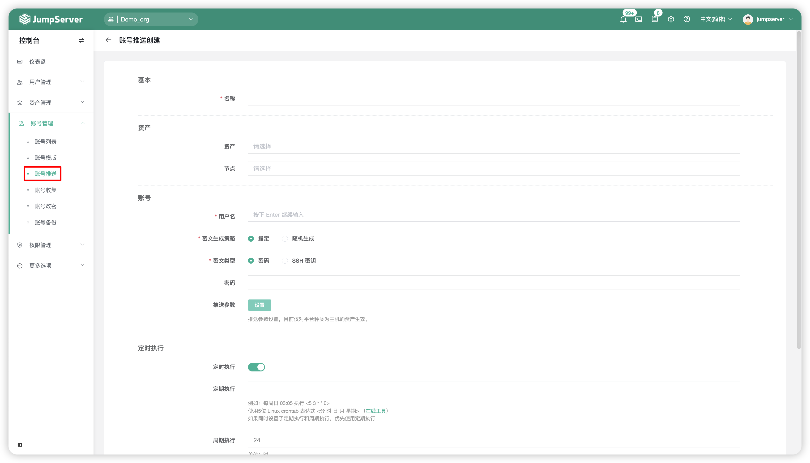
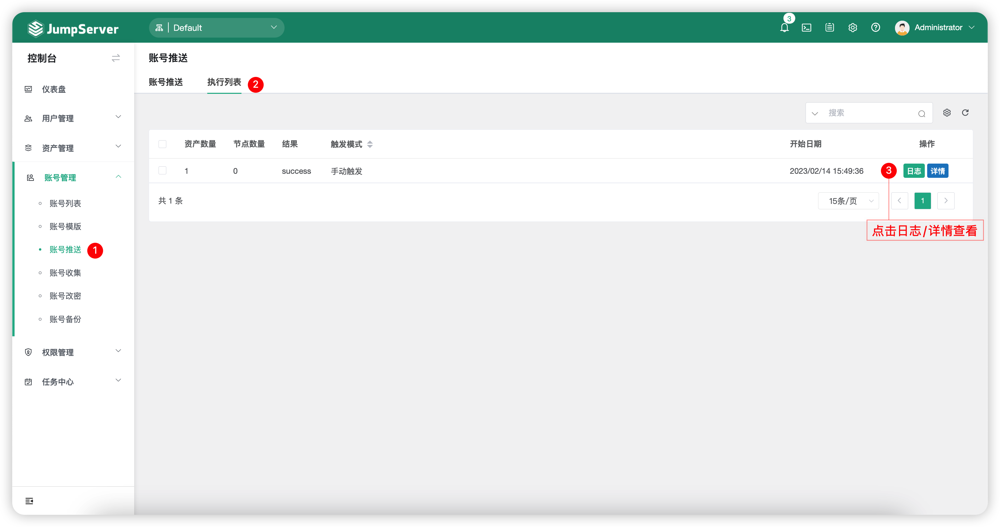
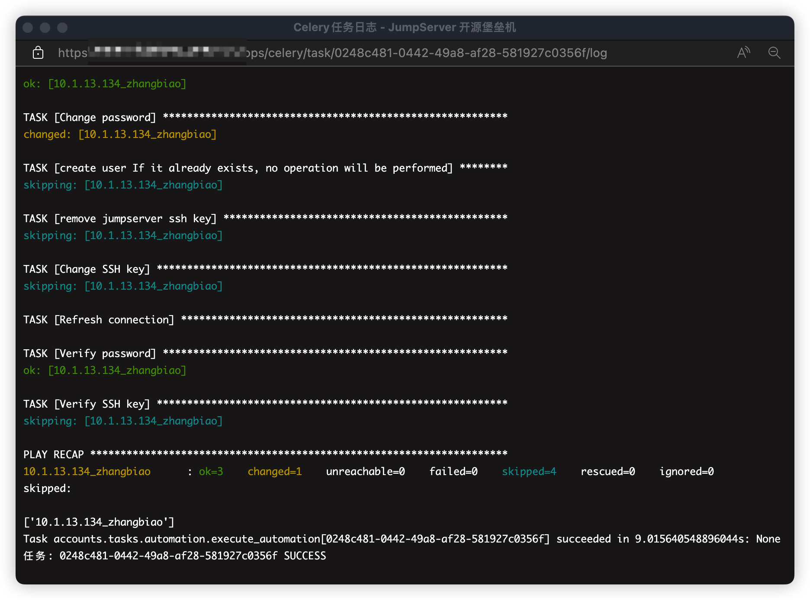

# 账号推送
## 1 功能简述
!!! tip ""
    - JumpServer 支持自动化推送用户到纳管的资产中。

## 2 账号推送规则的创建
!!! tip ""
    - 点击`账号推送`页面的`创建`按钮，创建一个账户推送任务。

!!! tip ""
    - 详细参数说明

    | 参数    |                说明                  |
    | ------- | ------------------------------------ |
    | 名称 | 账号推送任务的名称。 |
    | 用户名 | 被推送的资产账户名称。 |
    | 资产 | 需要被推送账户的资产。 |
    | 节点 | 需要被推送账户的节点。 |
    | 密码策略-密文生成策略 | 选择被推送的用户的密码策略。   A.指定：管理员用户手动输入密码；  B.随机：JumpServer 自行生成密码。 |
    | 密码策略-密文类型 | 被推送的用户密文的类型。 |
    | 密码策略-密码 | A.选择密文生成策略为指定，管理员用户输入密码；   B.选择密文生成策略为随机，管理员用户设置密码长度。 |
    | 定时执行 | 选择该自动化任务是否定时执行，设置定时任务执行时间。 |

## 3 执行列表
!!! tip ""
    - 点击切换至`账号推送`-`执行列表`页签，该页面主要查看账号推送计划任务的执行日志、任务详情等详细信息。

!!! tip ""
    - 执行日志示例图如下：

