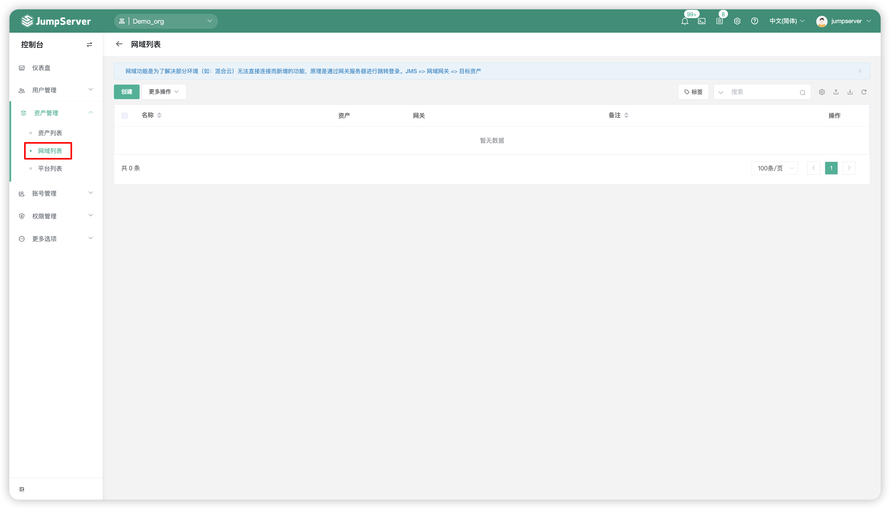
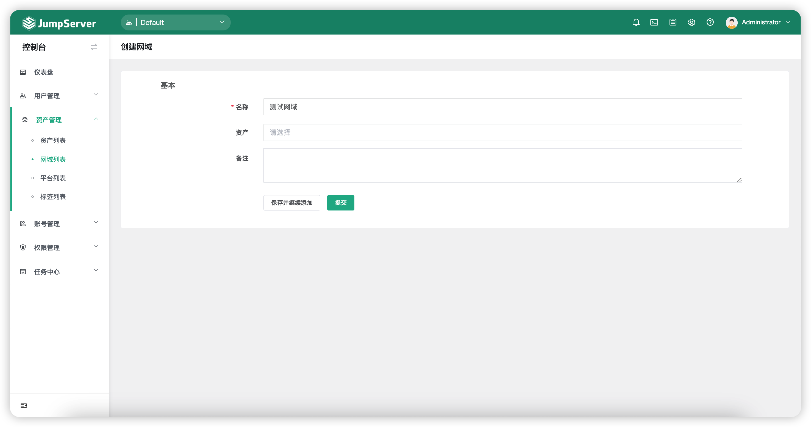
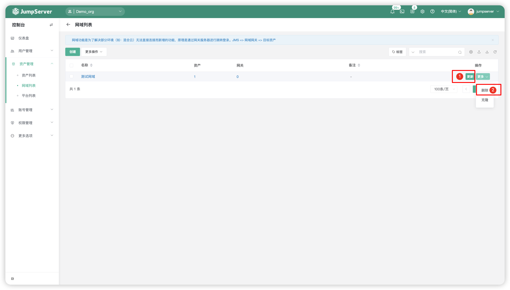
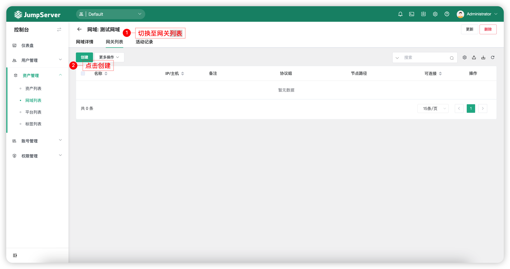
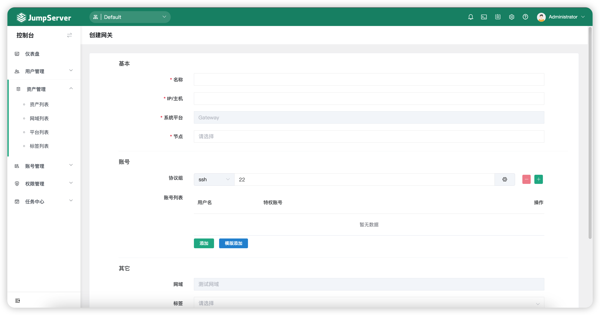
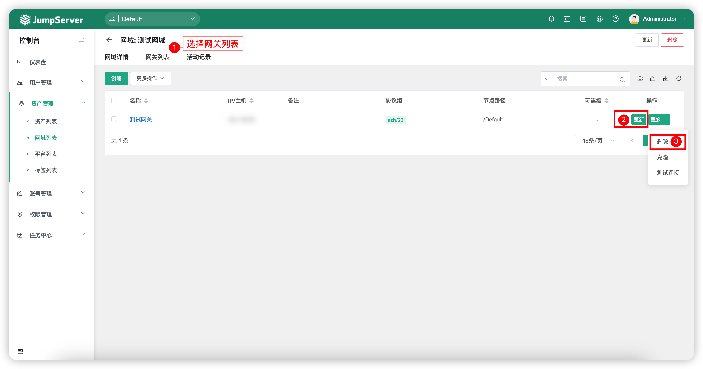

# 网域列表
## 1 功能简述
!!! tip ""
    - JumpServer 支持网域功能。
    - 网域功能是为了解决部分环境无法连接的问题，原理是通过网关服务器进行 SSH 隧道进行流量转发。
    - 点击页面左侧的`网域列表`按钮，进入网域列表界面。网域列表界面主要针对于 JumpServer 的网域列表进行增加、删除、更改、查看。

## 2 网域创建/更新/删除
!!! tip ""
    - 点击网域列表页面的`创建`按钮，进入网域列表信息设置页面，填写网域信息。

!!! tip ""
    - 当需求更新某个网域信息时，可以点击相应的网域名称后方的`更新`按钮，进入网域信息更新页面，更新网域相关信息。
    - 当需求删除某个网域时，可以点击相应的网域名称后方的`更多`按钮，选择`删除`按钮，点击删除即可。

## 3 网关创建/更新/删除
!!! tip ""
    - 在创建好网域名称后，点击`网域名称`进入网域详情页面，切换至`网关列表`，进入创建页面，创建网关，填写网关信息。

!!! tip ""
    - 当需求更新某个网关信息时，可以点击相应的`网域名称`进入网域详情页面，切换至`网关列表`，点击相应网关名称后方的`更新`按钮，进入网关信息更新页面，更新网关相关信息。
    - 当需求删除某个网关时，可以点击相应的`网域名称`进入网域详情页面，切换至`网关列表`，点击相应网关名称后方的`更多`按钮，选择`删除`按钮，点击删除即可。
