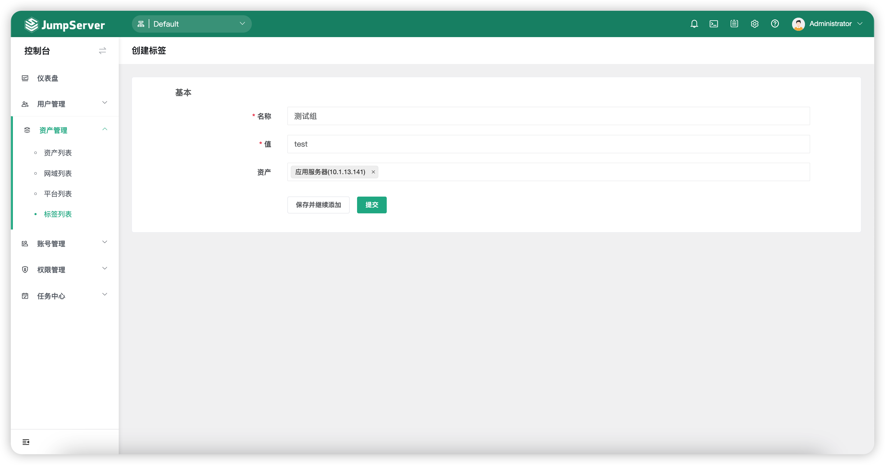
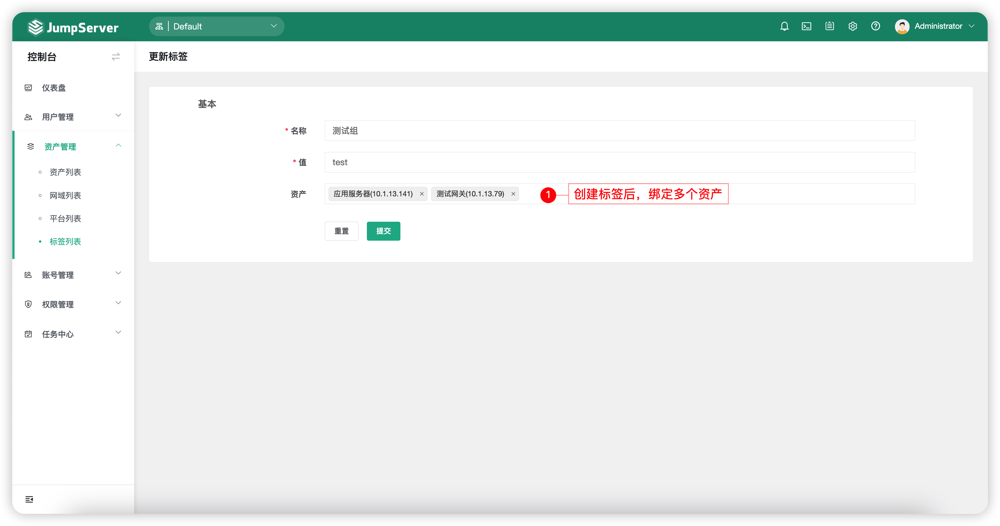
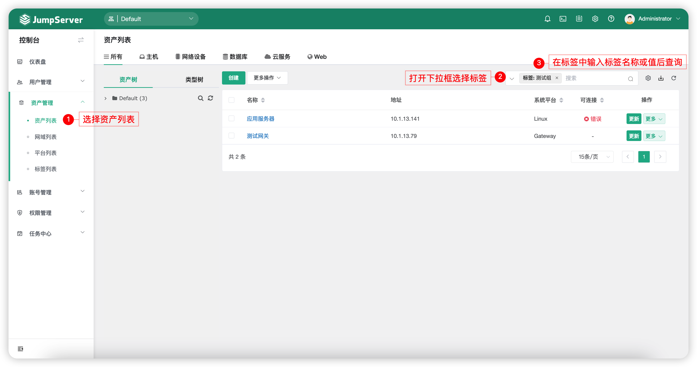

# 标签列表
## 1 功能简述
!!! tip ""
    - JumpServer支持标签功能。将资产打上标签便于查询和管理，可以由用户自定义资产的各种属性，方便归类汇总分析。

## 2 标签的创建
!!! tip ""
    - 点击标签管理页面左上角`创建`按钮，进入标签创建页面。

!!! tip "提示"
    - 标签信息有名称和值。
    - 名称可以是描述功能信息，例如：用途。
    - 值则可以是具体信息，例如：组织，1-部门1-研发。
    - 标签创建的时候可以选择为已存在的资产打上该标签，标签名称可以重名，一个资产可以有多个标签。
    - 标签删除，资产上的标签信息会自动消失。

## 3 标签的查询
!!! tip ""
    - 在创建标签的页面中选择多个资产绑定.

!!! tip ""
    - 切换至`资产列表`页面中，通过查询指定标签来访问多个资产信息。
