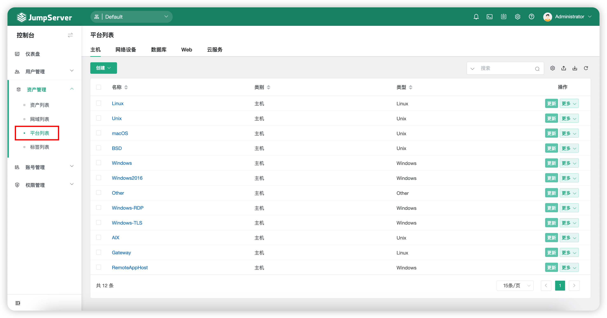
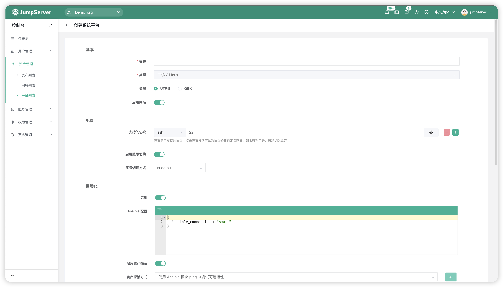
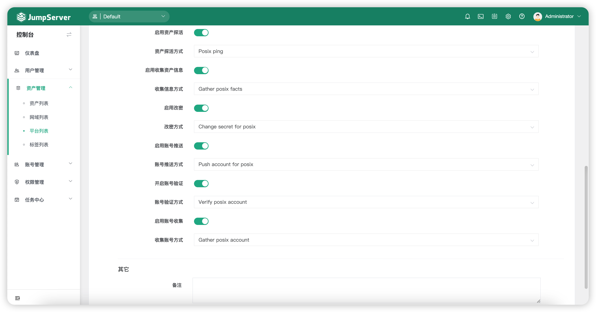

# 平台列表
## 1 功能简述
!!! tip ""
    - JumpServer 支持用户自定义平台列表。
    - 平台列表在创建资产时供选择，用户可以在创建资产时为资产选择不同的系统类型，如 Linux、Windows 等。
    - 用户也可以新建一个平台类型，并选择指定的基础平台，就可以在创建资产中指定新建的平台类型，不同的平台类型决定了改密计划中改密脚本的执行命令。

## 2 系统平台的创建
!!! tip ""
    - 点击平台列表页面的`创建`按钮，填写系统平台的信息即可创建新的系统平台，以 Linux 为例。

!!! tip ""
    - 基本参数说明

    | 参数    |                说明                  |
    | ------- | ------------------------------------ |
    | 名称 | 系统平台的名称。 |
    | 类型 | 系统平台的类型，不同的系统类型决定不同的编码与自动化方式。 |
    | 编码 | 系统平台选择的编码方式，可选择"UTF8"或"GBK"。 |
    | 启用网域 | 是否启用网域，某些类型的平台中不可开启即该平台类型不支持启用网域。 |
    | 支持的协议 | 设置系统平台支持的协议，每个平台中默认的协议不可删除。协议的默认端口号支持修改。 |
    | 启用切换账号 | 授权用户模块主要介绍资产被授权的用户以及用户组并查看对应的授权规则。 |
    | 不启用切换账号 | 不启用切换账号功能。某些系统平台中不支持启用切换账号即表示该系统平台不支持切换账号功能。 |

!!! tip ""
    - 切换账号参数说明

    | 启用/禁用  |                说明                  |
    | --------- | ------------------------------------ |
    | 启用切换账号 | 授权用户模块主要介绍资产被授权的用户以及用户组并查看对应的授权规则。 |
    | 不启用切换账号 | 不启用切换账号功能。某些系统平台中不支持启用切换账号即表示该系统平台不支持切换账号功能。 |

!!! tip ""
    - 自动化参数说明（启用状态），不启用为自动化任务关闭

    | 参数  |                说明                  |
    | --------- | ------------------------------------ |
    | Ansible配置 | Ansible 连接等信息配置。 |
    | 资产探测方式 | 设置资产获取链接性的探测方式。 |
    | 收集信息方式 | 设置收集信息的方式。 |
    | 账号改密方式 | 设置账号改密方式。  |
    | 推送账号方式 | 设置推送账号的方式。 |
    | 校验账号方式 | 设置校验账号的方式。 |
    | 收集账号方式 | 设置收集账号的方式。 |