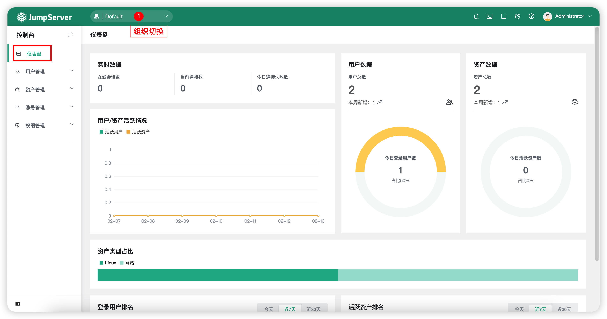
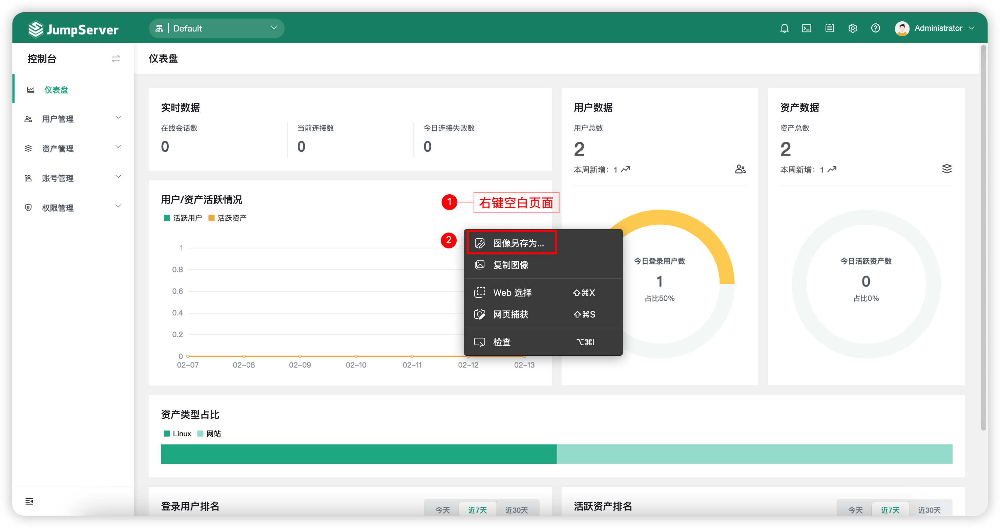

# 仪表盘

## 1 功能简述
!!! tip ""
    - JumpServer 的仪表盘页面，主要展示用户与资产以及登录会话情况的概览数据。
    - 系统管理员可切换到各个组织下，看到该组织的用户总数、资产总数、在线用户、在线会话等。
    - 组织管理员只能看到某个组织的概览数据。
    - JumpServer系统内置全局组织，系统管理员通过全局组织下可看到整个JumpServer平台的综合数据。

## 2 仪表盘页面展示

## 3 仪表盘页面导出为图片
!!! tip ""
    - JumpServer 支持将仪表盘页面的图像（用户/资产活跃情况、用户数据库图、资产数据图、资产类型占比）导出为图片，方便保存，在该页面中空白处鼠标右击，选择`图片另存为`按钮。
