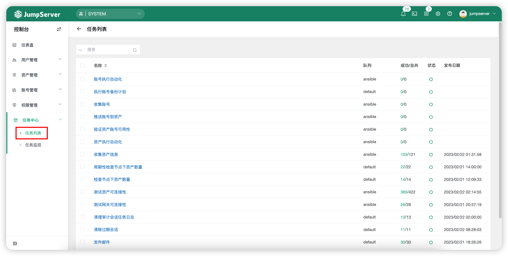
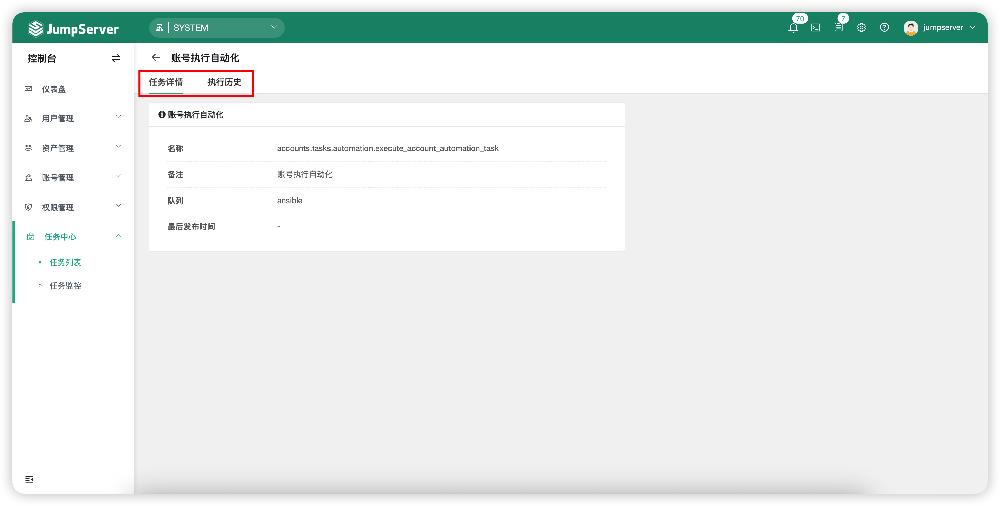

# 任务列表

## 1 功能简述
!!! tip ""
    - 点击`任务中心`-`任务列表`按钮，进入任务列表页面。
    - 该页面可查看所有自动化任务，其中包含账号备份计划，推送账号，检查资产连接性、邮件发送自动化任务等。
    - 点击自动化任务名称即可进入该自动化任务的详情页面，在该自动化任务的详情页面可查看任务详情信息，执行历史等信息。

## 2 任务详情查看
!!! tip ""
    - 点击自动化任务名称即可进入该自动化任务的详情页面，在该自动化任务的详情页面可查看任务详情信息，执行历史等信息。
