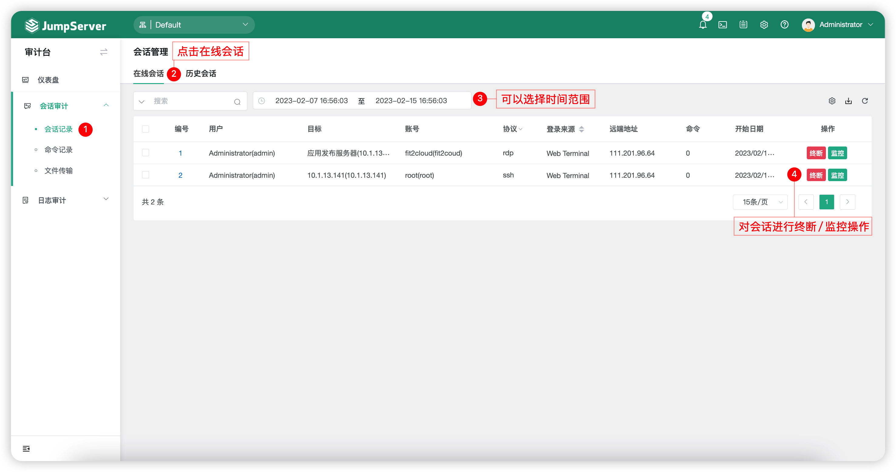
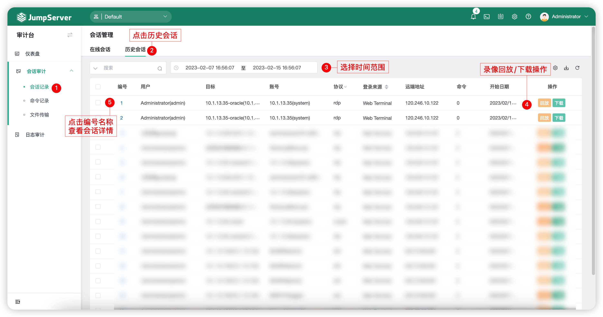
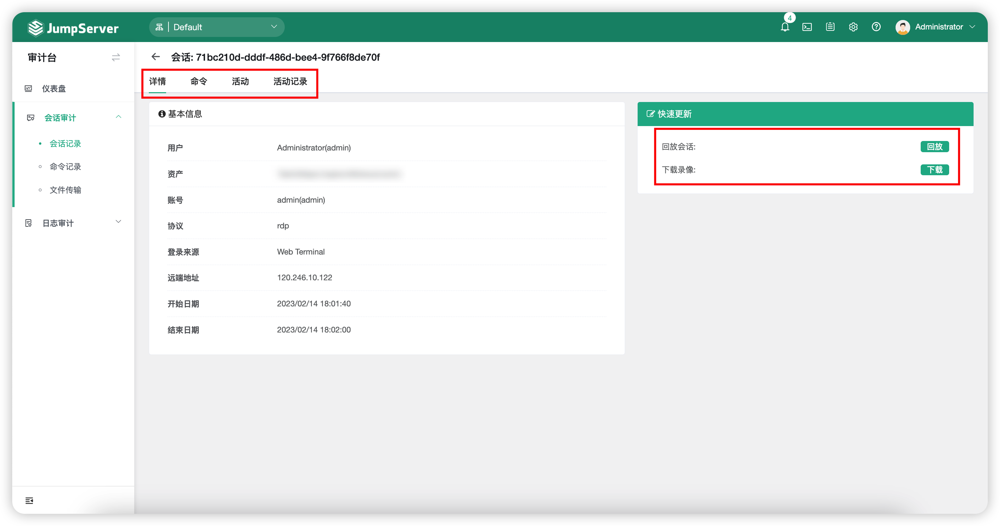

# 会话记录
## 1 功能简述
!!! tip ""
    - 会话记录包含在线会话与历史会话两部分，主要展示的信息有登录资产的会话详细纪律，包含用户、协议、远端地址、会话时间以及会话录像等。

## 2 在线会话
!!! tip ""
    - 在线会话可以查看到所有目前正在使用 JumpServer 登录资产的会话。并且可以实时监控，在出现不合规操作时，可直接终断会话。
    - JumpServer 实时监控支持 SSH 协议与 RDP 协议的会话连接，RDP 客户端方式会话与数据库协议会话暂不支持实时监控。
    - 终断会话会有几秒钟的延迟后生效。

!!! tip ""
    - 点击切换至`会话记录`-`在线会话`页签，如图所示

## 3 历史会话
!!! tip ""
    - 历史会话可以查看所有 JumpServer 连接资产的详细信息以及操作录像，方便进行回溯与追责。
    - JumpServer 可以在线浏览器查看录像或者下载录像到本地通过 JumpServer 离线录像播放器播放录像。

!!! tip ""
    - 点击切换至`会话记录`-`历史会话`页签，如图所示

### 3.1 会话详情
!!! tip ""
    - 点击`会话记录`-`历史会话`页签，该页面的`编号`按钮，可进入会话的详细信息页面.
  

!!! tip ""
    - 详细模块说明

    | 模块    |                说明                  |
    | ------- | ------------------------------------ |
    | 基本信息 | 基本信息模块主要介绍该会话的基础信息，包含登录用户、登录来源、远端地址、会话开始时间与结束时间等。 |
    | 快速更新 | 快速更新模块主要针对录像的播放，包含直接播放与下载录像后播放。 |
    | 命令 | 命令模块可以查询到该会话连接过程中用户执行的命令记录。 |
    | 活动 | JumpServer 支持会话分享，即分享已连接的会话给其它用户。活动模块即可查看分享记录。 |
    | 活动记录 | 活动记录模块主要查看该会话的详细记录。 |
