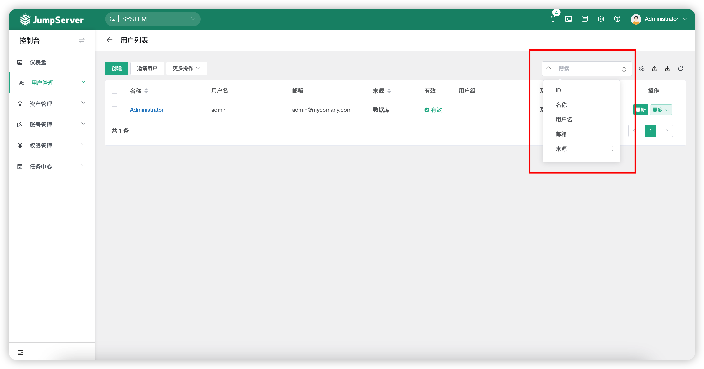
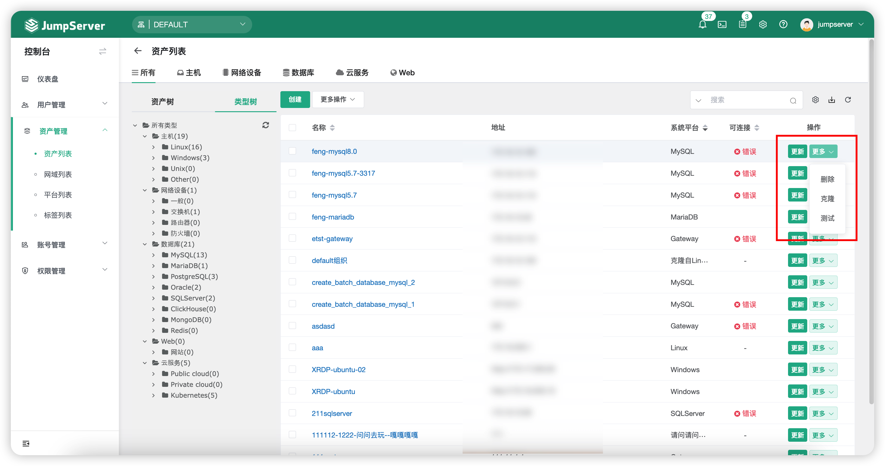
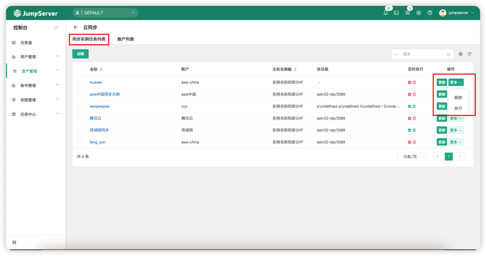
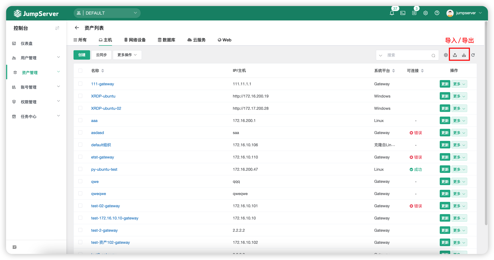
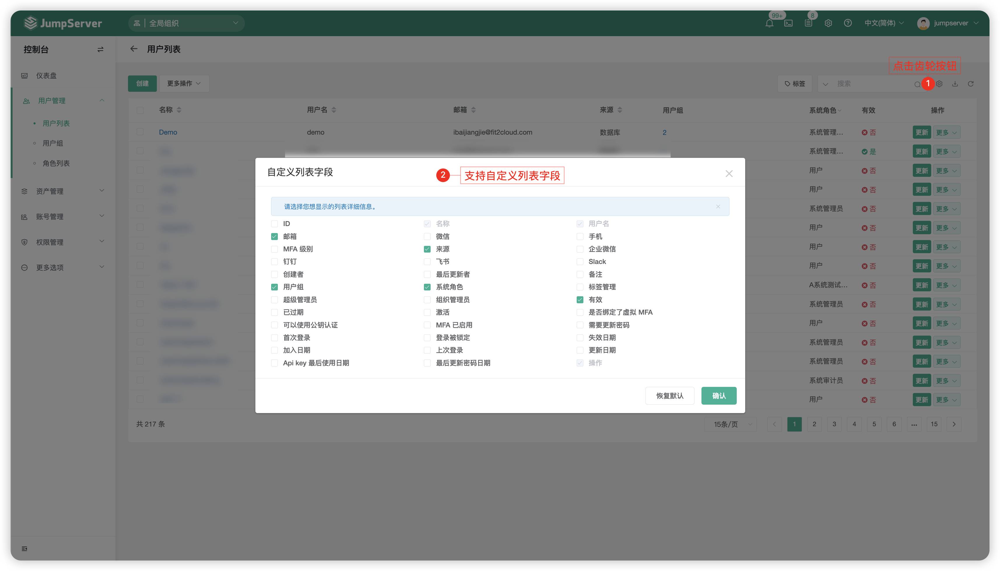

# 通用功能
## 1 语言切换
!!! tip ""
    - 在登陆 JumpServer 页面处，可进行指定语言的切换，目前支持切换简体中文、英文、日本语。

## 2 搜索框
!!! tip ""
    - JumpServer 在功能模块中设有搜索框功能来提高查询效率，包含用户、资产、任务、审计等模块。

!!! tip ""
    - 选择图示搜索下拉框，即可针对数据字段进行搜索。

## 3 "更多"按钮
### 3.1 针对资产、用户类型
!!! tip ""
    - JumpServer 在功能模块中设有`"更多"`按钮来方便管理员对资产、用户等类型的目标进行删除、克隆、测试动作，如下图所示：

### 3.2 针对任务、规则类型
!!! tip ""
    - JumpServer 在功能模块中设有`"更多"`按钮来方便管理员对任务、规则等类型等目标进行删除、执行（手动执行任务）动作，如下图所示：

## 4 数据导入导出
!!! tip ""
    - JumpServer 支持通过模版来对数据进行导入导出操作。
    - 数据类型：资产、账号、授权规则。

## 5 自定义列表字段
!!! tip ""
    - JumpServer 支持在功能模块中的页面进行自定义列表字段操作。

