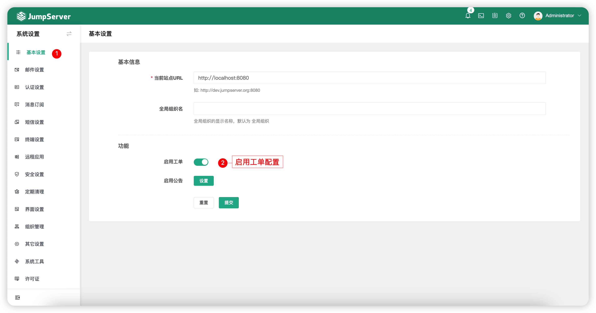
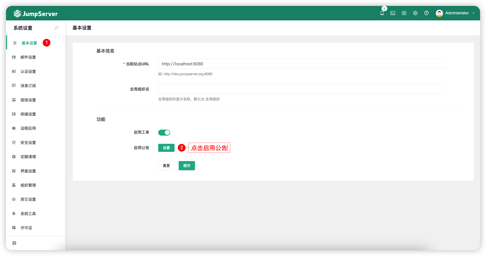
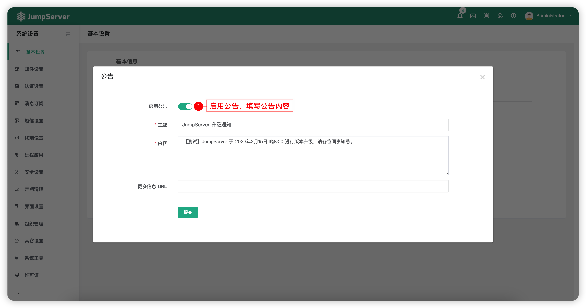

# 基本设置
## 1 功能简述
!!! tip ""
    - 点击页面左侧菜单的`基本设置`按钮，进入基本设置页面.
    - 可以编辑基本信息，包含当前站点 URL（用户通过外部链接，如邮件跳转到堡垒机的 URL，此处可以填写域名或 IP）、支持自定义全局组织名称。

## 2 启用工单
!!! tip ""
    - 在此页面，可以自定义是否启用`工单`功能。

!!! tip ""
    - 启用工单后，工单页面效果如下：

## 3 启用公告
!!! tip ""
    - 在此页面，可以自定义是否启用`公告`功能，并设置`公告内容`。

!!! tip ""
    - 启用公告后，公告页面效果如下：
