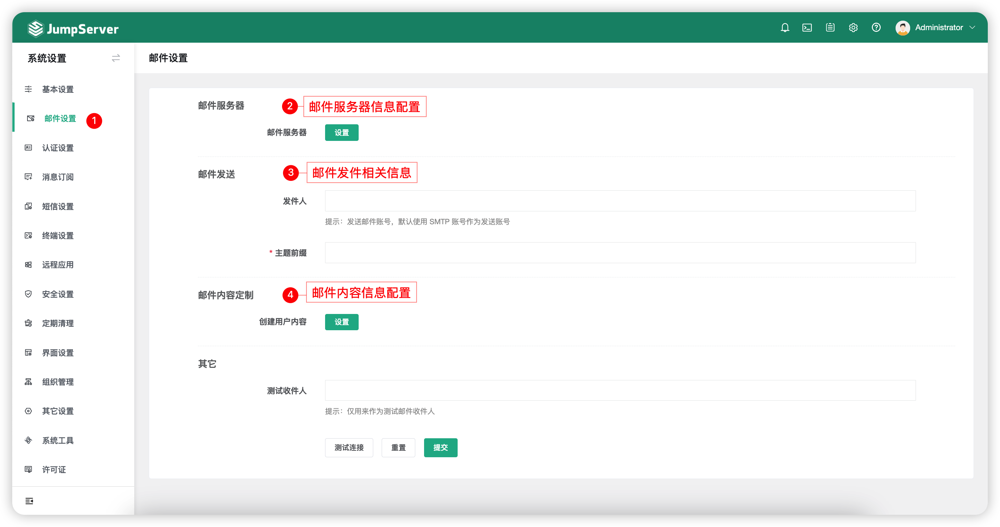

# 邮件设置
## 1 功能简述
!!! tip ""
    - 点击页面左侧的`邮件设置`按钮，即进入邮件设置页面。
    - 邮件设置界面主要配置邮件的发件邮箱信息，用于发送创建用户密码设置邮件、危险命令邮件、授权过期邮件等邮件到 JumpServer 用户邮箱。

## 2 配置说明
!!! tip ""
    - 以163邮箱为例说明。
    - SMTP 主机是 smtp.163.com。 
    - SMTP 端口默认是25，使用 SSL 时端口为465/994，使用 TLS 时端口为587。
    - SMTP 账号密码是登录邮箱的账号密码或账号授权码。
    - 配置邮件服务器与邮件发送后，可添加测试收件人并点击`测试连接`按钮，如果配置正确，页面出现提示信息，同时 JumpServer 会发送一条测试邮件到 SMTP 账号邮箱。
