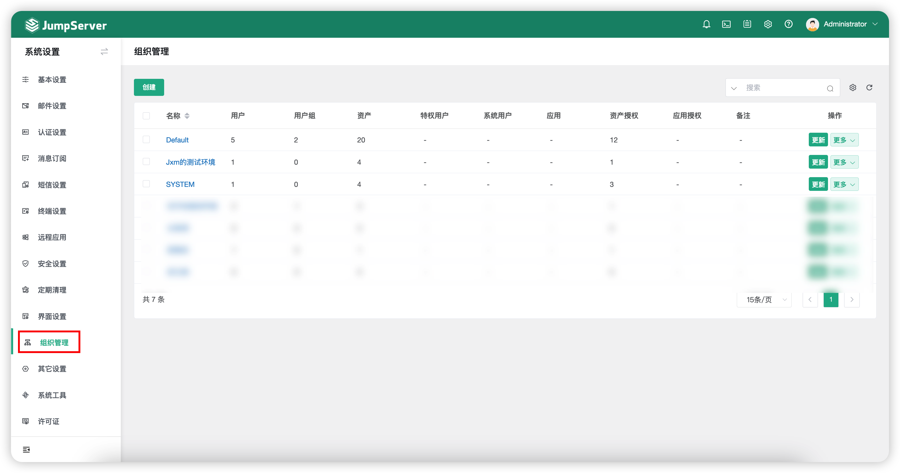
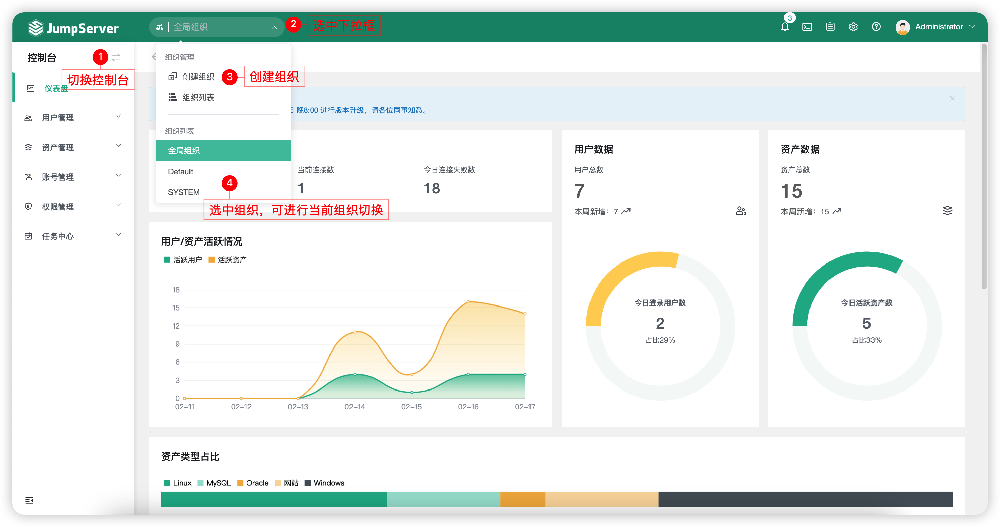

# 组织管理
## 1 功能简述
!!! tip ""
    - 点击页面左侧的`其他设置`按钮，进入组织管理页面。
    - JumpServer 支持按组织的管理方式，方便授权管理员根据公司组织结构创建和查看不同组织环境下的运维审计信息，包括管理员、用户、用户组、资产、网域、管理用户、系统用户、标签、权限管理等

## 2 创建组织
!!! tip ""
    - 切换至控制台页面，选中左上角的组织下拉框按钮，进入组织创建页面。
    - 先为创建的组织命名；创建组织成功后，组织列表显示新创建的组织信息。

!!! warning "注意"
    - 组织内的角色、资产、账户等信息等更新、删除操作，都应切换至各自的组织内进行操作。