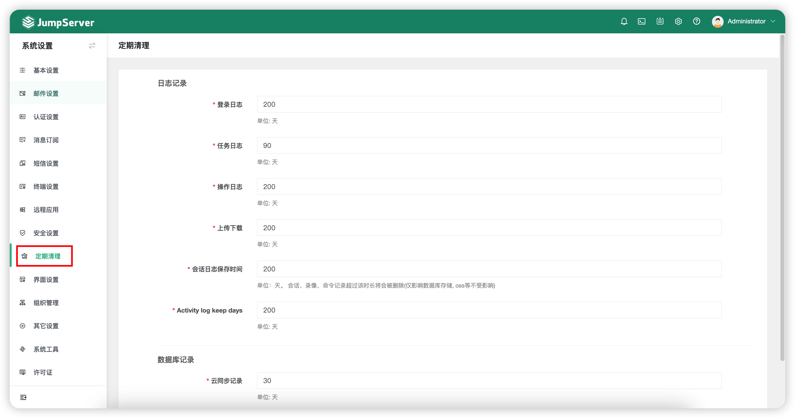

# 定期清理
## 1 功能简述
!!! tip ""
    - 点击页面左侧的`定期清理`按钮，即进入定期清理页面。
    - 该页面的配置主要控制本地保存的记录，当录像与日志存储到外部存储中，不受该页面配置影响。
    - 定期清理类型有：登录、任务、操作、上传下载日志和数据库记录，可以配置定时清理周期，为服务器存储减轻压力。

!!! tip ""
    - 详细参数说明：

!!! tip ""

    | 参数     | 说明                  |
    | ------- | --------------------- |
    | 登录日志 | 登录日志主要记录记录 JumpServer 用户的登录信息，包括用户名、类型、Agent、登陆 IP 地址、登录地点以及登录日期。 |
    | 任务日志 | 任务日志主要记录一些批量命令等自动化的任务信息。 |
    | 操作日志 | 操作日志主要记录用户对资产的操作动作、操作时间以及操作的资源类型和远端地址。 |
    | 上传下载 | 上传下载主要记录用户进行 FTP 上传、下载时所留下的操作记录。 |
    | 会话日志保存时间 | 会话日志主要记录通过 JumpServer 登录资产产生的会话日志包含录像与命令记录。 |
    | 活动记录 | 活动日志保留时间。 |
    | 云同步记录 | 云同步记录主要记录执行云同步任务的信息。 |