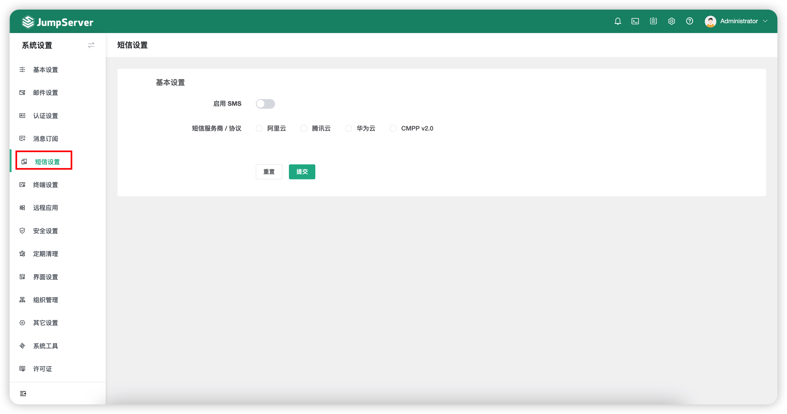

# 短信设置
!!! note "注：短信（阿里云、腾讯云）认证为 JumpServer 企业版功能。"

## 1 功能简述
!!! tip ""
    - 点击页面左侧的`短信设置`按钮，可以设置短信 MFA 认证方式（目前支持阿里云、腾讯云、CMPP v2.0 和华为云）
    - JumpServer 还支持使用手机短信找回用户密码，管理员需要开启 SMS 服务，且用户信息需要配置手机号。

## 2 配置说明
!!! tip ""
    - 选择对应的短信服务商，填入服务商平台认证相关信息，点击`测试`按钮可测试配置是否正确。

## 3 用户侧配置
!!! tip ""
    - 点击用户头像 - `个人信息` - 左侧栏`个人信息`配置用户个人手机号信息。

!!! tip ""
    - 点击用户头像 - `个人信息` - 左侧栏`账号信息`配置多因子认证为短信认证。

