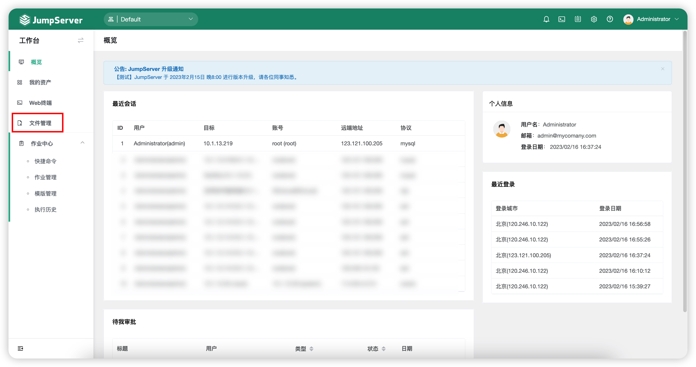
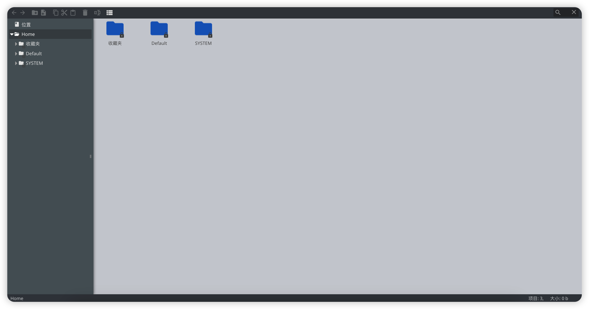
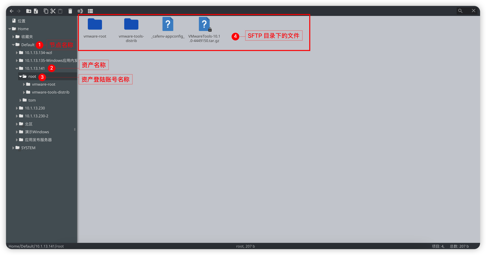
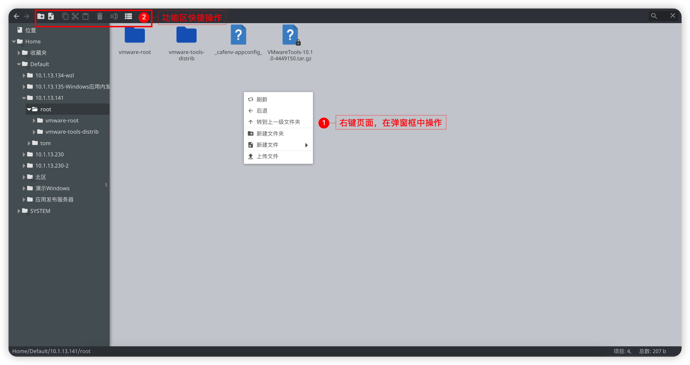

# 文件管理

## 1 功能简述
!!! tip ""
    - 文件管理是传输文件的一种方式，上传下载默认 SFTP 目录默认为/tmp 路径。
    - SFTP 目录与资产平台进行绑定，JumpServer 默认平台的 SFTP 目录无法修改（需联系管理员操作修改）

## 2 页面使用
!!! tip ""
    - 点击左侧节点树对应资产，即可进入资产中的 SFTP 目录。
    - 当某个资产有且仅有一个账号授权时，点击资产名称即可直接进入该资产对应授权用户的SFTP目录，当某个资产拥有多个账号授权时，需点击资产名称后选择资产对应的账号才能进入对应的SFTP目录。

!!! tip ""
    - 进入 SFTP 目录后，即可对文件夹或文件对应操作。
    - 操作方式支持两种，第一种方式：直接在右侧页面右击唤出操作菜单；第二种方式：上方黑色部分的按钮进行对应的操作。
