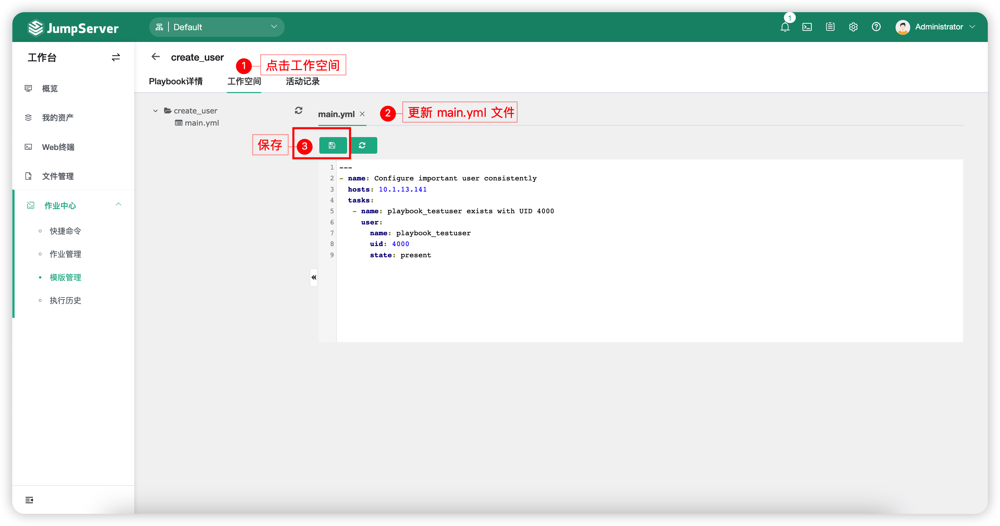

# 模版管理
## 1 功能简述
!!! tip ""
    - 模版管理功能主要是针对命令、Playbook 两种类型来创建模版，方便在`快捷命令`和`作业管理`模块快速使用。

## 2 创建模版
!!! tip ""
    - 以 Playbook 类型模版示例（在目标资产创建一个 UID 为4000的用户）
    - 点击切换至`模版管理`页面中的`Playbook 管理`页签，创建 Playbook 模版。
    - 先自行创建模版名称，然后点击`名称` - `工作空间` 页签，更新 main.yml 文件后保存，如下图：

## 3 指定 Playbook 模版运行作业任务
!!! tip ""
   - 参考 [作业管理](job_management.md) 介绍模块。
