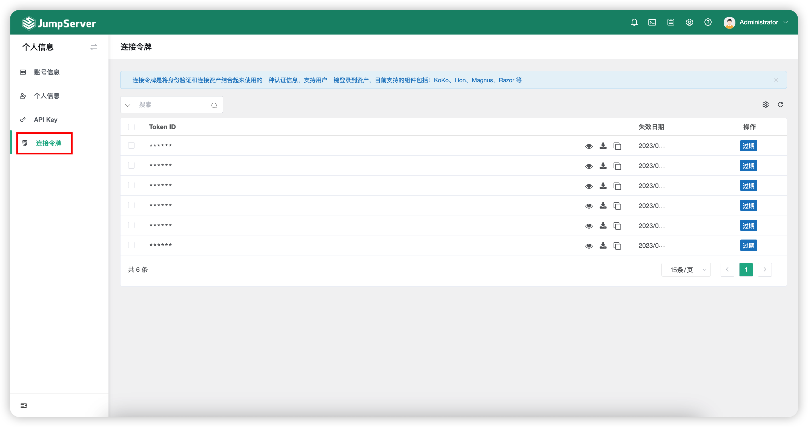

# 连接令牌

## 1 功能简述
!!! tip ""
    - 连接令牌是将身份验证和连接资产结合起来使用的一种认证信息，支持用户一键登录到资产，目前支持的组件包括：KoKo、Lion、Magnus、Razor 等。用户可以自行查看连接令牌信息并使令牌过期。

!!! tip ""
    - 页面展示如下：

## 2 创建令牌
!!! tip ""
    - 创建连接令牌的方式如下：
   
!!! tip "" 
    - 连接 SSH 协议资产：通过 Web 终端连接 Linux 资产，即可创建令牌信息； 
    - 连接 RDP 协议资产：通过 Web 终端连接 RDP 资产，选择连接方式为“RDP 客户端”，即可创建令牌信息； 
    - 连接数据库应用：通过 Web 终端连接数据库应用，选择连接方式为“DB Client”，即可创建令牌信息； 
    - 通过调用 API 方式创建。