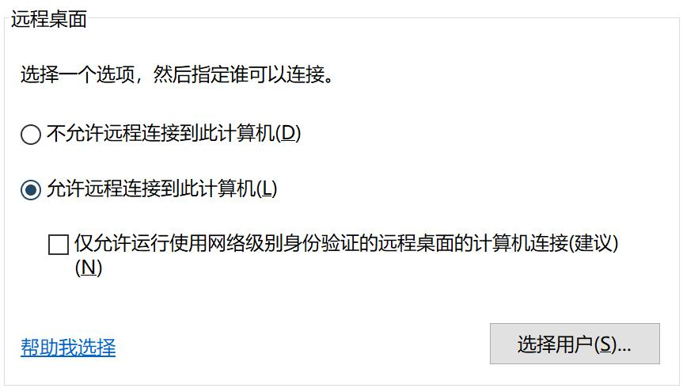

# Windows RDP 资产要求

!!! info "部分安装了安全软件的资产无法正常连接"

!!! info "系统平台 哪个能用就用哪个，此选项跟资产的远程设置有关"

## Windows 7/2008

!!! tip ""
    打开远程设置  
    防火墙放行 rdp 端口  
    创建资产时 系统平台 选择 Windows

!!! tip "`资产管理` `系统用户` 为 `托管密码` 需要设置"
    - 在资产上面修改远程设置 勾选 仅允许运行使用网络级别身份验证的远程桌面的计算机连接(更安全)(N)

!!! tip "`资产管理` `系统用户` 为 `手动输入` 需要设置"
    - 在资产上面修改远程设置 勾选 允许运行任意版本远程桌面的计算机连接(较不安全)(L)

## Windows 8/10

!!! tip ""
    打开远程设置  
    防火墙放行 rdp 端口

!!! tip "`资产管理` `系统用户` 为 `托管密码` 需要设置"
    - 创建资产时 系统平台 选择 Windows
    - 在资产上面修改远程设置 勾选 仅允许运行使用网络级别身份验证的远程桌面的计算机连接(建议)(N)

!!! tip "`资产管理` `系统用户` 为 `手动输入` 需要设置"
    - 创建资产时 系统平台 选择 Windows(2016)
    - 在资产上面修改远程设置 不要勾选 仅允许运行使用网络级别身份验证的远程桌面的计算机连接(建议)(N)

## Windows 2012/2016/2019

!!! tip ""
    打开远程设置  
    防火墙放行 rdp 端口

!!! tip "`资产管理` `系统用户` 为 `托管密码` 需要设置"
    - 创建资产时 系统平台 选择 Windows
    - 在资产上面修改远程设置 勾选 仅允许运行使用网络级别身份验证的远程桌面的计算机连接(建议)(N)

!!! tip "`资产管理` `系统用户` 为 `手动输入` 需要设置"
    - 创建资产时 系统平台 选择 Windows(2016)
    - 在资产上面修改远程设置 不要勾选 仅允许运行使用网络级别身份验证的远程桌面的计算机连接(建议)(N)

!!! info "多人同时连接请自行部署 `Remote Desktop Service`"
