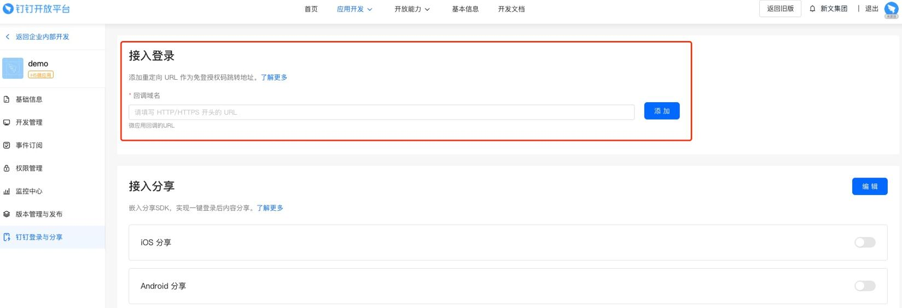

# 钉钉认证

!!! info "使用 阿里钉钉 的用户作为 JumpServer 登录用户"

### 创建应用

    打开 [钉钉开发平台](https://developers.dingtalk.com/)，用管理员权限用户登录；
    选择企业内部开发 创建应用，应用类型：H5微应用 小程序都可以，开发方式：企业自主开发

---

### 查看凭据

    创建成功后把 `AgentId` `AppKey` `AppSecret` 对应的值填到 JumpServer 钉钉认证里面

---

### 设置应用

    把 JumpServer 的 url 地址填入刚才创建的应用的 `钉钉登录与分享` 的 `回调域名` 里面

    在开发管理处填写 JumpServer 服务器的 `出口地址` 和 `应用首页地址`；
    出口地址就是实际对外的公网地址，钉钉的白名单限制，你设置此 ip 后，只能通过此 ip 与钉钉 api 通信

    在权限管理里面选择 `通讯录管理` 选中 `成员信息读权限` 点击批量申请

    用户正常使用账号密码登录 JumpServer 后，在个人信息里面绑定钉钉账号，绑定完成后就可以使用钉钉账号登录 JumpServer
