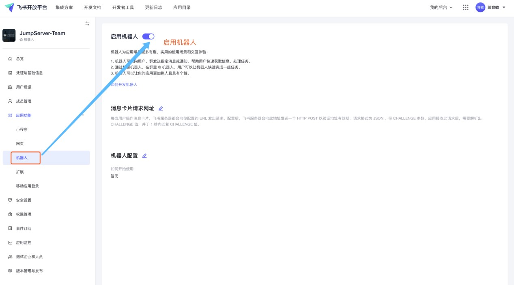
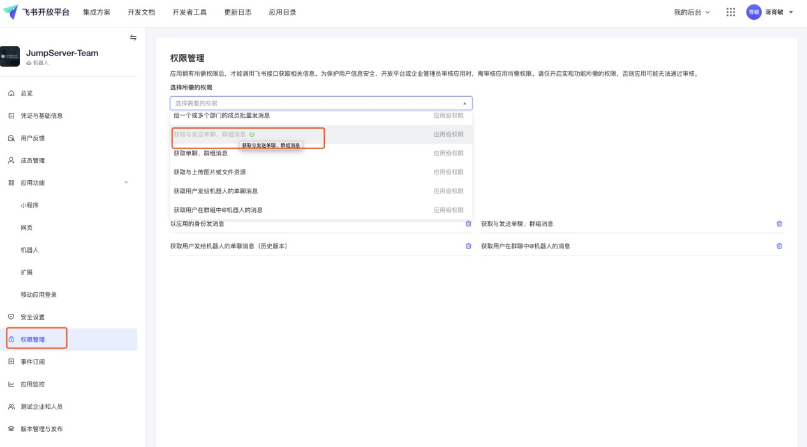
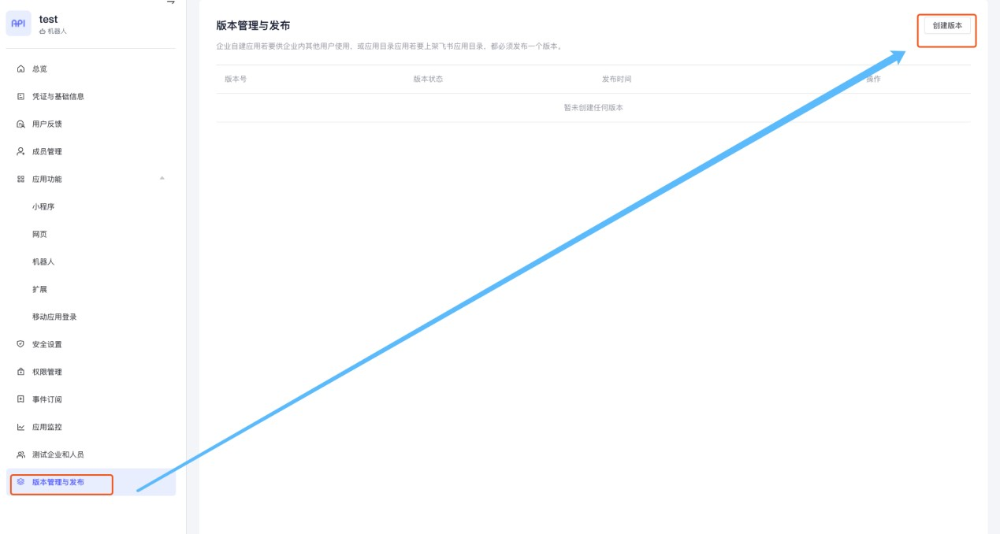
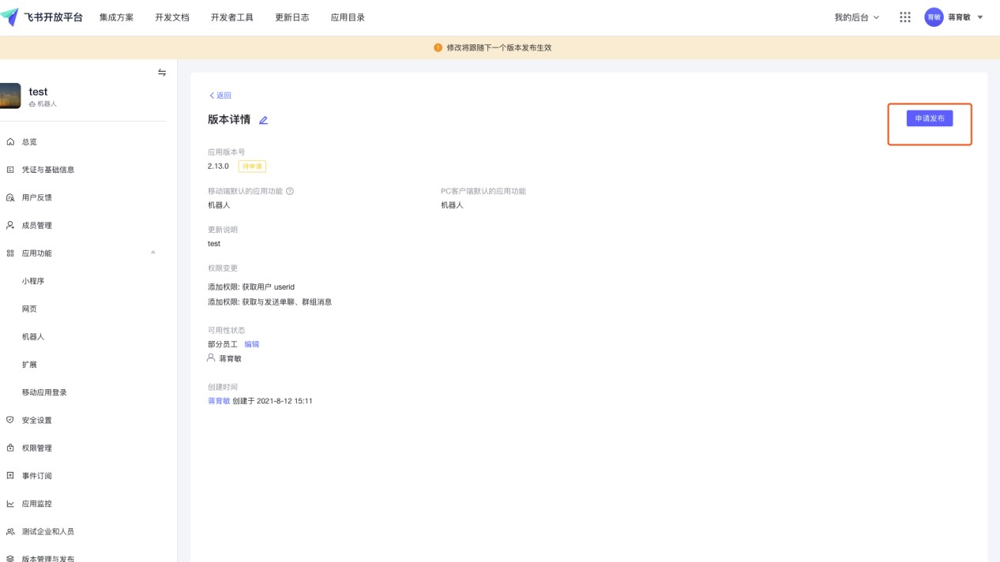

# 飞书认证

!!! info "使用 飞书 的用户作为 JumpServer 登录用户"

### 创建应用

    打开 [飞书开放平台](https://open.feishu.cn/app/)，用管理员权限用户登录，
    点击 创建企业自建应用，选择 企业自建应用，输入 应用名称 和 应用描述 后点击 确定创建

---

### 设置应用

    点击刚创建的应用，进入应用详情页

    点击左侧菜单 应用功能 - 机器人，打开 启用机器人 选项

    点击左侧菜单 安全设置，添加重定向 URL 和 IP 白名单

    - https://<jumpserver_host>/core/auth/feishu/qr/bind/callback/
    - https://<jumpserver_host>/core/auth/feishu/qr/login/callback/
    - IP 白名单填写 JumpServer 服务器的公网 IP

!!! warning "jumpserver_host 改成你自己的 JumpServer 域名"

    点击左侧菜单 权限管理 添加 获取用户 userid 和 获取与发送单聊、群聊消息 权限

    点击左侧菜单 版本管理与发布 点击右上角 创建版本，输入应用版本号，
    应用功能选择 机器人，输入更新说明，指定员工，点击保存

    点击刚创建的版本进入 版本详情，点击右上角 申请发布

    打开 飞书管理后台，在左侧菜单 工作台中，点击应用审核，
    找到刚才提交的应用，点击审核 并通过。

    确定 应用列表 的应用已经处于 已启用 状态

---

### 查看凭据

    点击应用名称进入 应用详情，在左侧菜单 凭证与基础信息
    将 AppID 与 AppSecret 填入 JumpServer 飞书认证中

    用户正常使用账号密码登录 JumpServer 后，在个人信息里面绑定飞书账号
    绑定完成后就可以使用飞书账号登录 JumpServer
