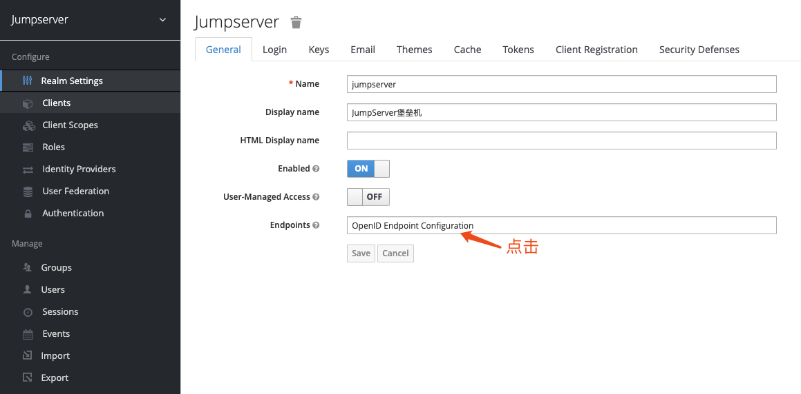

# OpenID 认证

## Keycloak 对接

### 1. 创建设置 KeyCloak Client


### 2. 获取 Secret key


### 3. 查看配置



!!! info ""
    ```yaml
    {
        "issuer":"https://id.jumpserver.org/auth/realms/jumpserver",
        "authorization_endpoint":"https://id.jumpserver.org/auth/realms/jumpserver/protocol/openid-connect/auth",
        "token_endpoint":"https://id.jumpserver.org/auth/realms/jumpserver/protocol/openid-connect/token",
        "token_introspection_endpoint":"https://id.jumpserver.org/auth/realms/jumpserver/protocol/openid-connect/token/introspect",
        "userinfo_endpoint":"https://id.jumpserver.org/auth/realms/jumpserver/protocol/openid-connect/userinfo",
        "end_session_endpoint":"https://id.jumpserver.org/auth/realms/jumpserver/protocol/openid-connect/logout",
        "jwks_uri":"https://id.jumpserver.org/auth/realms/jumpserver/protocol/openid-connect/certs",
        "check_session_iframe":"https://id.jumpserver.org/auth/realms/jumpserver/protocol/openid-connect/login-status-iframe.html",
        "grant_types_supported":[
            "authorization_code",
            "implicit",
            "refresh_token",
            "password",
            "client_credentials"
        ],
        "response_types_supported":[
            "code",
            "none",
            "id_token",
            "token",
            "id_token token",
            "code id_token",
            "code token",
            "code id_token token"
        ],
        "subject_types_supported":[
            "public",
            "pairwise"
        ],
        "id_token_signing_alg_values_supported":[
            "ES384",
            "RS384",
            "HS256",
            "HS512",
            "ES256",
            "RS256",
            "HS384",
            "ES512",
            "RS512"
        ],
        "userinfo_signing_alg_values_supported":[
            "ES384",
            "RS384",
            "HS256",
            "HS512",
            "ES256",
            "RS256",
            "HS384",
            "ES512",
            "RS512",
            "none"
        ],
        "request_object_signing_alg_values_supported":[
            "ES384",
            "RS384",
            "ES256",
            "RS256",
            "ES512",
            "RS512",
            "none"
        ],
        "response_modes_supported":[
            "query",
            "fragment",
            "form_post"
        ],
        "registration_endpoint":"https://id.jumpserver.org/auth/realms/jumpserver/clients-registrations/openid-connect",
        "token_endpoint_auth_methods_supported":[
            "private_key_jwt",
            "client_secret_basic",
            "client_secret_post",
            "client_secret_jwt"
        ],
        "token_endpoint_auth_signing_alg_values_supported":[
            "RS256"
        ],
        "claims_supported":[
            "sub",
            "iss",
            "auth_time",
            "name",
            "given_name",
            "family_name",
            "preferred_username",
            "email"
        ],
        "claim_types_supported":[
            "normal"
        ],
        "claims_parameter_supported":false,
        "scopes_supported":[
            "openid",
            "address",
            "email",
            "offline_access",
            "phone",
            "profile",
            "roles",
            "web-origins"
        ],
        "request_parameter_supported":true,
        "request_uri_parameter_supported":true,
        "code_challenge_methods_supported":[
            "plain",
            "S256"
        ],
        "tls_client_certificate_bound_access_tokens":true,
        "introspection_endpoint":"https://id.jumpserver.org/auth/realms/jumpserver/protocol/openid-connect/token/introspect"
    }
    ```

### 5. 配置 JumpServer

!!! info "配置有两种方式，一种是 Keycloak 的配置，一种是 OIDC 的配置"
    === "Keycloak 方式使用配置"
        ```sh
        vi /opt/jumpserver/config/config.txt
        ```
        ```vim
        # OPENID配置
        # version <= 1.5.8
        AUTH_OPENID=true
        BASE_SITE_URL=http://demo.jumpserver.org/
        AUTH_OPENID_SERVER_URL=https://id.jumpserver.org/auth
        AUTH_OPENID_REALM_NAME=jumpserver
        AUTH_OPENID_CLIENT_ID=jumpserver
        AUTH_OPENID_CLIENT_SECRET=****************
        AUTH_OPENID_SHARE_SESSION=true
        AUTH_OPENID_IGNORE_SSL_VERIFICATION=true
        ```

        ??? question "设置参数说明"
            `BASE_SITE_URL`: JumpServer服务的地址（注意末尾加  "/"）

            `AUTH_OPENID`: 是否启用 OpenID 认证

            `AUTH_OPENID_SERVER_URL`: OpenID Server 服务的地址（注意末尾要加 "/"）

            `AUTH_OPENID_REALM_NAME`: realm 名称（client 所在的的 realm

            `AUTH_OPENID_CLIENT_ID`: Client ID

            `AUTH_OPENID_CLIENT_SECRET`: Client Secret

            `AUTH_OPENID_IGNORE_SSL_VERIFICATION`: 是否忽略 SSL 验证（在向 OpenID Server 发送请求获取数据时）

            `AUTH_OPENID_SHARE_SESSION`: 是否共享 session（控制用户是否可以单点退出）

    === "标准 OIDC 配置方式"
        ```sh
        vi /opt/jumpserver/config/config.txt
        ```
        ```vim
        # OPENID配置
        AUTH_OPENID=true
        BASE_SITE_URL=https://demo.jumpserver.org/
        AUTH_OPENID_CLIENT_ID=jumpserver
        AUTH_OPENID_CLIENT_SECRET=****************
        AUTH_OPENID_PROVIDER_ENDPOINT=https://id.jumpserver.org/auth
        AUTH_OPENID_PROVIDER_AUTHORIZATION_ENDPOINT=https://id.jumpserver.org/auth/realms/jumpserver/protocol/openid-connect/auth
        AUTH_OPENID_PROVIDER_TOKEN_ENDPOINT=https://id.jumpserver.org/auth/realms/jumpserver/protocol/openid-connect/token
        AUTH_OPENID_PROVIDER_JWKS_ENDPOINT=https://id.jumpserver.org/auth/realms/jumpserver/protocol/openid-connect/certs
        AUTH_OPENID_PROVIDER_USERINFO_ENDPOINT=https://id.jumpserver.org/auth/realms/jumpserver/protocol/openid-connect/userinfo
        AUTH_OPENID_PROVIDER_END_SESSION_ENDPOINT=https://id.jumpserver.org/auth/realms/jumpserver/protocol/openid-connect/logout
        AUTH_OPENID_PROVIDER_SIGNATURE_ALG=HS256
        AUTH_OPENID_PROVIDER_SIGNATURE_KEY=null
        AUTH_OPENID_SCOPES=openid profile email
        AUTH_OPENID_ID_TOKEN_MAX_AGE=60
        AUTH_OPENID_ID_TOKEN_INCLUDE_CLAIMS=true
        AUTH_OPENID_USE_STATE=true
        AUTH_OPENID_USE_NONCE=true
        AUTH_OPENID_SHARE_SESSION=true
        AUTH_OPENID_IGNORE_SSL_VERIFICATION=true
        ```

        ??? question "设置参数说明"
            `BASE_SITE_URL`: JumpServer service URL

            `AUTH_OPENID`: Whether to enable OpenID authentication  

            `AUTH_OPENID_CLIENT_ID`: This setting defines the Client ID that should be provided by the considered OIDC provider.  

            `AUTH_OPENID_CLIENT_SECRET`: This setting defines the Client Secret that should be provided by the considered OIDC provider.  

            `AUTH_OPENID_PROVIDER_ENDPOINT`: This setting defines the top-level endpoint under which all OIDC-specific endpoints are available (such as the authotization, token and userinfo endpoints).  

            `AUTH_OPENID_PROVIDER_AUTHORIZATION_ENDPOINT`: This setting defines the authorization endpoint URL of the OIDC provider.  

            `AUTH_OPENID_PROVIDER_TOKEN_ENDPOINT`: This setting defines the token endpoint URL of the OIDC provider.  

            `AUTH_OPENID_PROVIDER_JWKS_ENDPOINT`: This setting defines the JWKs endpoint URL of the OIDC provider.  

            `AUTH_OPENID_PROVIDER_USERINFO_ENDPOINT`: This setting defines the userinfo endpoint URL of the OIDC provider.  

            `AUTH_OPENID_PROVIDER_END_SESSION_ENDPOINT`: This setting defines the end session endpoint URL of the OIDC provider.  

            `AUTH_OPENID_PROVIDER_SIGNATURE_ALG`: This setting defines the signature algorithm used by the OpenID Connect Provider to sign ID tokens. The value of this setting should be  HS256 or RS256.  

            `AUTH_OPENID_PROVIDER_SIGNATURE_KEY`: This setting defines the value of the key used by the OP to the sign ID tokens. It should be used only when the AUTH_OPENID_PROVIDER_SIGNATURE_ALG setting is set to RS256.  

            `AUTH_OPENID_SCOPES`: This setting defines the OpenID Connect scopes to request during authentication.  

            `AUTH_OPENID_ID_TOKEN_MAX_AGE`: This setting defines the amount of time (in seconds) an id_token should be considered valid.  

            `AUTH_OPENID_ID_TOKEN_INCLUDE_CLAIM`: This settings defines whether the id_token content can be used to retrieve userinfo claims and scopes in order to create and update the user being authenticated.  

            `AUTH_OPENID_USE_STATE`: This setting defines whether or not states should be used when forging authorization requests. States are used to maintain state between the authentication request and the callback.  

            `AUTH_OPENID_USE_NONCE`: This setting defines whether or not nonces should be used when forging authorization requests. Nonces are used to mitigate replay attacks.  

            `AUTH_OPENID_SHARE_SESSION`: Whether or not to share session (controls whether or not the user can exit with a single point)  

            `AUTH_OPENID_IGNORE_SSL_VERIFICATION`: Whether to ignore SSL validation (when sending a request to OpenID Server for data)  

            `AUTH_OPENID_ALWAYS_UPDATE_USER`: Whether the user information is always updated (when the user logs in and authenticates successfully every time)  
