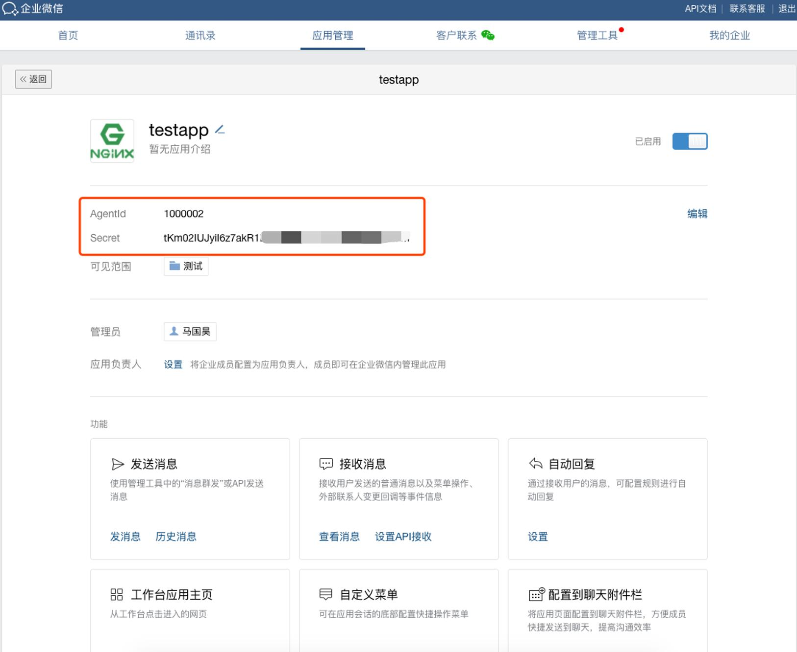

# 微信认证

!!! info "使用 企业微信 的用户作为 JumpServer 登录用户"

### 创建应用

    打开 [企业微信管理后台](https://work.weixin.qq.com/)，用管理员权限用户登录，
    选择 `工作台`，进入 `应用管理` 页面，选择 `创建应用`

---

### 设置应用

    在应用的信息设置页面进行相关设置，`可见范围` 选择可以接收消息通知的部门或个人

---

### 查看凭据

    创建完应用后，可以进入应用查看相关的访问凭证信息，记录 `AgentId` `Secret`

    进入 `我的企业` 页面，在 `企业信息` 栏里查询 `企业ID`

---

### 配置认证

    将获取到的 `企业ID` `AgentId` `Secret` 填到 JumpServer 企业微信认证里面

    配置 `授权回调域`，将 JumpServer 的 url 地址填入企业微信 `授权回调域` 里面

    用户正常使用账号密码登录 JumpServer 后，在个人信息里面绑定微信账号，绑定完成后就可以使用微信账号登录 JumpServer
