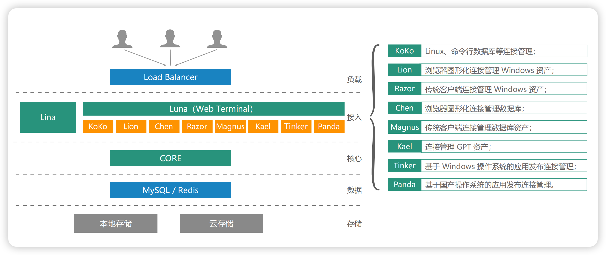

# System Architecture
## 1 Application Architecture
!!! tip ""
    - JumpServer adopts a layered architecture consisting of load layer, access layer, core layer, data layer, and storage layer.
    - The JumpServer application architecture diagram is as follows:

## 2 Component description
!!! tip ""
    - The Core component is the core component of JumpServer, and other components depend on it to start.
    - Koko is the component for Unix-like asset platforms, providing character connections through SSH and Telnet protocols.
    - Lion is the component for Windows asset platforms, used to access Windows assets from the Web.
    - XRDP is the component for RDP protocol, primarily used to access Windows assets such as Windows 2000, XP systems through JumpServer Client.
    - Razor is the component for RDP protocol; JumpServer Client uses the Razor component by default to access Windows assets.
    - Magnus is the component for databases, used to access database assets through client proxy.
    - Kael is the component for GPT asset platforms, used to manage ChatGPT assets.
    - Chen is the component for databases, used to access database assets through Web GUI.
    - Celery is the component for handling asynchronous tasks, used to execute JumpServer-related automation tasks.
    - Video is specifically for processing the format conversion of session recordings produced by Razor and Lion components, converting generated session recordings to MP4 format.
    - Panda is an application publisher based on domestic operating systems, used to schedule Virtualapp applications.
    

## 3 Logical architecture
!!! tip "See [Source Code Deployment](installation/source_install/requirements.md) for details"
