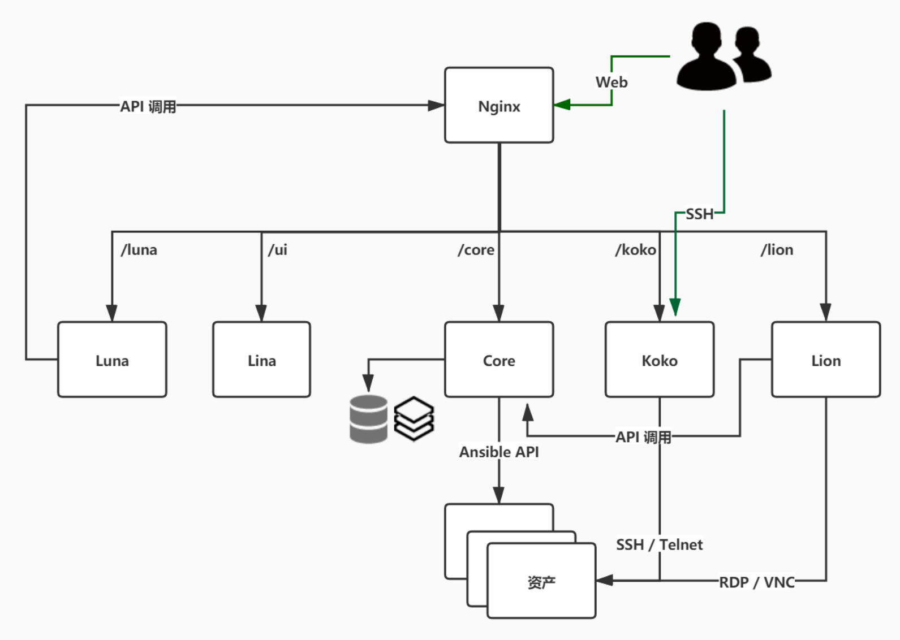

# 编译文档

!!! warning "Windows 平台推荐使用 VSCode 的 Remote SSH 功能在 Linux 上进行编译"

## 架构图


JumpServer 分为多个组件，大致的架构如上图所示。其中 [Lina][lina] 和 [Luna][luna] 为纯静态文件，最终由 [nginx][nginx] 整合。

### 数据库要求

| Name    | Core                     | MySQL  | MariaDB | Redis |
| :------ | :----------------------- | :----- | :------ | :---- |
| Version | {{ jumpserver.version }} | >= 5.7 | >= 10.2 | >= 6  |

!!! warning "MySQL 和 MariaDB 二选一即可, JumpServer 需要使用 MySQL 或 MariaDB 存储数据"

## Core
[Core][core] 是 JumpServer 的核心组件，由 [Django][django] 二次开发而来，内置了 [Gunicorn][gunicorn] [Celery][celery] Beat [Flower][flower] [Daphne][daphne] 服务。

### 环境要求

| Name    | Core                     | Python |
| :------ | :----------------------- | :----- |
| Version | {{ jumpserver.version }} | >= 3.8 |

### 下载源代码

可以从 [Github][core] 网站上获取最新的 [Release][core_release] 副本。这些版本是最新代码的稳定快照，从项目网站下载的源将采用 .tar.gz 存档的形式，通过命令行中提取该存档：

```bash
cd /opt
mkdir /opt/jumpserver-{{ jumpserver.version }}
wget -O /opt/jumpserver-{{ jumpserver.version }}.tar.gz https://github.com/jumpserver/jumpserver/archive/refs/tags/{{ jumpserver.version }}.tar.gz
tar -xf jumpserver-{{ jumpserver.version }}.tar.gz -C /opt/jumpserver-{{ jumpserver.version }} --strip-components 1
cd jumpserver-{{ jumpserver.version }}
rm -f apps/common/utils/ip/geoip/GeoLite2-City.mmdb apps/common/utils/ip/ipip/ipipfree.ipdb
wget https://download.jumpserver.org/files/ip/GeoLite2-City.mmdb -O apps/common/utils/ip/geoip/GeoLite2-City.mmdb
wget https://download.jumpserver.org/files/ip/ipipfree.ipdb -O apps/common/utils/ip/ipip/ipipfree.ipdb
```

```bash
ls -l requirements/
```
```vim
requirements/           # 对应操作系统需要的依赖包
├── apk_pkg.sh          # Alpine
├── deb_pkg.sh          # 基于 Debian 的发行版(如: Ubuntu)
├── issues.txt          # macOS 一些问题及解决方案
├── mac_pkg.sh          # macOS
├── requirements.txt    # python
└── rpm_pkg.sh          # 基于 RedHat 的发行版(如: CentOS)
```

=== "Ubuntu 20.04"
    ```bash
    apt-get install -y pkg-config libxmlsec1-dev libpq-dev libffi-dev libxml2 libxslt-dev libldap2-dev libsasl2-dev sshpass mariadb-client bash-completion g++ make sshpass
    ```

    !!! warning "如果你安装的是 MySQL, 将 mariadb 开发包自行替换成 mysql, 或者不要将 数据库 和 Core 部署在一起"
    ```bash
    apt-get install -y libmariadb-dev
    ```

    ### 安装 Python3

    从 [Python][python] 网站获取部署 Python3 的方法，请根据 [环境要求](#_3)，通过命令行中判断是否安装完成：

    ```bash
    apt-get install -y python3.8 python3.8-dev python3-venv
    ```
    ```bash
    python3
    ```
    ```python
    Python 3.8.12 (default, Dec 21 2021, 10:55:30)
    [GCC 10.2.1 20210110] on linux
    Type "help", "copyright", "credits" or "license" for more information.
    >>>
    ```

### 安装 python 依赖

为 JumpServer 项目单独创建 python3 虚拟环境。

```bash
python3 -m venv /opt/py3
source /opt/py3/bin/activate
```

每次运行项目都需要先执行 `source /opt/py3/bin/activate` 载入此环境。

```bash
pip install -U pip setuptools wheel
pip install -r requirements/requirements.txt
```

### 修改配置文件

```bash
cp config_example.yml config.yml
vi config.yml
```
```yaml
# SECURITY WARNING: keep the secret key used in production secret!
# 加密秘钥 生产环境中请修改为随机字符串，请勿外泄, 可使用命令生成
# $ cat /dev/urandom | tr -dc A-Za-z0-9 | head -c 48;echo
SECRET_KEY: ****************  # 必填项, 长度推荐 50 位以上

# SECURITY WARNING: keep the bootstrap token used in production secret!
# 预共享Token koko 和 lion 用来注册服务账号，不在使用原来的注册接受机制
# $ cat /dev/urandom | tr -dc A-Za-z0-9 | head -c 24;echo
BOOTSTRAP_TOKEN: ***********  # 必填项, 长度推荐 20 位以上

# Development env open this, when error occur display the full process track, Production disable it
# DEBUG 模式 开启DEBUG后遇到错误时可以看到更多日志
DEBUG: true                   # 开发建议打开 DEBUG, 生产环境应该关闭

# DEBUG, INFO, WARNING, ERROR, CRITICAL can set. See https://docs.djangoproject.com/en/1.10/topics/logging/
# 日志级别
LOG_LEVEL: DEBUG              # 开发建议设置 DEBUG, 生产环境推荐使用 ERROR
# LOG_DIR:

# Session expiration setting, Default 24 hour, Also set expired on on browser close
# 浏览器Session过期时间，默认24小时, 也可以设置浏览器关闭则过期
# SESSION_COOKIE_AGE: 86400
SESSION_EXPIRE_AT_BROWSER_CLOSE: true  # 浏览器关闭 session 过期

# Database setting, Support sqlite3, mysql, postgres ....
# 数据库设置
# See https://docs.djangoproject.com/en/1.10/ref/settings/#databases

# SQLite setting:
# 使用单文件sqlite数据库
# DB_ENGINE: sqlite3
# DB_NAME:
# MySQL or postgres setting like:
# 使用Mysql作为数据库
DB_ENGINE: mysql
DB_HOST: 127.0.0.1       # 自行配置 数据库相关
DB_PORT: 3306
DB_USER: jumpserver
DB_PASSWORD: ********
DB_NAME: jumpserver

# When Django start it will bind this host and port
# ./manage.py runserver 127.0.0.1:8080
# 运行时绑定端口, 将会使用 0.0.0.0:8080 0.0.0.0:8070 端口
HTTP_BIND_HOST: 0.0.0.0
HTTP_LISTEN_PORT: 8080
WS_LISTEN_PORT: 8070

# Use Redis as broker for celery and web socket
# Redis配置
REDIS_HOST: 127.0.0.1    # 自行配置 Redis 相关
REDIS_PORT: 6379
REDIS_PASSWORD: ********
# REDIS_DB_CELERY: 3
# REDIS_DB_CACHE: 4

# Use OpenID Authorization
# 使用 OpenID 进行认证设置
# AUTH_OPENID: False # True or False
# BASE_SITE_URL: None
# AUTH_OPENID_CLIENT_ID: client-id
# AUTH_OPENID_CLIENT_SECRET: client-secret
# AUTH_OPENID_PROVIDER_ENDPOINT: https://op-example.com/
# AUTH_OPENID_PROVIDER_AUTHORIZATION_ENDPOINT: https://op-example.com/authorize
# AUTH_OPENID_PROVIDER_TOKEN_ENDPOINT: https://op-example.com/token
# AUTH_OPENID_PROVIDER_JWKS_ENDPOINT: https://op-example.com/jwks
# AUTH_OPENID_PROVIDER_USERINFO_ENDPOINT: https://op-example.com/userinfo
# AUTH_OPENID_PROVIDER_END_SESSION_ENDPOINT: https://op-example.com/logout
# AUTH_OPENID_PROVIDER_SIGNATURE_ALG: HS256
# AUTH_OPENID_PROVIDER_SIGNATURE_KEY: None
# AUTH_OPENID_SCOPES: "openid profile email"
# AUTH_OPENID_ID_TOKEN_MAX_AGE: 60
# AUTH_OPENID_ID_TOKEN_INCLUDE_CLAIMS: True
# AUTH_OPENID_USE_STATE: True
# AUTH_OPENID_USE_NONCE: True
# AUTH_OPENID_SHARE_SESSION: True
# AUTH_OPENID_IGNORE_SSL_VERIFICATION: True
# AUTH_OPENID_ALWAYS_UPDATE_USER: True

# Use Radius authorization
# 使用Radius来认证
# AUTH_RADIUS: false
# RADIUS_SERVER: localhost
# RADIUS_PORT: 1812
# RADIUS_SECRET:

# CAS 配置
# AUTH_CAS': False,
# CAS_SERVER_URL': "http://host/cas/",
# CAS_ROOT_PROXIED_AS': 'http://jumpserver-host:port',  
# CAS_LOGOUT_COMPLETELY': True,
# CAS_VERSION': 3,

# LDAP/AD settings
# LDAP 搜索分页数量
# AUTH_LDAP_SEARCH_PAGED_SIZE: 1000
#
# 定时同步用户
# 启用 / 禁用
# AUTH_LDAP_SYNC_IS_PERIODIC: True
# 同步间隔 (单位: 时) (优先）
# AUTH_LDAP_SYNC_INTERVAL: 12
# Crontab 表达式
# AUTH_LDAP_SYNC_CRONTAB: * 6 * * *
#
# LDAP 用户登录时仅允许在用户列表中的用户执行 LDAP Server 认证
# AUTH_LDAP_USER_LOGIN_ONLY_IN_USERS: False
#
# LDAP 认证时如果日志中出现以下信息将参数设置为 0 (详情参见：https://www.python-ldap.org/en/latest/faq.html)
# In order to perform this operation a successful bind must be completed on the connection
# AUTH_LDAP_OPTIONS_OPT_REFERRALS: -1

# OTP settings
# OTP/MFA 配置
# OTP_VALID_WINDOW: 0
# OTP_ISSUER_NAME: Jumpserver

# Perm show single asset to ungrouped node
# 是否把未授权节点资产放入到 未分组 节点中
# PERM_SINGLE_ASSET_TO_UNGROUP_NODE: False
#
# 同一账号仅允许在一台设备登录
# USER_LOGIN_SINGLE_MACHINE_ENABLED: False
#
# 启用定时任务
# PERIOD_TASK_ENABLE: True
#
# 启用二次复合认证配置
# LOGIN_CONFIRM_ENABLE: False
#
# Windows 登录跳过手动输入密码
# WINDOWS_SKIP_ALL_MANUAL_PASSWORD: False
```

处理国际化

```bash
rm -f apps/locale/zh/LC_MESSAGES/django.mo
python apps/manage.py compilemessages
```

### 启动 Core

后台运行可以加 -d，`./jms start -d`

```bash
./jms start
```

## Lina

[Lina][lina] 是 JumpServer 的前端 UI 项目，主要使用 [Vue][vue]，[Element UI][element_ui] 完成。

### 环境要求

| Name    | Lina                     | Node |
| :------ | :----------------------- | :--- |
| Version | {{ jumpserver.version }} | 10   |

=== "源代码部署"

    ### 下载源代码

    从 [Github][lina] 下载 Source code.tar.gz 源代码，通过命令行中提取该存档：

    ```bash
    cd /opt
    mkdir /opt/lina-{{ jumpserver.version }}
    wget -O /opt/lina-{{ jumpserver.version }}.tar.gz https://github.com/jumpserver/lina/archive/refs/tags/{{ jumpserver.version }}.tar.gz
    tar -xf lina-{{ jumpserver.version }}.tar.gz -C /opt/lina-{{ jumpserver.version }} --strip-components 1
    ```

    ### 安装 Node
    从 [Node][node] 官方网站参考文档部署 Node.js，请根据 [环境要求](#_6)，通过命令行中判断是否安装完成：

    === "Ubuntu 20.04"
        ```bash
        cd /opt
        wget https://npm.taobao.org/mirrors/node/v10.24.1/node-v10.24.1-linux-x64.tar.xz
        tar -xf node-v10.24.1-linux-x64.tar.xz
        mv node-v10.24.1-linux-x64 /usr/local/node
        chown -R root:root /usr/local/node
        export PATH=/usr/local/node/bin:$PATH
        echo 'export PATH=/usr/local/node/bin:$PATH' >> ~/.bashrc
        ```

    ```bash
    node -v
    ```
    `v10.24.1`

    ### 安装依赖
    ```bash
    cd /opt/lina-{{ jumpserver.version }}
    npm install -g yarn
    yarn install
    ```

    ### 修改配置文件
    ```bash
    vi .env.development
    ```
    ```yaml
    # 全局环境变量 请勿随意改动
    ENV = 'development'

    # base api
    VUE_APP_BASE_API = ''
    VUE_APP_PUBLIC_PATH = '/ui/'

    # vue-cli uses the VUE_CLI_BABEL_TRANSPILE_MODULES environment variable,
    # to control whether the babel-plugin-dynamic-import-node plugin is enabled.
    # It only does one thing by converting all import() to require().
    # This configuration can significantly increase the speed of hot updates,
    # when you have a large number of pages.
    # Detail:  https://github.com/vuejs/vue-cli/blob/dev/packages/@vue/babel-preset-app/index.js

    VUE_CLI_BABEL_TRANSPILE_MODULES = true

    # External auth
    VUE_APP_LOGIN_PATH = '/core/auth/login/'
    VUE_APP_LOGOUT_PATH = '/core/auth/logout/'

    # Dev server for core proxy
    VUE_APP_CORE_HOST = 'http://localhost:8080'  # 修改成 Core 的 url 地址
    VUE_APP_CORE_WS = 'ws://localhost:8070'
    VUE_APP_ENV = 'development'
    ```

    ### 运行 Lina
    ```bash
    yarn serve
    ```

    ### 构建 Lina
    ```bash
    yarn build:prod
    cp -rf lina lina-{{ jumpserver.version }}
    tar -czf lina-{{ jumpserver.version }}.tar.gz lina-{{ jumpserver.version }}
    ```

    !!! tip "构建完成后, 生成在 lina 目录下"

=== "使用 Release"

    ### 下载 Release 文件

    从 [Github][lina] 网站上获取最新的 [Release][lina_release] 副本。这些版本是最新代码的稳定快照

    | OS     | Arch  | Name                                                                  |
    | :----- | :---- | :-------------------------------------------------------------------- |
    | All    | All   | [lina-{{ jumpserver.version }}.tar.gz][lina-{{ jumpserver.version }}] |

    ```bash
    cd /opt
    wget https://github.com/jumpserver/lina/releases/download/{{ jumpserver.version }}/lina-{{ jumpserver.version }}.tar.gz
    tar -xf lina-{{ jumpserver.version }}.tar.gz
    ```

## Luna

[Luna][luna] 是 JumpServer 的前端 UI 项目，主要使用 [Angular CLI][angular_cli] 完成。

### 环境要求

| Name    | Luna                     | Node |
| :------ | :----------------------- | :--- |
| Version | {{ jumpserver.version }} | 10   |

=== "源代码部署"

    ### 下载源代码

    可以从 [Github][luna] 网站上获取最新的 [Release][core_release] 副本。这些版本是最新代码的稳定快照，从项目网站下载 Source code.tar.gz 源代码，通过命令行中提取该存档：

    ```bash
    cd /opt
    mkdir /opt/luna-{{ jumpserver.version }}
    wget -O /opt/luna-{{ jumpserver.version }}.tar.gz https://github.com/jumpserver/luna/archive/refs/tags/{{ jumpserver.version }}.tar.gz
    tar -xf luna-{{ jumpserver.version }}.tar.gz -C /opt/luna-{{ jumpserver.version }} --strip-components 1
    ```

    ### 安装 Node
    从 [Node][node] 官方网站参考文档部署 Node.js，请根据 [环境要求](#_10)，通过命令行中判断是否安装完成：

    ```bash
    node -v
    ```
    `v10.24.1`

    ### 安装依赖
    ```bash
    cd /opt/luna-{{ jumpserver.version }}
    npm install
    npm install --dev
    npm rebuild node-sass
    ```

    ### 修改配置文件
    ```bash
    vi proxy.conf.json
    ```
    ```yaml
    {
      "/koko": {
        "target": "http://localhost:5000",  # KoKo 地址
        "secure": false,
        "ws": true
      },
      "/media/": {
        "target": "http://localhost:8080",  # Core 地址
        "secure": false,
        "changeOrigin": true
      },
      "/api/": {
        "target": "http://localhost:8080",  # Core 地址
        "secure": false,                    # https ssl 需要开启
        "changeOrigin": true
      },
      "/core": {
        "target": "http://localhost:8080",  # Core 地址
        "secure": false,
        "changeOrigin": true
      },
      "/static": {
        "target": "http://localhost:8080",  # Core 地址
        "secure": false,
        "changeOrigin": true
      },
      "/lion": {
        "target": "http://localhost:9529",  # Lion 地址
        "secure": false,
        "pathRewrite": {
          "^/lion/monitor": "/monitor"
        },
        "ws": true,
        "changeOrigin": true
      },
      "/omnidb": {
        "target": "http://localhost:8082",
        "secure": false,
        "ws": true,
        "changeOrigin": true
      }
    }
    ```

    ### 运行 Luna
    ```bash
    ./node_modules/.bin/ng serve
    ```

    ### 构建 Luna
    ```bash
    ./node_modules/.bin/ng build
    mv dist /opt/luna-{{ jumpserver.version }}
    tar -czf luna-{{ jumpserver.version }}.tar.gz luna-{{ jumpserver.version }}
    ```

    !!! tip "构建完成后, 生成在 dist 目录下"

=== "使用 Release"

    ### 下载 Release 文件

    | OS     | Arch  | Name                                                                  |
    | :----- | :---- | :-------------------------------------------------------------------- |
    | All    | All   | [luna-{{ jumpserver.version }}.tar.gz][luna-{{ jumpserver.version }}] |

    从 [Github][luna] 网站上获取最新的 [Release][luna_release] 副本。这些版本是最新代码的稳定快照

    ```bash
    cd /opt
    wget https://github.com/jumpserver/luna/releases/download/{{ jumpserver.version }}/luna-{{ jumpserver.version }}.tar.gz
    tar -xf luna-{{ jumpserver.version }}.tar.gz
    ```

## KoKo

Koko 是 Go 版本的 coco，重构了 coco 的 SSH/SFTP 服务和 Web Terminal 服务。

### 环境要求

| Name    | KoKo                     | Go   | Node | Redis Client |
| :------ | :----------------------- | :--  | :--- | :----------- |
| Version | {{ jumpserver.version }} | 1.17 | 10   | >= 6.0       |

=== "源代码部署"

    ### 下载源代码

    从项目网站下载 Source code.tar.gz 源代码，通过命令行中提取该存档：

    ```bash
    cd /opt
    mkdir /opt/koko-{{ jumpserver.version }}
    wget -O /opt/koko-{{ jumpserver.version }}.tar.gz https://github.com/jumpserver/koko/archive/refs/tags/{{ jumpserver.version }}.tar.gz
    tar -xf koko-{{ jumpserver.version }}.tar.gz -C /opt/koko-{{ jumpserver.version }} --strip-components 1
    ```

    ### 安装 Node
    从 [Node][node] 官方网站参考文档部署 Node.js，请根据 [环境要求](#_10)，通过命令行中判断是否安装完成：

    ```bash
    node -v
    ```
    `v10.24.1`

    ### 安装 Client 依赖

    === "Ubuntu 20.04"
        ```bash
        apt-get update
        apt install software-properties-common
        add-apt-repository -y ppa:redislabs/redis
        apt-get install -y mariadb-client bash-completion redis-tools
        cd /opt
        mkdir /opt/kubectl-aliases
        wget http://download.jumpserver.org/public/kubectl_aliases.tar.gz -O kubectl_aliases.tar.gz
        tar -xf kubectl_aliases.tar.gz -C /opt/kubectl-aliases
        ```

    ### 安装 Go
    从 [Go][go] 官方网站参考文档部署 golang，请根据 [环境要求](#_14)，通过命令行中判断是否安装完成：

    === "Ubuntu 20.04"
        ```bash
        cd /opt
        wget https://golang.google.cn/dl/go1.17.7.linux-amd64.tar.gz
        tar -xf go1.17.7.linux-amd64.tar.gz -C /usr/local/
        chown -R root:root /usr/local/go
        export PATH=/usr/local/go/bin:$PATH
        echo 'export PATH=/usr/local/go/bin:$PATH' >> ~/.bashrc
        ```

    ```bash
    go version
    ```
    `go version go1.17.7 linux/amd64`

    ### 编译

    | OS    | Arch  | Command     |
    | :---- | :---- | :---------- |
    | Linux | amd64 | make linux  |
    | macOS | amd64 | make darwin |

    ```bash
    cd /opt/koko-{{ jumpserver.version }}
    make
    cp build/koko-{{ jumpserver.version }}-linux-amd64.tar.gz /opt
    ```

    !!! tip "构建完成后, 生成在 build 目录下"

=== "使用 Release"

    ### 下载 Release 文件

    从 [Github][koko] 网站上获取最新的 [Release][koko_release] 副本。这些版本是最新代码的稳定快照。

    | OS     | Arch    | Name                                                                                              |
    | :----- | :------ | :------------------------------------------------------------------------------------------------ |
    | Linux  | amd64   | [koko-{{ jumpserver.version }}-linux-amd64.tar.gz][koko-{{ jumpserver.version }}-linux-amd64]     |
    | Linux  | arm64   | [koko-{{ jumpserver.version }}-linux-arm64.tar.gz][koko-{{ jumpserver.version }}-linux-arm64]     |
    | linux  | loong64 | [koko-{{ jumpserver.version }}-linux-loong64.tar.gz][koko-{{ jumpserver.version }}-linux-loong64] |
    | Darwin | amd64   | [koko-{{ jumpserver.version }}-darwin-amd64.tar.gz][koko-{{ jumpserver.version }}-darwin-amd64]   |
    | Darwin | arm64   | [koko-{{ jumpserver.version }}-darwin-arm64.tar.gz][koko-{{ jumpserver.version }}-darwin-arm64]   |

    === "Linux/amd64"
        ```bash
        cd /opt
        wget https://download.jumpserver.org/public/kubectl-linux-amd64.tar.gz -O kubectl.tar.gz
        tar -xf kubectl.tar.gz
        mv kubectl /usr/local/bin/rawkubectl
        wget https://download.jumpserver.org/public/helm-v3.9.0-linux-amd64.tar.gz
        tar -xf helm-v3.9.0-linux-amd64.tar.gz
        mv linux-amd64/helm /usr/local/bin/rawhelm
        chmod 755 /usr/local/bin/rawkubectl /usr/local/bin/rawhelm
        chown root:root /usr/local/bin/rawkubectl /usr/local/bin/rawhelm
        rm -rf linux-amd64
        wget https://github.com/jumpserver/koko/releases/download/{{ jumpserver.version }}/koko-{{ jumpserver.version }}-linux-amd64.tar.gz
        tar -xf koko-{{ jumpserver.version }}-linux-amd64.tar.gz -C /opt
        cd koko-{{ jumpserver.version }}-linux-amd64
        mv kubectl /usr/local/bin/kubectl
        ```

    === "Linux/arm64"
        ```bash
        cd /opt
        wget https://download.jumpserver.org/public/kubectl-linux-arm64.tar.gz -O kubectl.tar.gz
        tar -xzf kubectl.tar.gz
        mv kubectl /usr/local/bin/rawkubectl
        wget https://download.jumpserver.org/public/helm-v3.9.0-linux-arm64.tar.gz
        tar -xf helm-v3.9.0-linux-arm64.tar.gz
        mv linux-arm64/helm /usr/local/bin/rawhelm
        chmod 755 /usr/local/bin/rawkubectl /usr/local/bin/rawhelm
        chown root:root /usr/local/bin/rawkubectl /usr/local/bin/rawhelm
        rm -rf linux-arm64
        wget https://github.com/jumpserver/koko/releases/download/{{ jumpserver.version }}/koko-{{ jumpserver.version }}-linux-arm64.tar.gz
        tar -xf koko-{{ jumpserver.version }}-linux-arm64.tar.gz -C /opt
        cd koko-{{ jumpserver.version }}-linux-arm64
        mv kubectl /usr/local/bin/kubectl
        ```

### 修改配置文件

```bash
cp config_example.yml config.yml
vi config.yml
```
```yaml
# 项目名称, 会用来向Jumpserver注册, 识别而已, 不能重复
# NAME: {{ Hostname }}

# Jumpserver项目的url, api请求注册会使用
CORE_HOST: http://127.0.0.1:8080   # Core 的地址

# Bootstrap Token, 预共享秘钥, 用来注册coco使用的service account和terminal
# 请和jumpserver 配置文件中保持一致，注册完成后可以删除
BOOTSTRAP_TOKEN: ********  # 和 Core config.yml 的值保持一致

# 启动时绑定的ip, 默认 0.0.0.0
BIND_HOST: 0.0.0.0

# 监听的SSH端口号, 默认2222
SSHD_PORT: 2222            # 使用 0.0.0.0:2222

# 监听的HTTP/WS端口号，默认5000
HTTPD_PORT: 5000           # 使用 0.0.0.0:5000

# 项目使用的ACCESS KEY, 默认会注册,并保存到 ACCESS_KEY_STORE中,
# 如果有需求, 可以写到配置文件中, 格式 access_key_id:access_key_secret
# ACCESS_KEY: null

# ACCESS KEY 保存的地址, 默认注册后会保存到该文件中
# ACCESS_KEY_FILE: data/keys/.access_key

# 设置日志级别 [DEBUG, INFO, WARN, ERROR, FATAL, CRITICAL]
LOG_LEVEL: DEBUG           # 开发建议设置 DEBUG, 生产环境推荐使用 ERROR

# SSH连接超时时间 (default 15 seconds)
# SSH_TIMEOUT: 15

# 语言 [en,zh]
# LANGUAGE_CODE: zh

# SFTP的根目录, 可选 /tmp, Home其他自定义目录
# SFTP_ROOT: /tmp

# SFTP是否显示隐藏文件
# SFTP_SHOW_HIDDEN_FILE: false

# 是否复用和用户后端资产已建立的连接(用户不会复用其他用户的连接)
# REUSE_CONNECTION: true

# 资产加载策略, 可根据资产规模自行调整. 默认异步加载资产, 异步搜索分页; 如果为all, 则资产全部加载, 本地搜索分页.
# ASSET_LOAD_POLICY:

# zip压缩的最大额度 (单位: M)
# ZIP_MAX_SIZE: 1024M

# zip压缩存放的临时目录 /tmp
# ZIP_TMP_PATH: /tmp

# 向 SSH Client 连接发送心跳的时间间隔 (单位: 秒)，默认为30, 0则表示不发送
# CLIENT_ALIVE_INTERVAL: 30

# 向资产发送心跳包的重试次数，默认为3
# RETRY_ALIVE_COUNT_MAX: 3

# 会话共享使用的类型 [local, redis], 默认local
# SHARE_ROOM_TYPE: local

# Redis配置
# REDIS_HOST: 127.0.0.1      # 如果需要部署多个 koko, 需要通过 redis 来保持会话
# REDIS_PORT: 6379
# REDIS_PASSWORD:
# REDIS_CLUSTERS:
# REDIS_DB_ROOM:
```

### 启动 KoKo

后台运行可以加 -d，`./koko -d`

```bash
./koko
```

## Lion

[Lion][lion] 使用了 [Apache][apache] 软件基金会的开源项目 [Guacamole][guacamole]，JumpServer 使用 Golang 和 Vue 重构了 Guacamole 实现 RDP/VNC 协议跳板机功能。

### 环境要求

| Name    | JumpServer               | Guacd                  |  Lion                    |
| :------ | :----------------------- | :--------------------- | :----------------------- |
| Version | {{ jumpserver.version }} | [1.3.0][guacd-1.3.0]   | {{ jumpserver.version }} |

可以从 [Github][guacamole-server] 网站上获取对应的 guacd 副本。这些版本是最新代码的稳定快照，从项目网站下载 Source code.tar.gz 源代码，通过命令行中提取该存档：

```bash
mkdir /opt/guacamole-{{ jumpserver.version }}
cd /opt/guacamole-{{ jumpserver.version }}
wget http://download.jumpserver.org/public/guacamole-server-1.3.0.tar.gz
tar -xzf guacamole-server-1.3.0.tar.gz
cd guacamole-server-1.3.0/
```

参考 [building-guacamole-server][building-guacamole-server] 官方文档，安装对应操作系统的依赖包。

=== "Ubuntu 20.04"
    ```bash
    apt-get install -y libcairo2-dev libjpeg-turbo8-dev libpng-dev libtool-bin libossp-uuid-dev
    apt-get install -y libavcodec-dev libavformat-dev libavutil-dev libswscale-dev freerdp2-dev libpango1.0-dev libssh2-1-dev libtelnet-dev libvncserver-dev libwebsockets-dev libpulse-dev libssl-dev libvorbis-dev libwebp-dev
    ```

### 构建 Guacd

```bash
./configure --with-init-dir=/etc/init.d
make
make install
ldconfig
```

!!! tip "如果希望使用 systemd 管理, 可以使用 ./configure --with-systemd-dir=/etc/systemd/system/"

### 下载 Lion

可以从 [Github][lion] 网站上获取最新的 [Release][lion_release] 副本。

| OS      | Arch    | Name                                                                                              |
| :------ | :------ | :------------------------------------------------------------------------------------------------ |
| Linux   | amd64   | [lion-{{ jumpserver.version }}-linux-amd64.tar.gz][lion-{{ jumpserver.version }}-linux-amd64]     |
| Linux   | arm64   | [lion-{{ jumpserver.version }}-linux-arm64.tar.gz][lion-{{ jumpserver.version }}-linux-arm64]     |
| Linux   | loong64 | [lion-{{ jumpserver.version }}-linux-loong64.tar.gz][lion-{{ jumpserver.version }}-linux-loong64] |
| Darwin  | amd64   | [lion-{{ jumpserver.version }}-darwin-amd64.tar.gz][lion-{{ jumpserver.version }}-darwin-amd64]   |
| Windows | amd64   | [lion-{{ jumpserver.version }}-windows-amd64.tar.gz][lion-{{ jumpserver.version }}-windows-amd64] |

=== "Linux/amd64"
    ```bash
    cd /opt
    wget https://github.com/jumpserver/lion-release/releases/download/{{ jumpserver.version }}/lion-{{ jumpserver.version }}-linux-amd64.tar.gz
    tar -xf lion-{{ jumpserver.version }}-linux-amd64.tar.gz
    cd lion-{{ jumpserver.version }}-linux-amd64
    ```

=== "Linux/arm64"
    ```bash
    cd /opt
    wget https://github.com/jumpserver/lion-release/releases/download/{{ jumpserver.version }}/lion-{{ jumpserver.version }}-linux-arm64.tar.gz
    tar -xf lion-{{ jumpserver.version }}-linux-arm64.tar.gz
    cd lion-{{ jumpserver.version }}-linux-arm64
    ```

### 修改配置文件

```bash
cp config_example.yml config.yml
vi config.yml
```
```yaml
# 项目名称, 会用来向Jumpserver注册, 识别而已, 不能重复
# NAME: {{ Hostname }}

# Jumpserver项目的url, api请求注册会使用
CORE_HOST: http://127.0.0.1:8080   # Core 的地址

# Bootstrap Token, 预共享秘钥, 用来注册使用的service account和terminal
# 请和jumpserver 配置文件中保持一致，注册完成后可以删除
BOOTSTRAP_TOKEN: ********  # 和 Core config.yml 的值保持一致

# 启动时绑定的ip, 默认 0.0.0.0
BIND_HOST: 0.0.0.0

# 监听的HTTP/WS端口号，默认8081
HTTPD_PORT: 8081

# 设置日志级别 [DEBUG, INFO, WARN, ERROR, FATAL, CRITICAL]
LOG_LEVEL: DEBUG           # 开发建议设置 DEBUG, 生产环境推荐使用 ERROR

# Guacamole Server ip，默认127.0.0.1
# GUA_HOST: 127.0.0.1

# Guacamole Server 端口号，默认4822
# GUA_PORT: 4822

# 会话共享使用的类型 [local, redis], 默认local
# SHARE_ROOM_TYPE: local

# Redis配置
# REDIS_HOST: 127.0.0.1
# REDIS_PORT: 6379
# REDIS_PASSWORD:
# REDIS_DB_ROOM:
```

### 启动 Guacd

```bash
/etc/init.d/guacd start
```

### 启动 Lion

```bash
./lion
```

## Magnus

可以从 [Github][magnus] 网站上获取最新的 [Release][magnus_release] 副本。

| OS      | Arch    | Name                                                                                                  |
| :------ | :------ | :---------------------------------------------------------------------------------------------------- |
| Linux   | amd64   | [magnus-{{ jumpserver.version }}-linux-amd64.tar.gz][magnus-{{ jumpserver.version }}-linux-amd64]     |
| Linux   | arm64   | [magnus-{{ jumpserver.version }}-linux-arm64.tar.gz][magnus-{{ jumpserver.version }}-linux-arm64]     |
| Linux   | loong64 | [magnus-{{ jumpserver.version }}-linux-loong64.tar.gz][magnus-{{ jumpserver.version }}-linux-loong64] |
| Darwin  | amd64   | [magnus-{{ jumpserver.version }}-darwin-amd64.tar.gz][magnus-{{ jumpserver.version }}-darwin-amd64]   |
| Darwin  | arm64   | [magnus-{{ jumpserver.version }}-darwin-arm64.tar.gz][magnus-{{ jumpserver.version }}-darwin-arm64]   |

Magnus 需要使用 Wisp 与 JumpServer 通信，从 [Github][wisp] 网站上获取最新的 [Release][wisp_release] 副本。

| OS      | Arch    | Name                                                                                        |
| :------ | :------ | :------------------------------------------------------------------------------------------ |
| Linux   | amd64   | [wisp-{{ jumpserver.wisp }}-linux-amd64.tar.gz][wisp-{{ jumpserver.wisp }}-linux-amd64]     |
| Linux   | arm64   | [wisp-{{ jumpserver.wisp }}-linux-arm64.tar.gz][wisp-{{ jumpserver.wisp }}-linux-arm64]     |
| Linux   | loong64 | [wisp-{{ jumpserver.wisp }}-linux-loong64.tar.gz][wisp-{{ jumpserver.wisp }}-linux-loong64] |
| Darwin  | amd64   | [wisp-{{ jumpserver.wisp }}-darwin-amd64.tar.gz][wisp-{{ jumpserver.wisp }}-darwin-amd64]   |
| Darwin  | arm64   | [wisp-{{ jumpserver.wisp }}-darwin-arm64.tar.gz][wisp-{{ jumpserver.wisp }}-darwin-arm64]   |
| Windows | amd64   | [wisp-{{ jumpserver.wisp }}-windows-amd64.tar.gz][wisp-{{ jumpserver.wisp }}-windows-amd64] |

=== "Linux/amd64"

    ### 解压缩包

    ```bash
    cd /opt
    wget https://github.com/jumpserver/magnus-release/releases/download/{{ jumpserver.version }}/magnus-{{ jumpserver.version }}-linux-amd64.tar.gz
    tar -xf magnus-{{ jumpserver.version }}-linux-amd64.tar.gz
    cd magnus-{{ jumpserver.version }}-linux-amd64
    ```
    ```bash
    wget https://github.com/jumpserver/wisp/releases/download/{{ jumpserver.wisp }}/wisp-{{ jumpserver.wisp }}-linux-amd64.tar.gz
    tar -xf wisp-{{ jumpserver.wisp }}-linux-amd64.tar.gz
    mv wisp-{{ jumpserver.wisp }}-linux-amd64/wisp /usr/local/bin/
    chown root:root /usr/local/bin/wisp /opt/magnus-{{ jumpserver.version }}-linux-amd64/magnus
    chmod 755 /usr/local/bin/wisp /opt/magnus-{{ jumpserver.version }}-linux-amd64/magnus
    ```

    ### 修改配置文件

    ```bash
    cp config_example.yml config.yml
    vi config.yml
    ```
    ```yaml
    # Jumpserver项目的url, api请求注册会使用
    CORE_HOST: http://127.0.0.1:8080   # Core 的地址

    # Bootstrap Token, 预共享秘钥, 用来注册使用的service account和terminal
    # 请和jumpserver 配置文件中保持一致，注册完成后可以删除
    BOOTSTRAP_TOKEN: ********  # 和 Core config.yml 的值保持一致

    # 服务 bind 地址
    BIND_HOST: "0.0.0.0"

    # 数据库代理暴露的端口
    MYSQL_PORT: 33060
    MARIA_DB_PORT: 33061
    POSTGRESQL_PORT: 54320

    # 日志级别
    LOG_LEVEL: "info"

    # jumpserver api grpc 组件地址
    WISP_HOST: "localhost"
    WISP_PORT: 9090
    ```

    ### 启动 Wisp

    ```bash
    export CORE_HOST="http://127.0.0.1:8080"   # Core 的地址
    export BOOTSTRAP_TOKEN=********            # 和 Core config.yml 的值保持一致
    export WORK_DIR="/opt/magnus-{{ jumpserver.version }}-linux-amd64"
    export COMPONENT_NAME="magnus"
    export EXECUTE_PROGRAM="/opt/magnus-{{ jumpserver.version }}-linux-amd64/magnus"
    wisp
    ```

=== "Linux/arm64"

    ### 解压缩包

    ```bash
    cd /opt
    wget https://github.com/jumpserver/magnus-release/releases/download/{{ jumpserver.version }}/magnus-{{ jumpserver.version }}-linux-arm64.tar.gz
    tar -xf magnus-{{ jumpserver.version }}-linux-arm64.tar.gz
    cd magnus-{{ jumpserver.version }}-linux-arm64
    ```
    ```bash
    wget https://github.com/jumpserver/wisp/releases/download/{{ jumpserver.wisp }}/wisp-{{ jumpserver.wisp }}-linux-arm64.tar.gz
    tar -xf wisp-{{ jumpserver.wisp }}-linux-arm64.tar.gz
    mv wisp-{{ jumpserver.wisp }}-linux-arm64/wisp /usr/local/bin/
    chown root:root /usr/local/bin/wisp /opt/magnus-{{ jumpserver.version }}-linux-arm64/magnus
    chmod 755 /usr/local/bin/wisp /opt/magnus-{{ jumpserver.version }}-linux-arm64/magnus
    ```

    ### 修改配置文件

    ```bash
    cp config_example.yml config.yml
    vi config.yml
    ```
    ```yaml
    # Jumpserver项目的url, api请求注册会使用
    CORE_HOST: http://127.0.0.1:8080   # Core 的地址

    # Bootstrap Token, 预共享秘钥, 用来注册使用的service account和terminal
    # 请和jumpserver 配置文件中保持一致，注册完成后可以删除
    BOOTSTRAP_TOKEN: ********  # 和 Core config.yml 的值保持一致

    # 服务 bind 地址
    BIND_HOST: "0.0.0.0"

    # 数据库代理暴露的端口
    MYSQL_PORT: 33060
    MARIA_DB_PORT: 33061
    POSTGRESQL_PORT: 54320

    # 日志级别
    LOG_LEVEL: "info"

    # jumpserver api grpc 组件地址
    WISP_HOST: "localhost"
    WISP_PORT: 9090
    ```

    ### 启动 Wisp

    ```bash
    export CORE_HOST="http://127.0.0.1:8080"   # Core 的地址
    export BOOTSTRAP_TOKEN=********            # 和 Core config.yml 的值保持一致
    export WORK_DIR="/opt/magnus-{{ jumpserver.version }}-linux-arm64"
    export COMPONENT_NAME="magnus"
    export EXECUTE_PROGRAM="/opt/magnus-{{ jumpserver.version }}-linux-arm64/magnus"
    wisp
    ```

## Nginx

从 [Nginx][nginx] 官方网站上获取 Nginx 的最新发行版本 [linux_packages][linux_packages]，通过命令行验证安装是否完成：

=== "Ubuntu 20.04"
    ```bash
    apt-get install -y curl gnupg2 ca-certificates lsb-release ubuntu-keyring
    echo "deb http://nginx.org/packages/ubuntu focal nginx" > /etc/apt/sources.list.d/nginx.list
    curl -o /etc/apt/trusted.gpg.d/nginx_signing.asc https://nginx.org/keys/nginx_signing.key
    apt-get update
    apt-get install -y nginx
    echo > /etc/nginx/conf.d/default.conf
    ```

```bash
nginx -v
```
`nginx version: nginx/1.20.2`

### 整合 JumpServer

```bash
vi /etc/nginx/conf.d/jumpserver.conf
```

=== "源代码部署"

    ```nginx
    server {
      listen 80;
      # server_name _;

      client_max_body_size 5000m; 文件大小限制

      # Luna 配置
      location /luna/ {
        # 注意将模板中的组件名称替换为服务实际 ip 地址， 如都在本机部署
        # proxy_pass       http://127.0.0.1:4200;
        proxy_pass http://luna:4200;
      }

      # Core data 静态资源
      location /media/replay/ {
        add_header Content-Encoding gzip;
        root /opt/jumpserver-{{ jumpserver.version }}/data/;
      }

      location /media/ {
        root /opt/jumpserver-{{ jumpserver.version }}/data/;
      }

      location /static/ {
        root /opt/jumpserver-{{ jumpserver.version }}/data/;
      }

      # KoKo Lion 配置
      location /koko/ {
        # 注意将模板中的组件名称替换为服务实际 ip 地址， 如都在本机部署
        # proxy_pass       http://127.0.0.1:5000;
        proxy_pass       http://koko:5000;
        proxy_set_header X-Real-IP $remote_addr;
        proxy_set_header Host $host;
        proxy_set_header X-Forwarded-For $proxy_add_x_forwarded_for;
        proxy_http_version 1.1;
        proxy_buffering off;
        proxy_set_header Upgrade $http_upgrade;
        proxy_set_header Connection "upgrade";
      }

      # lion 配置
      location /lion/ {
        # 注意将模板中的组件名称替换为服务实际 ip 地址， 如都在本机部署
        # proxy_pass       http://127.0.0.1:8081;
        proxy_pass http://lion:8081;
        proxy_buffering off;
        proxy_request_buffering off;
        proxy_http_version 1.1;
        proxy_set_header X-Forwarded-For $proxy_add_x_forwarded_for;
        proxy_set_header Upgrade $http_upgrade;
        proxy_set_header Connection $http_connection;
        proxy_ignore_client_abort on;
        proxy_connect_timeout 600;
        proxy_send_timeout 600;
        proxy_read_timeout 600;
        send_timeout 6000;
      }

      # Core 配置
      location /ws/ {
        # 注意将模板中的组件名称替换为服务实际 ip 地址， 如都在本机部署
        # proxy_pass       http://127.0.0.1:8070;
        proxy_pass http://core:8070;
        proxy_set_header X-Real-IP $remote_addr;
        proxy_set_header Host $host;
        proxy_set_header X-Forwarded-For $proxy_add_x_forwarded_for;
        proxy_http_version 1.1;
        proxy_buffering off;
        proxy_set_header Upgrade $http_upgrade;
        proxy_set_header Connection "upgrade";
      }

      location /api/ {
        # 注意将模板中的组件名称替换为服务实际 ip 地址， 如都在本机部署
        # proxy_pass       http://127.0.0.1:8080;
        proxy_pass http://core:8080;
        proxy_set_header X-Real-IP $remote_addr;
        proxy_set_header Host $host;
        proxy_set_header X-Forwarded-For $proxy_add_x_forwarded_for;
      }

      location /core/ {
        # 注意将模板中的组件名称替换为服务实际 ip 地址， 如都在本机部署
        # proxy_pass       http://127.0.0.1:8080;
        proxy_pass http://core:8080;
        proxy_set_header X-Real-IP $remote_addr;
        proxy_set_header Host $host;
        proxy_set_header X-Forwarded-For $proxy_add_x_forwarded_for;
      }

      # 前端 Lina
      location /ui/ {
        # 注意将模板中的组件名称替换为服务实际 ip 地址， 如都在本机部署
        # proxy_pass       http://127.0.0.1:9528;
        proxy_pass http://lina:9528;
        proxy_set_header X-Real-IP $remote_addr;
        proxy_set_header Host $host;
        proxy_set_header X-Forwarded-For $proxy_add_x_forwarded_for;
      }

      location / {
        rewrite ^/(.*)$ /ui/$1 last;
      }
    }
    ```

=== "使用 Release"

    ```nginx
    server {
      listen 80;
      # server_name _;

      client_max_body_size 5000m; 文件大小限制

      # 前端 Lina
      location /ui/ {
        try_files $uri / /index.html;
        alias /opt/lina-{{ jumpserver.version }}/;
        expires 24h;
      }

      # Luna 配置
      location /luna/ {
        try_files $uri / /index.html;
        alias /opt/luna-{{ jumpserver.version }}/;
        expires 24h;
      }

      # Core data 静态资源
      location /media/replay/ {
        add_header Content-Encoding gzip;
        root /opt/jumpserver-{{ jumpserver.version }}/data/;
      }

      location /media/ {
        root /opt/jumpserver-{{ jumpserver.version }}/data/;
      }

      location /static/ {
        root /opt/jumpserver-{{ jumpserver.version }}/data/;
        expires 24h;
      }

      # KoKo Lion 配置
      location /koko/ {
        # 注意将模板中的组件名称替换为服务实际 ip 地址， 如都在本机部署
        # proxy_pass       http://127.0.0.1:5000;
        proxy_pass       http://koko:5000;
        proxy_set_header X-Real-IP $remote_addr;
        proxy_set_header Host $host;
        proxy_set_header X-Forwarded-For $proxy_add_x_forwarded_for;
        proxy_http_version 1.1;
        proxy_buffering off;
        proxy_set_header Upgrade $http_upgrade;
        proxy_set_header Connection "upgrade";
      }

      # lion 配置
      location /lion/ {
        # 注意将模板中的组件名称替换为服务实际 ip 地址， 如都在本机部署
        # proxy_pass       http://127.0.0.1:8081;
        proxy_pass http://lion:8081;
        proxy_buffering off;
        proxy_request_buffering off;
        proxy_http_version 1.1;
        proxy_set_header X-Forwarded-For $proxy_add_x_forwarded_for;
        proxy_set_header Upgrade $http_upgrade;
        proxy_set_header Connection $http_connection;
        proxy_ignore_client_abort on;
        proxy_connect_timeout 600;
        proxy_send_timeout 600;
        proxy_read_timeout 600;
        send_timeout 6000;
      }

      # Core 配置
      location /ws/ {
        # 注意将模板中的组件名称替换为服务实际 ip 地址， 如都在本机部署
        # proxy_pass       http://127.0.0.1:8070;
        proxy_pass http://core:8070;
        proxy_set_header X-Real-IP $remote_addr;
        proxy_set_header Host $host;
        proxy_set_header X-Forwarded-For $proxy_add_x_forwarded_for;
        proxy_http_version 1.1;
        proxy_buffering off;
        proxy_set_header Upgrade $http_upgrade;
        proxy_set_header Connection "upgrade";
      }

      location /api/ {
        # 注意将模板中的组件名称替换为服务实际 ip 地址， 如都在本机部署
        # proxy_pass       http://127.0.0.1:8080;
        proxy_pass http://core:8080;
        proxy_set_header X-Real-IP $remote_addr;
        proxy_set_header Host $host;
        proxy_set_header X-Forwarded-For $proxy_add_x_forwarded_for;
      }

      location /core/ {
        # 注意将模板中的组件名称替换为服务实际 ip 地址， 如都在本机部署
        # proxy_pass       http://127.0.0.1:8080;
        proxy_pass http://core:8080;
        proxy_set_header X-Real-IP $remote_addr;
        proxy_set_header Host $host;
        proxy_set_header X-Forwarded-For $proxy_add_x_forwarded_for;
      }

      location / {
        rewrite ^/(.*)$ /ui/$1 last;
      }
    }
    ```

```bash
nginx -t
```
```bash
nginx -s reload
```

[nginx]: http://nginx.org/
[lina]: https://github.com/jumpserver/lina/
[vue]: https://cn.vuejs.org/
[element_ui]: https://element.eleme.cn/
[luna]: https://github.com/jumpserver/luna/
[angular_cli]: https://github.com/angular/angular-cli
[core]: https://github.com/jumpserver/jumpserver/
[django]: https://docs.djangoproject.com/
[gunicorn]: https://gunicorn.org/
[celery]: https://docs.celeryproject.org/
[flower]: https://github.com/mher/flower/
[daphne]: https://github.com/django/daphne/
[github]: https://github.com/
[core_release]: https://github.com/jumpserver/jumpserver/releases/tag/{{ jumpserver.version }}
[python]: https://www.python.org/downloads/
[linux_packages]: http://nginx.org/en/linux_packages.html
[lina_release]: https://github.com/jumpserver/lina/releases/tag/{{ jumpserver.version }}
[node]: https://nodejs.org/
[luna_release]: https://github.com/jumpserver/luna/releases/tag/{{ jumpserver.version }}
[koko_release]: https://github.com/jumpserver/koko/releases/tag/{{ jumpserver.version }}
[go]: https://golang.google.cn/
[koko]: https://github.com/jumpserver/koko
[koko_release]: https://github.com/jumpserver/koko/releases/tag/{{ jumpserver.version }}
[lion]: https://github.com/jumpserver/lion-release
[lion_release]: https://github.com/jumpserver/lion-release/releases/tag/{{ jumpserver.version }}
[guacamole]: http://guacamole.apache.org/
[apache]: http://www.apache.org/
[guacamole-server]: https://github.com/apache/guacamole-server
[building-guacamole-server]: http://guacamole.apache.org/doc/gug/installing-guacamole.html#building-guacamole-server
[guacd-1.3.0]: http://download.jumpserver.org/public/guacamole-server-1.3.0.tar.gz
[guacamole-{{ jumpserver.version }}]: http://download.jumpserver.org/release/{{ jumpserver.version }}/guacamole-client-{{ jumpserver.version }}.tar.gz
[wisp]: https://github.com/jumpserver/wisp
[wisp_release]: https://github.com/jumpserver/wisp/releases/tag/{{ jumpserver.wisp }}
[magnus]: https://github.com/jumpserver/magnus-release
[magnus_release]: https://github.com/jumpserver/magnus-release/releases/tag/{{ jumpserver.version }}
[lina-{{ jumpserver.version }}]: https://github.com/jumpserver/lina/releases/download/{{ jumpserver.version }}/lina-{{ jumpserver.version }}.tar.gz
[luna-{{ jumpserver.version }}]: https://github.com/jumpserver/luna/releases/download/{{ jumpserver.version }}/luna-{{ jumpserver.version }}.tar.gz
[koko-{{ jumpserver.version }}-linux-amd64]: https://github.com/jumpserver/koko/releases/download/{{ jumpserver.version }}/koko-{{ jumpserver.version }}-linux-amd64.tar.gz
[koko-{{ jumpserver.version }}-linux-arm64]: https://github.com/jumpserver/koko/releases/download/{{ jumpserver.version }}/koko-{{ jumpserver.version }}-linux-arm64.tar.gz
[koko-{{ jumpserver.version }}-linux-loong64]: https://github.com/jumpserver/koko/releases/download/{{ jumpserver.version }}/koko-{{ jumpserver.version }}-linux-loong64.tar.gz
[koko-{{ jumpserver.version }}-darwin-amd64]: https://github.com/jumpserver/koko/releases/download/{{ jumpserver.version }}/koko-{{ jumpserver.version }}-darwin-amd64.tar.gz
[koko-{{ jumpserver.version }}-darwin-arm64]: https://github.com/jumpserver/koko/releases/download/{{ jumpserver.version }}/koko-{{ jumpserver.version }}-darwin-arm64.tar.gz
[lion-{{ jumpserver.version }}-linux-amd64]: https://github.com/jumpserver/lion-release/releases/download/{{ jumpserver.version }}/lion-{{ jumpserver.version }}-linux-amd64.tar.gz
[lion-{{ jumpserver.version }}-linux-arm64]: https://github.com/jumpserver/lion-release/releases/download/{{ jumpserver.version }}/lion-{{ jumpserver.version }}-linux-arm64.tar.gz
[lion-{{ jumpserver.version }}-linux-loong64]: https://github.com/jumpserver/lion-release/releases/download/{{ jumpserver.version }}/lion-{{ jumpserver.version }}-linux-loong64.tar.gz
[lion-{{ jumpserver.version }}-darwin-amd64]: https://github.com/jumpserver/lion-release/releases/download/{{ jumpserver.version }}/lion-{{ jumpserver.version }}-darwin-amd64.tar.gz
[lion-{{ jumpserver.version }}-windows-amd64]: https://github.com/jumpserver/lion-release/releases/download/{{ jumpserver.version }}/lion-{{ jumpserver.version }}-windows-amd64.tar.gz
[magnus-{{ jumpserver.version }}-linux-amd64]: https://github.com/jumpserver/magnus-release/releases/download/{{ jumpserver.version }}/magnus-{{ jumpserver.version }}-linux-amd64.tar.gz
[magnus-{{ jumpserver.version }}-linux-arm64]: https://github.com/jumpserver/magnus-release/releases/download/{{ jumpserver.version }}/magnus-{{ jumpserver.version }}-linux-arm64.tar.gz
[magnus-{{ jumpserver.version }}-linux-loong64]: https://github.com/jumpserver/magnus-release/releases/download/{{ jumpserver.version }}/magnus-{{ jumpserver.version }}-linux-loong64.tar.gz
[magnus-{{ jumpserver.version }}-darwin-amd64]: https://github.com/jumpserver/magnus-release/releases/download/{{ jumpserver.version }}/magnus-{{ jumpserver.version }}-darwin-amd64.tar.gz
[magnus-{{ jumpserver.version }}-darwin-arm64]: https://github.com/jumpserver/magnus-release/releases/download/{{ jumpserver.version }}/magnus-{{ jumpserver.version }}-darwin-arm64.tar.gz
[wisp-{{ jumpserver.wisp }}-linux-amd64]: https://github.com/jumpserver/wisp/releases/download/{{ jumpserver.wisp }}/wisp-{{ jumpserver.wisp }}-linux-amd64.tar.gz
[wisp-{{ jumpserver.wisp }}-linux-arm64]: https://github.com/jumpserver/wisp/releases/download/{{ jumpserver.wisp }}/wisp-{{ jumpserver.wisp }}-linux-arm64.tar.gz
[wisp-{{ jumpserver.wisp }}-linux-loong64]: https://github.com/jumpserver/wisp/releases/download/{{ jumpserver.wisp }}/wisp-{{ jumpserver.wisp }}-linux-loong64.tar.gz
[wisp-{{ jumpserver.wisp }}-darwin-amd64]: https://github.com/jumpserver/wisp/releases/download/{{ jumpserver.wisp }}/wisp-{{ jumpserver.wisp }}-darwin-amd64.tar.gz
[wisp-{{ jumpserver.wisp }}-darwin-arm64]: https://github.com/jumpserver/wisp/releases/download/{{ jumpserver.wisp }}/wisp-{{ jumpserver.wisp }}-darwin-arm64.tar.gz
[wisp-{{ jumpserver.wisp }}-windows-amd64]: https://github.com/jumpserver/wisp/releases/download/{{ jumpserver.wisp }}/wisp-{{ jumpserver.wisp }}-windows-amd64.tar.gz
