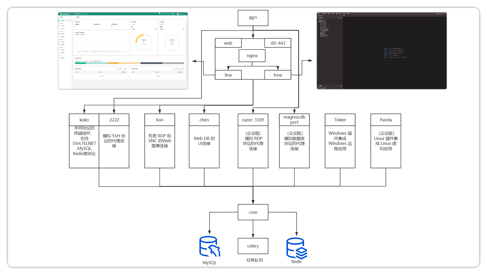

# 概述

!!! warning "Windows 平台推荐使用 VSCode 的 Remote SSH 功能在 Linux 上进行搭建"

## 1 架构图
!!! tip ""
    - JumpServer 分为多个组件，大致的架构以及组织功能如下图所示。

## 2 数据库要求
!!! tip ""
    - MySQL 和 Postgresql 二选一即可, JumpServer 需要使用 MySQL 或 Postgresql 存储数据。

    | Name    | Core                     | Postgresql(推荐)  | mysql | Redis |
    | :------ | :----------------------- | :----- | :------ | :---- |
    | Version | {{ jumpserver.tag }} | >= 16 | >= 5.7| >= 6.0  |
!!! warning "注意"
    启动服务前需要手动创建 JumpServer 的数据库和用户，并且该用户需要拥有对数据库的读写权限。

## 3 仓库说明
!!! tip ""
    - JumpServer 组件的源代码均托管在 GitHub，主要仓库如下：

    | 组件 | 仓库地址 | 说明 |
    | :--- | :------- | :--- |
    | Core | [jumpserver/core](https://github.com/jumpserver/core) | 核心服务 |
    | Luna | [jumpserver/luna](https://github.com/jumpserver/luna) | 前端终端 |
    | Lina | [jumpserver/lina](https://github.com/jumpserver/lina) | Web 终端 UI |
    | KoKo | [jumpserver/koko](https://github.com/jumpserver/koko) | 命令行终端服务 |
    | Lion | [jumpserver/lion](https://github.com/jumpserver/lion) | RDP/VNC 服务 |

    - 各仓库默认以 dev 作为最新开发分支，按版本号命名的分支为该版本发布时的代码快照。