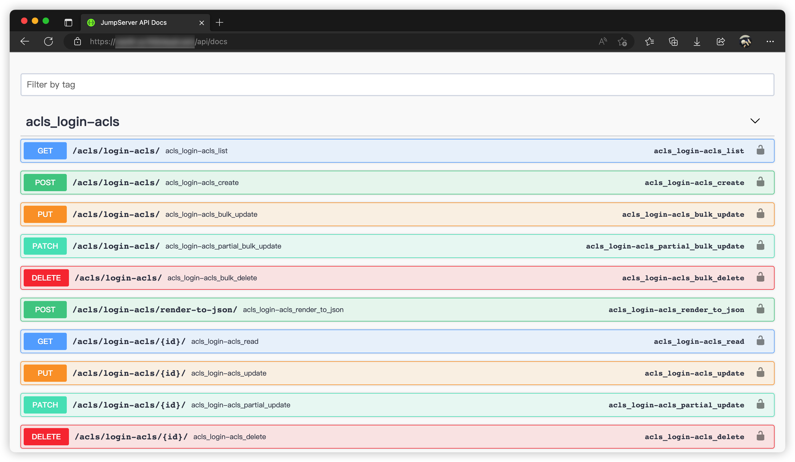

# API Documentation

!!! info "Note"
    API documentation is integrated into the code by default. After deployment is complete, you can access it using the following methods:

## 1 API Access
!!! tip ""

    |  Version                 |       Access Method      |               Example              |
    | ------------------------ | ------------------------ | ---------------------------------- |
    |  `{{ jumpserver.tag }}`  | `http://<url>/api/docs/` | `http://192.168.244.144/api/docs/` |

### 1.1 Page Effect


## 2 API Authentication

!!! tip "JumpServer API supports the following authentication methods:"
    ```
    Session         Can directly use session_id as authentication method after login
    Token           Get a one-time Token with expiration time. Token becomes invalid after expiration.
    Private Token   Permanent Token
    Access Key      Sign Http Header
    ```

    === "Session"
        After logging in through the page, jms_sessionid will exist in cookies. Include jms_sessionid in cookies when making requests.

    === "Token"
        ```sh
        curl -X POST http://localhost/api/v1/authentication/auth/ \
             -H 'Content-Type: application/json' \
             -d '{"username": "admin", "password": "admin"}'
        ```
        === "Python"
            ```python
            import requests
            import json
            
            url = 'http://localhost/api/v1/authentication/auth/'
            data = {
                'username': 'admin',
                'password': 'admin'
            }
            
            response = requests.post(url, json=data)
            token = response.json()['token']
            print(token)
            ```

        === "Golang"
            ```go
            package main
            
            import (
                "bytes"
                "encoding/json"
                "fmt"
                "io/ioutil"
                "net/http"
            )
            
            func main() {
                url := "http://localhost/api/v1/authentication/auth/"
                data := map[string]string{
                    "username": "admin",
                    "password": "admin",
                }
                
                jsonData, _ := json.Marshal(data)
                response, _ := http.Post(url, "application/json", bytes.NewBuffer(jsonData))
                
                body, _ := ioutil.ReadAll(response.Body)
                result := make(map[string]interface{})
                json.Unmarshal(body, &result)
                
                fmt.Println(result["token"])
            }
            ```
        === "Java"
            ```java
            import java.io.InputStream;
            import java.io.OutputStream;
            import java.net.HttpURLConnection;
            import java.net.URL;
            
            public class JumpServerAPI {
                public static void main(String[] args) throws Exception {
                    String url = "http://localhost/api/v1/authentication/auth/";
                    String params = "{\"username\": \"admin\", \"password\": \"admin\"}";
                    
                    URL obj = new URL(url);
                    HttpURLConnection connection = (HttpURLConnection) obj.openConnection();
                    
                    connection.setRequestMethod("POST");
                    connection.setRequestProperty("Content-Type", "application/json");
                    
                    connection.setDoOutput(true);
                    OutputStream os = connection.getOutputStream();
                    os.write(params.getBytes());
                    os.flush();
                    
                    InputStream is = connection.getInputStream();
                    byte[] buffer = new byte[1024];
                    int len;
                    StringBuilder response = new StringBuilder();
                    while ((len = is.read(buffer)) != -1) {
                        response.append(new String(buffer, 0, len));
                    }
                    
                    System.out.println(response.toString());
                }
            }
            ```

    === "Private Token"
        ```sh
        docker exec -it jms_core /bin/bash
        cd /opt/jumpserver/apps
        python manage.py shell
        from users.models import User
        u = User.objects.get(username='admin')
        u.create_private_token()
        ```
        If a private_token already exists, you can get it directly:
        ```python
        u.private_token
        ```
        For example, with PrivateToken: 937b38011acf499eb474e2fecb424ab3:
        ```sh
        curl -H 'Authorization: PrivateToken 937b38011acf499eb474e2fecb424ab3' \
             http://localhost/api/v1/users/users/
        ```

    === "Access Key"
        Create or get AccessKeyID and AccessKeySecret in the API Key list on the Web page.
