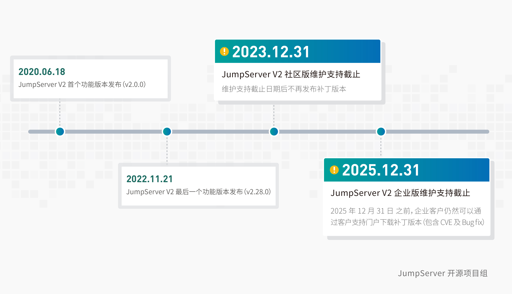

# 生命周期
!!! tip "V2 产品生命周期说明"
    2020年6月，JumpServer开源堡垒机发布V2版本，并坚持按月发布新版本。在JumpServer V2版本编号内，共累计迭代了28个版本，获得了广大用户的支持和喜爱，这也是现阶段安装基础最为广泛的JumpServer版本之一。
    
    2023年7月28日，JumpServer 开源项目组正式发布 JumpServer 开源堡垒机 V2版本产品生命周期相关说明。

    出于产品自身迭代和用户需求升级的要求，2023年2月27日，JumpServer 开源堡垒机正式发布 v3.0版本，目前已更新至 v3.5.0版本。JumpServer 开源项目组建议社区版和企业版用户更新至 JumpServer v3.x版本，以使用更多的新增功能并获取更好的软件使用体验。

    - 请广大 JumpServer 堡垒机用户注意：JumpServer V2版本（社区版）维护支持截止日期为2023年12月31日，JumpServer V2版本（企业版）维护支持截止日期为2025年12月31日。
    - 用户可以根据 JumpServer 维护支持时间表合理安排系统升级及迁移工作。如果您在升级过程中遇到问题，可以[联系 JumpServer 开源项目组获取升级建议和指导](https://docs.jumpserver.org/zh/v3/contact/)。

## V2 产品生命周期时间线图

