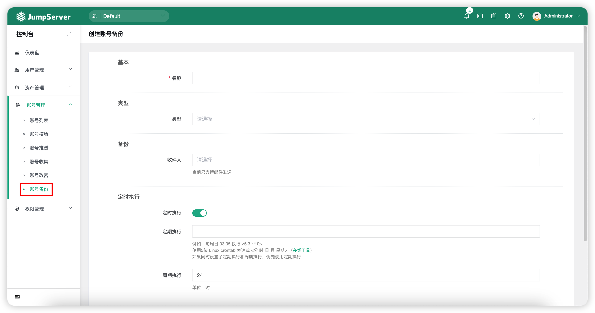
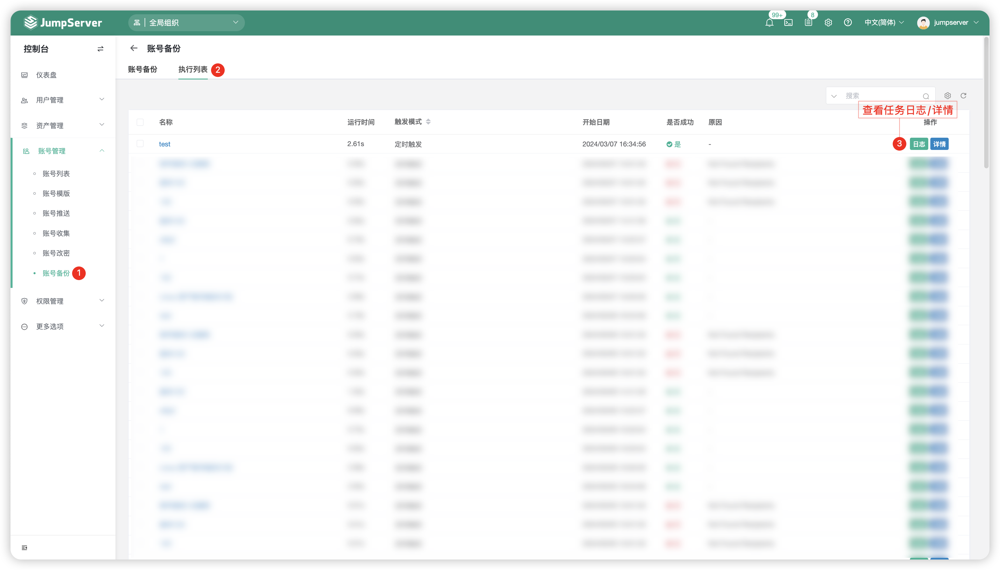

# 账号备份
!!! note "注：账号备份为 JumpServer 企业版功能。"

## 1 功能简述
!!! tip ""
    - 为了防止不可控因素导致服务器出现异常，出现数据损坏、资产账户丢失等环境无法正常运行的情况，JumpServer支持了账户备份功能，该功能可备份JumpServer上所有的资产账户。
    - 备份策略可选择即时备份和定时备份。

## 2 账号备份任务创建
!!! tip ""
    - 点击`账号备份`页面的`创建`按钮，创建一个账号备份任务。

!!! tip ""
    - 详细参数说明：

    | 参数    |                说明                  |
    | ------- | ------------------------------------ |
    | 名称 | 账号备份任务的名称。 |
    | 类型 | 需要备份账号的类型，可以根据账号类型创建备份任务。 |
    | 备份类型 | 支持将账号通过表格的方式备份到邮箱中，或通过SFTP的方式备份。 |
    | 密钥是否拆分成前后两部分 | 是否将账号的密钥拆分，保证安全。 |
    | 收件人A | 备份后的账号会发送一封邮件给用户，设置接收邮件的用户。账号的密钥会被拆分成前后两部分 |
    | 收件人B | 备份后的账号会发送一封邮件给用户，设置接收邮件的用户。账号的密钥会被拆分成前后两部分。 |
    | 定时执行 | 设置该备份任务是否定时任务，备份任务支持定时执行或手动执行。 |

## 3 执行列表
!!! tip ""
    - 点击切换至`账号备份`-`执行列表`页签，该页面主要查看账号备份任务的执行日志、任务详情等详细信息。
