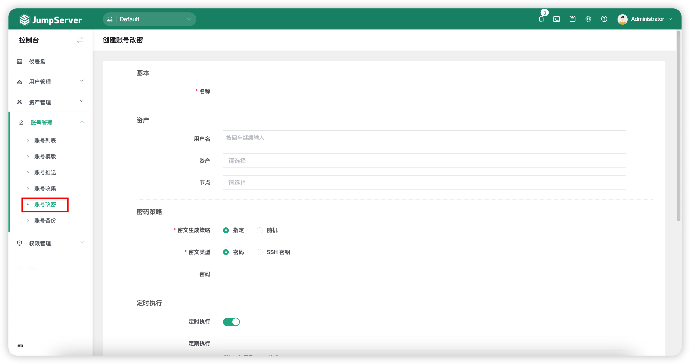
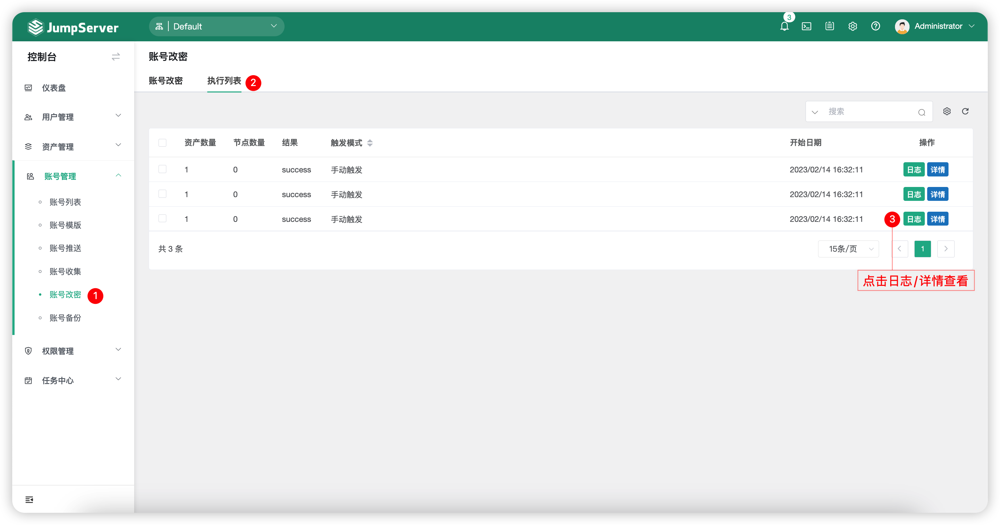

# 账号改密
!!! note "注：账号改密为 JumpServer 企业版功能。"

## 1 功能简述
!!! tip ""
    - 账号改密功能是为了满足用户的安全需求，定期修改资产中的用户密码，减少人力操作。
    - 账号改密功能修改资产中的用户密码是通过该资产配置的特权账号进行操作。
    - 账号改密目前支持 Linux 和部分支持 SSH 协议的资产，Windows 资产需安装 OpenSSH；账号改密目前不支持更改 Windows 域账号密码。

## 2 账号改密任务创建
!!! tip ""
    - 点击`账号改密`页面的`创建`按钮，创建一个账号改密任务。

!!! tip ""
    - 详细参数说明：

    | 参数    |                说明                  |
    | ------- | ------------------------------------ |
    | 名称 | 账号改密自动化任务的名称。 |
    | 用户名 | 需要改密的用户名。 |
    | 资产 | 需要改密的用户名目标资产。 |
    | 节点 | 需要改密的用户名目标资产所在的节点。 |
    | 密码策略-密文生成策略 | 选择被改密的用户的密码策略。   A.指定：管理员用户手动输入密码。   B.随机：JumpServer 自行生成密码。 |
    | 密码策略-密文类型 | 改密用户名的密文类型，支持密码和 SSH 密钥。 |
    | 定时执行 | 选择该自动化任务是否定时执行，设置定时任务执行时间。 |
    | 收件人 | 选择用户接受改密后的邮件通知信息。 |

## 3 执行列表
!!! tip ""
    - 点击切换至`账号改密`-`执行列表`页签，该页面主要查看账号改密任务的执行日志、任务详情等详细信息。

