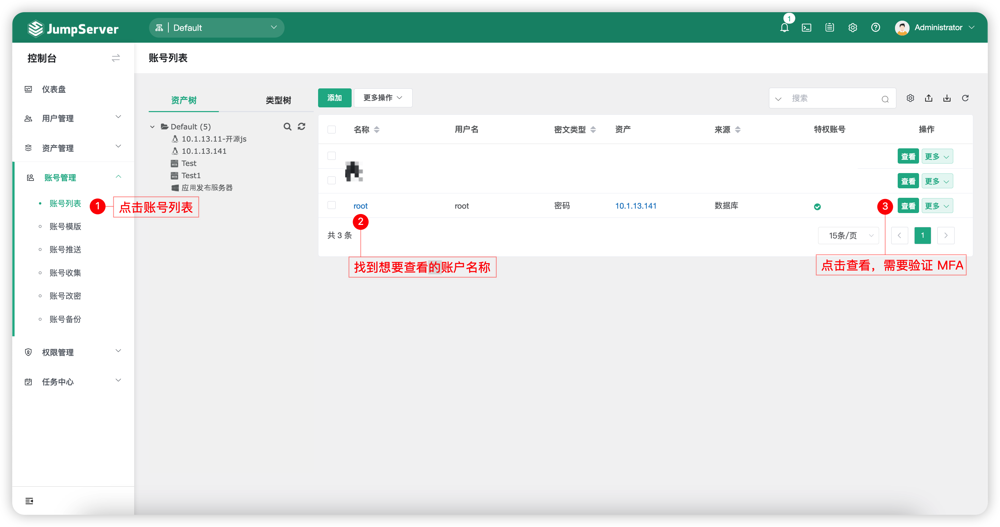
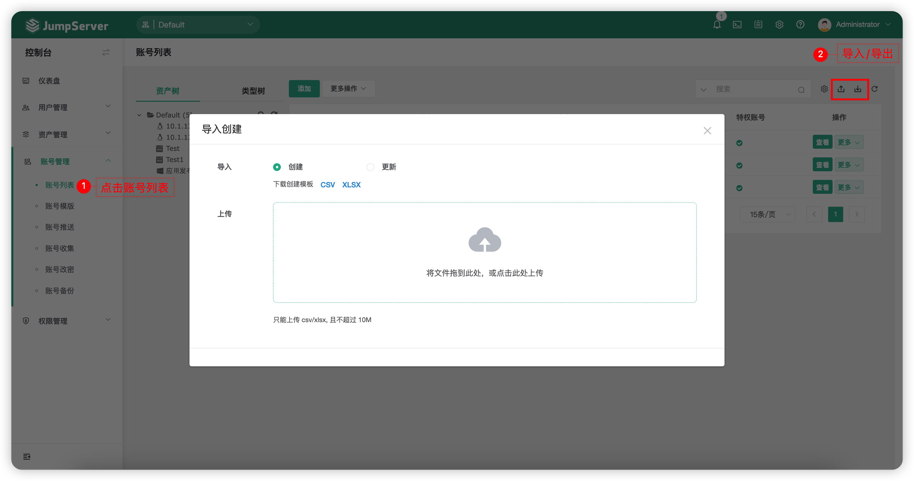

# 账号列表
## 1 功能简述
!!! tip ""
    - JumpServer 支持对资产的账号进行托管管理。

## 2 功能使用
### 2.1 账号信息查看
!!! tip ""
    - 点击页面左侧的资产树或者类型树选择节点或者资产，可以查看相关资产关联的账号信息（默认需要校验管理员账户的MFA）

!!! tip "提示"
    - 查看账号详细信息例如账号密码时需要验证用户的MFA。
    - JumpServer 为提高安全性，默认查看密码需要校验MFA；如需取消验证MFA，可以在JumpServer的配置文件（默认为/opt/jumpserver/config/config.txt）中添加配置项`SECURITY_VIEW_AUTH_NEED_MFA=Flase`并重启 JumpServer 服务。

### 2.2 账号信息导入/导出
!!! tip ""
    - 可以针对账户信息批量导入/导出，JumpServer 支持导出所有资产关联账号的详细信息与账号密码。

 

