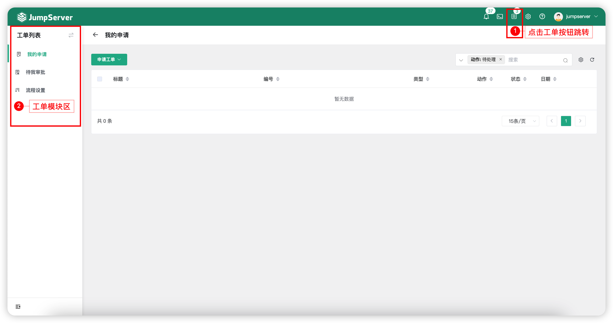
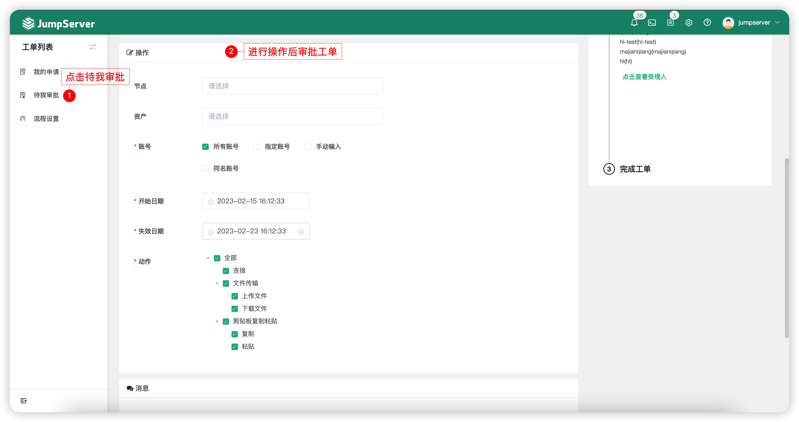
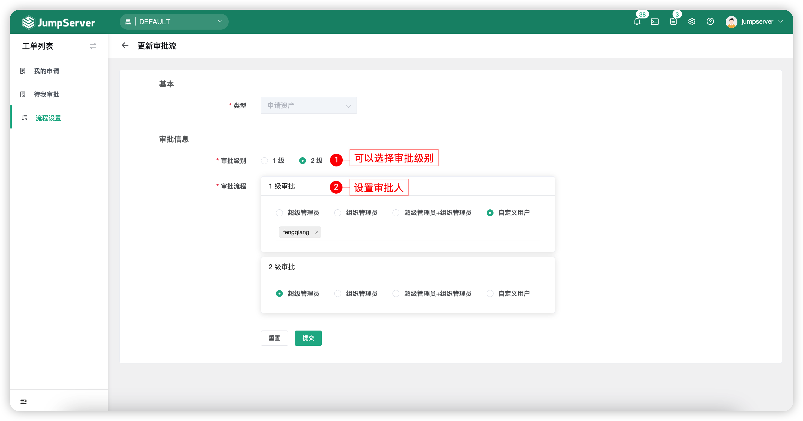

# 工单
!!! note "注：工单为 JumpServer 企业版功能。"

## 1 功能简述
!!! tip ""
    - 工单功能主要负责授权工单的申请与审核，同时 JumpServer 堡垒机支持二级审批流程。
    - 工单功能支持对 JumpServer 用户登录请求的行为以及命令过滤功能进行限制。
    - 用户点击申请、申请授权工单信息，根据设置完成的流程对应的审批人审批通过后，用户即可获得申请资产的权限或用户登录请求与命令过滤。

## 2 我的申请
!!! tip ""
    - 我的申请页面主要进行资产授权的申请、查看资产授权工单详情。

### 2.1 申请工单
!!! tip ""
    - 在我的申请页面点击`申请工单`按钮。
    - 选择`申请资产授权`按钮，进入资产授权申请页面如下所示：

!!! tip ""
    - 详细参数说明：

!!! tip ""

    | 参数     | 说明                  |
    | ------- | --------------------- |
    | 标题 | 该工单的标题。 |
    | 组织 ID | 该工单所申请的权限以及 JumpServer 用户所处的组织。 |
    | 节点 | JumpServer 用户申请的资产，节点指申请整个节点下所有资产的权限。 |
    | 资产 | JumpServer 用户申请的资产。 |
    | 申请账号 | JumpServer 用户申请的资产所使用的登录账号。 |
    | 动作 | JumpServer 用户申请拥有的动作权限。 |
    | 开始日期、失效日期 | 用户申请的权限使用的期限。 |

### 2.2 查看工单
!!! tip ""
    - 点击创建好的`工单标题`按钮，可进入工单详情页中。
    - 工单详情页中包含该工单的基本信息、申请信息以及审批人同时可以与审批人进行对话。

### 2.3 关闭工单
!!! tip ""
    - 申请人在审批人未审批前可自行关闭工单，关闭入口位于工单详情页下方。

## 3 待我审批
!!! tip ""
    - 在待我审批页面，点击`工单名称`按钮，对工单进行查阅审批。
    - 审批人查看工单时，可修改申请人申请的资产、账号、动作等权限。

## 4 流程设置
### 4.1 查看
!!! tip ""
    - 点击`申请资产`按钮即可进入申请资产的流程详情页，查看申请资产工单的基本信息以及审批信息。

!!! tip "审批人流转规则如下："
    - 审批人为超级管理员，申请人为普通用户时正常流转。
    - 审批人为两个用户时，当其中一个用户申请工单时，审批流程只会流转到另一个用户。
    - 审批人并不局限于组织内，某一个用户不存在于当前组织但只要条件符合也会流转到用户。

### 4.2 更新
!!! tip ""
    - 点击申请资产流程后方的`更新`按钮，即可进入流程更新页面，调整审批的级别与审批流程信息。
