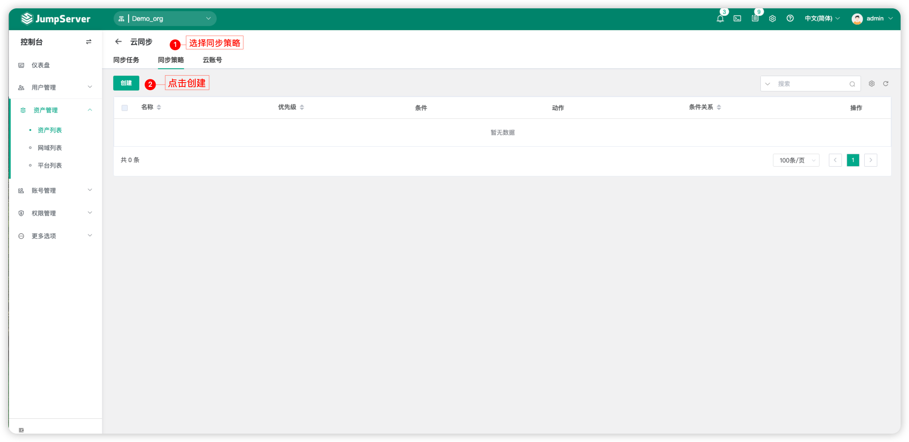
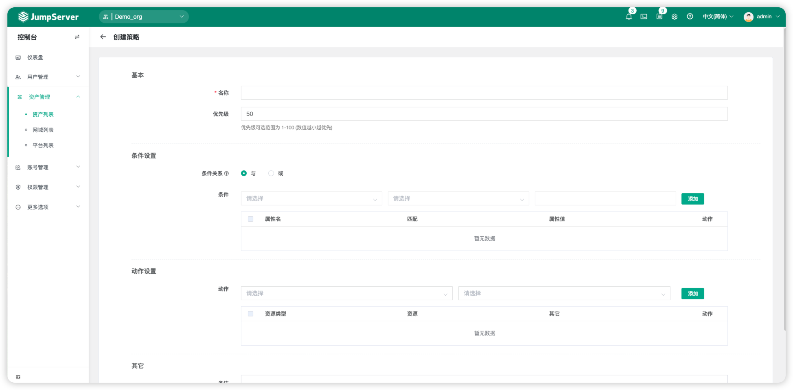

# 资产列表
!!! note "注：云同步为 JumpServer 企业版功能。"
!!! note "注：Oracle、PostgreSQL、SQL Server、ClickHouse 数据库均为 JumpServer 企业版功能。"

## 1 资产树与类型树
### 1.1 资产树
!!! tip ""
    - 资产树是对资产类别的一个划分，对于每个资产，可以按照不同维度进行划分，同一资产可以存在多维度的划分，例如：按照组织划分、按照项目划分、按照协议划分等等。
    - 划分节点后，可以灵活的分配用户权限，达到高效管理主机的目的。
    - 资产树根节点不能重名，右击节点可以添加、删除和重命名节点，以及资产的相关操作。

!!! tip ""
    - 详细参数说明：

    | 参数    |                说明                  |
    | -------| ------------------------------------ |
    | 创建节点 | 在当前节点下创建一个新的子节点。  |
    | 重命名节点 | 重命名节点。 |
    | 删除节点 | 删除当前节点。 |
    | 添加资产到节点 | 将其他节点的资产添加到当前节点下，原节点下资产不会被移除。 |
    | 移动资产到节点 | 将其他节点的资产移动到当前节点下，原节点下的资产会被移除。 |
    | 更新节点资产硬件信息 | 拉起自动化任务，批量更新当前节点下资产硬件信息。   注：需当前节点下的资产开启了自动化任务并配置正确的特权用户，该功能只支持 SSH 协议。|
    | 测试资产节点可连接性 | 拉起自动化任务，批量更新当前节点下资产的可连接性。   注：需当前节点下的资产开启了自动化任务并配置正确的特权用户，该功能只支持 SSH 协议。 |
    | 仅显示当前节点资产 | 只显示当前节点下的资产，不显示子节点下的资产。 |
    | 显示所有子节点资产 | 当前节点下和所有子节点下的资产都显示出来，不论子节点下是否还有多层子节点。 |
    | 校对资产数量 | 校对当前节点下的资产数量。 |
    | 显示节点详情 | 显示当前节点的详细信息，包含节点ID、名称与全称。 |

### 1.2 类型树
!!! tip ""
    - 类型树是对资产的另一种区分，JumpServer将主机、网络设备、数据库等均归类于JumpServer资产，类型树主要主要统计每一种类型的资产数量更直观的查看资产分布。

## 2 资产类型
!!! tip ""
    - JumpServer 将主机、网络设备、数据库等等均归类于 JumpServer 资产。
    - 管理员用户可以自行在平台列表中自定义平台类型。
    - 主机类型中默认包含 Linux 资产、Windows 资产、Unix 资产等。

!!! tip ""
    - 网络设备类型中默认包含 General、Cisco 等。

!!! tip ""
    - 数据库类型中默认包含 MySQL、MariaDB、Oracle、Redis 等。

!!! tip ""
    - 云服务中默认包含私有云与 Kubernetes。

!!! tip ""
    - Web 类型中默认包含网站。

!!! tip ""
    - GPT 类型中默认包含 ChatGPT。

## 3 资产创建
### 3.1 手动创建单个资产
=== "主机"
    !!! tip ""
        - JumpServer 支持手动创建资产，资产的创建需要填入资产的基本信息、账号、节点信息等必要信息。
        - 点击资产分类进入具体的分类页面（以 Linux 主机为例）
        - 点击页面左上角的`创建`按钮，进入资产创建页面，填写资产详细信息。
    

    !!! tip ""
        - 详细参数说明：

        | 参数    |                说明                  |
        | -------| ------------------------------------ |
        | 名称 | 必填项，该资产在 JumpServer 中的名称，与资产本身计算机名无关，不可重名。  |
        | IP/主机 | 必填项，资产的真实 IP 或 VIP 或域名。允许重名。 |
        | 资产平台 | 默认项，资产的资产平台，各个平台可以设置不同的字符编码及连接参数以及改密命令。 |
        | 节点 | 必填项，该资产所属于的节点。 |
        | 协议组 | 必填项，资产访问时用到的协议，可选一个或多个。 |
        | 账号列表 | 必填项，该资产的账号，可创建多个账号。账号与资产绑定。 |
        | 网域 | 可选项，针对某些跨网段资产，需要以网域网关（sshpass）为代理进行访问。 |
        | 标签 | 可选项，给该资产添加的标签, 方便管理。 |
        | 激活 | 必选项，该资产是否可使用。 |

=== "GPT"
    !!! tip ""
        - JumpServer 支持创建 GPT 资产，资产的创建需要填入资产的基本信息、代理地址、账号、节点信息等必要信息。
    

    !!! tip ""
        - 详细参数说明：

        | 参数    |                说明                  |
        | -------| ------------------------------------ |
        | 名称 | 必填项，该资产在 JumpServer 中的名称，与资产本身计算机名无关，不可重名。  |
        | 地址 | 必填项，Chat.openai 的地址。 |
        | 资产平台 | 默认项，资产的资产平台。 |
        | 节点 | 必填项，该资产所属于的节点。 |
        | HTTP(s) 代理 | 如果服务器不能直接访问 API 地址，你需要设置一个 HTTP 代理。例如 http(s)://host:port |
        | 账号列表 | 必填项，该资产的账号，可创建多个账号。账号与资产绑定。 |
        | 标签 | 可选项，给该资产添加的标签, 方便管理。 |
        | 激活 | 必选项，该资产是否可使用。 |

=== "Website"
    !!! tip ""
        - [Website 资产创建方式参考](https://docs.jumpserver.org/zh/v3/guide/system/remoteapp/#31-website)

### 3.2 通过 Excel 批量导入资产
!!! tip ""
    - JumpServer 支持通过Excel表格导入进行批量创建、更新资产。
    - JumpServer 提供两种模板信息，csv 与 xlsx 模板。
    - 首次导入资产，可点击资产列表的右上角`导入`按钮，下载导入模板后根据模板提示填写需要导入或更新的信息，填写完成后在导入页面导入文件即可。

### 3.3 云同步
!!! tip ""
    - JumpServer 堡垒机提供云主机同步功能。
    - 云同步功能支持将云资产同步到 JumpServer 堡垒机中。
    - 通过创建云账号和同步实例将阿里云、腾讯云、华为云、百度云、京东云、金山云、AWS(中国)、AWS(国际)、Azure(中国)、Azure(国际)、谷歌云、VMware、青云私有云、华为私有云、天翼私有云、OpenStack、Nutanix、Fusion Compute、局域网等云资产同步到 JumpServer 资产列表。

!!! tip ""
    - 点击页面左侧`资产列表`按钮，进入资产列表页面。
    - 点击资产列表页面的`主机`页签，点击`云同步`按钮，进入云同步页面。

!!! tip ""
    - 点击云同步页面的`云账号`页签，在此页面上创建云账号，以腾讯云为例(在腾讯云的账号页面获取腾讯云的相关密钥)

!!! tip ""
    - 点击云同步页面的`同步策略`页签，在此页面上创建同步策略。

!!! tip ""
    - 点击云同步页面的`同步任务`页签，在此页面上创建同步任务实例。

!!! tip ""
    - 详细参数说明：

    | 参数    |                说明                  |
    | -------| ------------------------------------ |
    | 名称 | 同步任务的名称。 |
    | 云账号 | 同步源的账号，即账号列表中的账号。 |
    | 地域 | 账号列表中可识别的地域，即需求同步的资产所处的地域。 |
    | 主机名策略 | 同步资产的主机名，选择`实例名称`或`实例名称+部分 IP` |
    | IP网段组 | 同步资产被匹配的 IP 网段组。如果匹配成功，资产即可被同步。 |
    | 同步IP类型 | 同步资产被同步的 IP 类型，私有 IP 或者公网 IP。 |
    | 资产信息保持最新 | 每次执行同步任务时，是否更新资产的所有信息。 |
    | 资产完全同步 | 当资产条件不满足匹配资产策略时，是否继续同步此类资产。 |
    | 策略 | 选择需要匹配的策略。 |
    | 定时执行 | 是否开启定时执行。 |

!!! tip ""
    - 点击`提交`按钮后，同步实例任务创建完成。
    - 同步任务可定时执行也可手动执行。
    - 手动执行即点击同步任务实例后方的`更多`按钮，选择`执行`按钮，即可执行同步任务。

## 4 资产更新
!!! tip ""
    - 当需求对某一个资产的信息进行更新时，可点击资产后方的`更新`按钮，进入资产信息更新页面，更新资产相关信息。

## 5 资产详情
!!! tip ""
    - 在`资产列表`页面点击`资产名称`，进入`资产详情`页面。
    - 资产详情页包含的信息包括资产基本信息、资产账号列表、授权用户、会话记录、命令记录、资产活动记录。

!!! tip ""
    - 详细参数说明：

    | 参数    |                说明                  |
    | -------| ------------------------------------ |
    | 基本信息 | 基本信息模块主要介绍资产的信息，包括名称、协议、资产平台等。 |
    | 快速更新 | 快速更新模块主要进行资产的自动化任务执行，例如：更新资产硬件信息与资产可连接性。 |
    | 节点 | 节点模块可以调整资产所属的模块。 |
    | 标签 | 标签模块可以查看资产所属的标签。 |
    | 账号列表 | 账号列表模块主要包含资产绑定的账号信息，在此模块进行账号的增加、删除、查看、修改。 |
    | 授权用户 | 授权用户模块主要介绍资产被授权的用户以及用户组并查看对应的授权规则。 |
    | 会话记录 | 会话记录模块记录该资产的会话信息，包括连接用户、连接时间等。 |
    | 命令记录 | 命令记录模块主要记录该资产上执行过的命令记录。 |
    | 活动记录 | 活动记录模块主要查看资产最近30次的日志，包含更新日志和会话记录。 |

## 6 资产删除
!!! tip ""
    - 当需要删除某个资产时，可以点击相应的资产后方的`更多`按钮，选择`删除`按钮，点击删除即可。
 