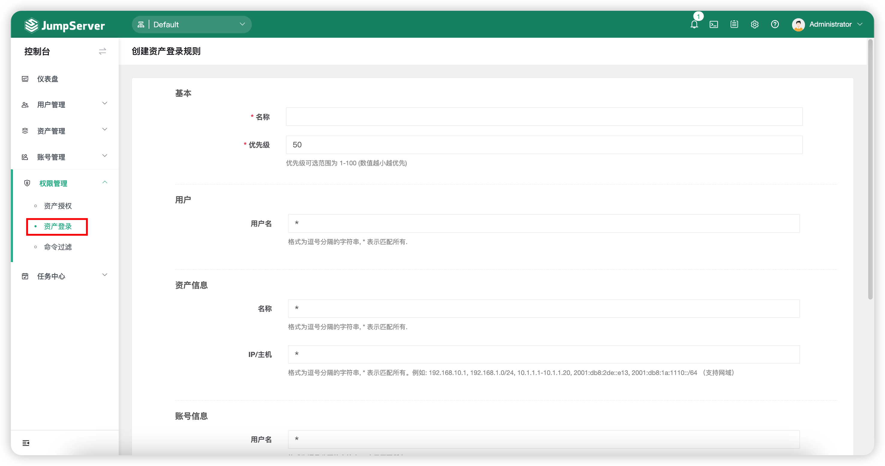

# 资产登陆
!!! note "注：登陆复核为 JumpServer 企业版功能。"

## 1 功能简述
!!! tip ""
    - JumpServer 支持对资产登录进行二次复核功能。
    - 依据安全策略，系统可以针对 JumpServer 登录用户、资产信息、账号信息三个维度对资产的登录进行限制，当设置二次复核动作时，执行审批人审批资产登录。
    - JumpServer 登录用户、资产信息、账号信息、动作四种限制可以组合使用。

## 2 资产登陆规则的创建
!!! tip ""
    - 点击`权限管理`-`资产登陆`页面的`创建`按钮，填写资产登陆规则的信息。

!!! tip ""
    - 详细参数说明：

!!! tip ""

    | 参数    |                说明                  |
    | ------- | ------------------------------------ |
    | 名称 | 资产登录规则的名称。 |
    | 优先级 | 资产登录规则的优先级，优先级可选范围为1~100，数值越小规则匹配越优先，默认为50。 |
    | 用户-用户名 | 当使用该用户登录 JumpServer 堡垒机并连接下面选项的资产时匹配该资产登录规则。 |
    | 资产信息名称 | 在进行连接资产操作时，资产登录规则会匹配该资产信息名称。 |
    | IP/主机 | 当连接该资产 IP 时匹配该资产登录规则。 |
    | 账号信息-用户名 | 当连接资产使用该用户名时匹配该资产登录规则。 |
    | 动作 | 匹配到该资产登录规则时做出的动作。   A."拒绝"：拒绝登陆资产；  B."接收"：允许登陆资产；  C."审批"：经过设置的审批人审批允许或者拒绝登陆。 |
