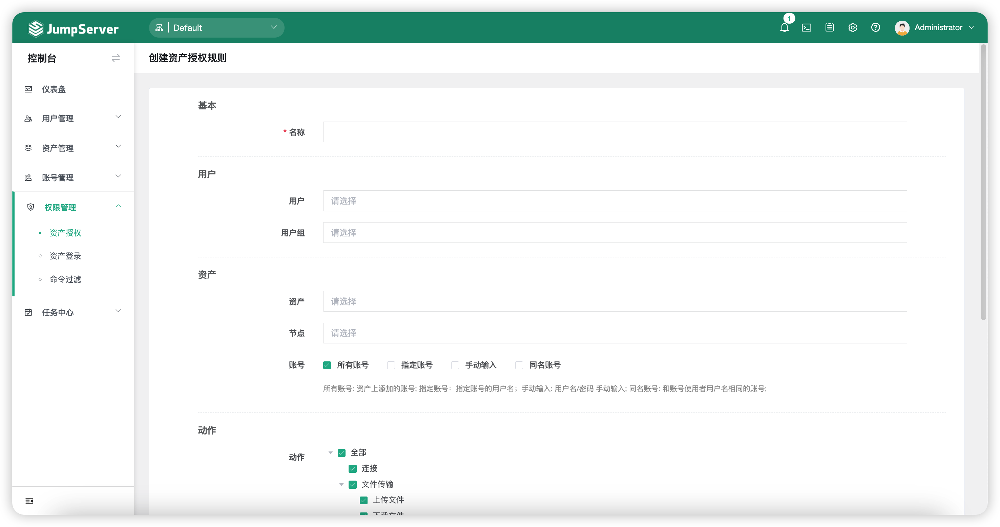
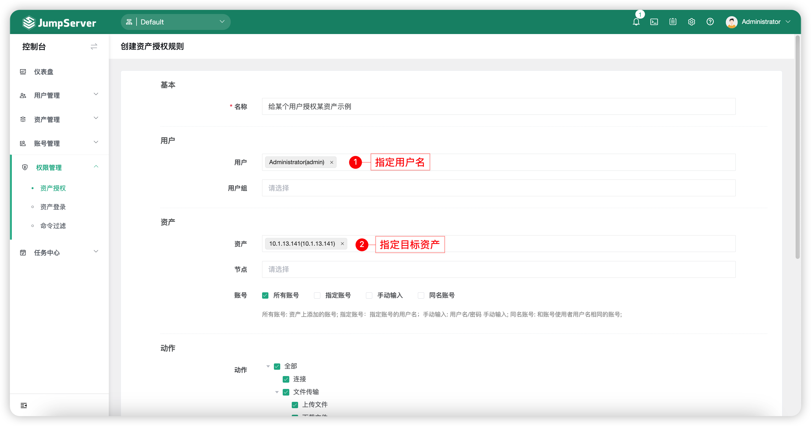
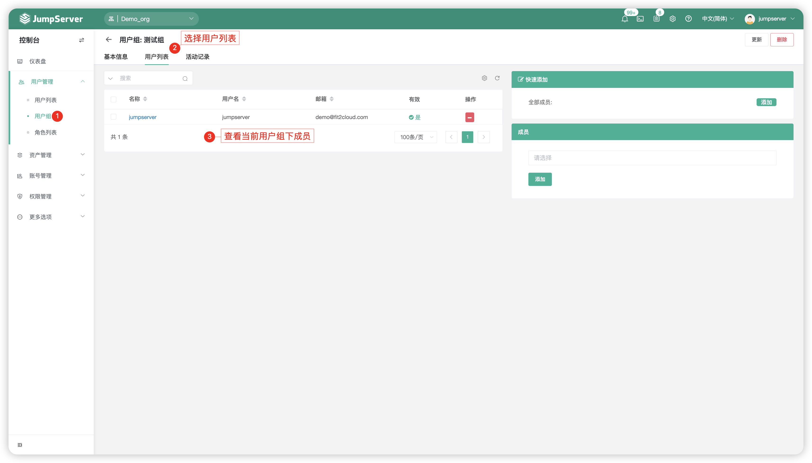
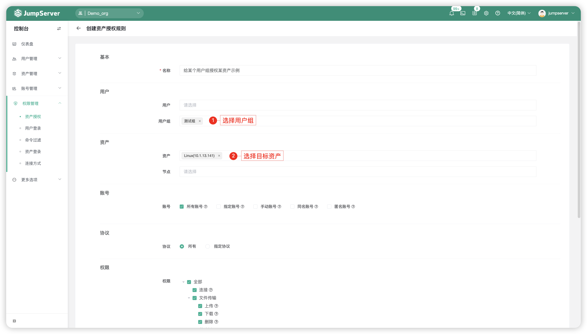

# 资产授权
## 1 功能简述
!!! tip ""
    - 资产的授权规则通过三个维度确定用户能使用哪个资产登录账号访问哪些资产并且拥有什么样的权限。

!!! tip ""
    - 资产授权规则三个维度分别如下:

!!! tip ""

    | 序号 | 维度   |                说明                  |
    | -- | ------- | ------------------------------------ |
    | 1 | 用户 | 用户维度主要包括用户与用户组（代表该用户组下所有的用户） |
    | 2 | 资产 | 资产维度主要包括资产、节点（资产组的概念，代表该节点下的所有资产）、账号（登录资产的账号） |
    | 3 | 动作 | 动作维度主要包括连接权限、上传下载权限、复制粘贴权限（仅支持SSH协议、RDP协议和VNC协议） |

## 2 创建资产授权规则
!!! tip ""
    - 点击资产授权页面的`创建`按钮，即进入资产授权创建页面。

!!! tip ""
    - 详细参数说明：

    | 参数    |                说明                  |
    | ------- | ------------------------------------ |
    | 名称 | 授权规则的名称。 |
    | 用户 | JumpServer 登录用户，即给该用户授权后续资产的连接或其它权限。 |
    | 用户组 | JumpServer 登录用户组，即给该用户组授权后续资产的连接或其它权限。 |
    | 资产 | 授权的资产，即用户需求连接的资产。 |
    | 节点 | 授权的节点，即用户需求连接的资产组。 |
    | 账号 | 授权资产登录的账号。   A.所有账号：资产上添加的所有账号都授权；   B.指定账号：手动输入需要授权的账号名称；   C.手动输入：授权用户连接时自行输入用户名/密码；   D.同名账户：授权用户连接时使用与用户同名的账号 |
    | 动作 | 授权的动作，即用户对资产可以做什么。   注：剪贴板权限控制目前仅支持RDP/VNC协议的连接。 |
    | 开始日期 | 该授权规则开始的时间，默认为该授权规则创建的时间。 |
    | 失效日期 | 该授权规则失效的时间。 |

## 3 资产授权示例
### 3.1 仅给某个用户授权某资产
!!! tip ""
    - 选择将`用户模块`中的`用户`选项选择为需要授权的用户，`用户组`选项置空；
    - 选择将`资产模块`中的`资产`选项为需要登录的资产，`节点`选项为空，`账号`选择所有账户。

!!! tip ""  
    - 授权规则截图如下：

### 3.2 给某个用户组授权某资产
!!! tip ""
    - 选择将`用户模块`中`用户组`选项选择为需要授权的用户组，`用户`选项为空；
    - 选择将`资产模块`中的`资产`选项选择为需要登录的资产，`节点`选项为空，`账号`选择所有账户。

!!! tip ""
    - 用户组截图如下：

!!! tip ""
    - 授权规则截图如下：

!!! warning "注意"
    - 授权规则模块中的任何选项都为空的情况下，该授权规则不起任何作用。 
    - 授权规则模块中的任一模块选项都为空的情况下，该授权规则不起任何作用。 
    - 授权规则不能使用“*”进行全匹配。

