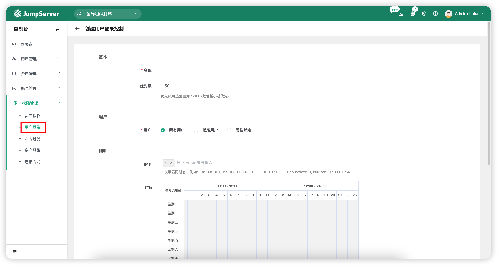

# 用户登录

## 1 功能简述
!!! tip ""
    - JumpServer 支持对用户登录进行二次复核功能。
    - 依据安全策略，系统可以针对 JumpServer 登录用户属性来对用户的登录进行限制，当设置二次复核动作时，执行审批人审批用户登录。

## 2 用户登录规则的创建
!!! tip ""
    - 点击`权限管理`-`用户登录`页面的`创建`按钮，填写用户登录规则的信息。

!!! tip ""
    - 详细参数说明：

    | 参数    |                说明                  |
    | ------- | ------------------------------------ |
    | 名称 | 用户登录规则的名称。 |
    | 优先级 | 用户登录规则的优先级，优先级可选范围为1~100，数值越小规则匹配越优先，默认为50。 |
    | 用户 | A."所有用户"：所有用户资源；   B."指定用户"：指定用户资源；   C."属性筛选"：根据属性名来匹配属性值筛选目标资源。 |
    | IP组 | 限制用户登录的IP地址。 |
    | 时段 | 限制用户登录的时间段。 |
    | 动作 | 匹配到该用户登录规则时做出的动作。  A."拒绝"：拒绝用户登录；  B."接收"：允许用户登录；  C."审批"：经过设置的审批人审批允许或者拒绝登录。 |