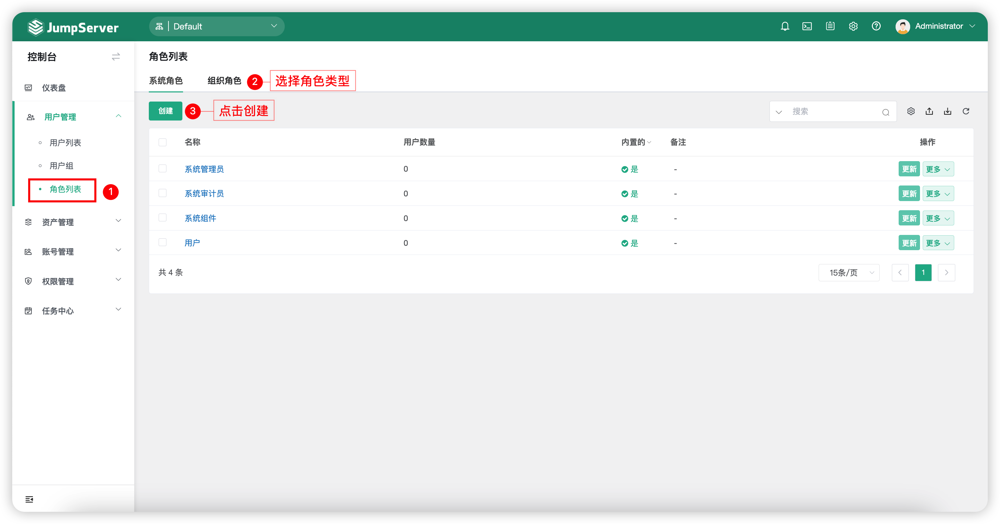
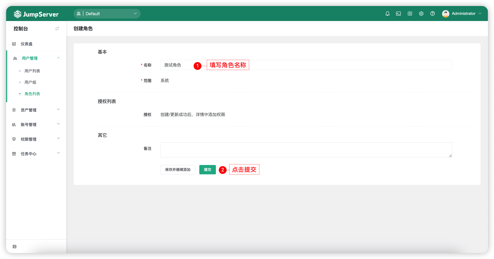
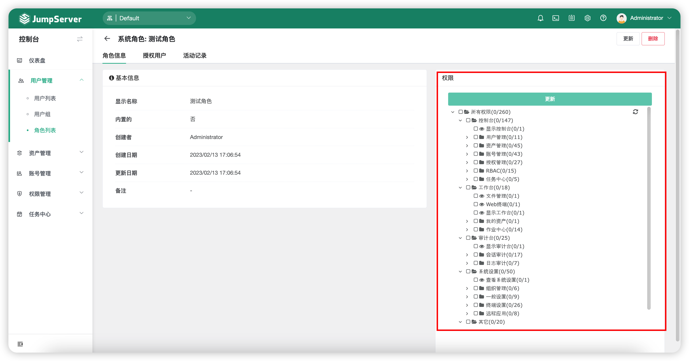
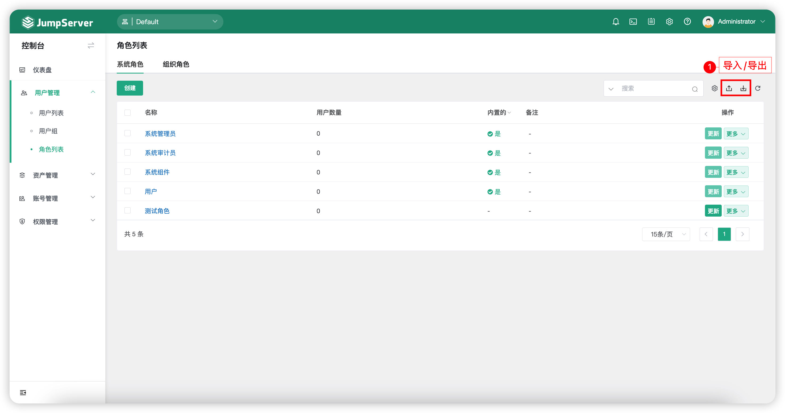
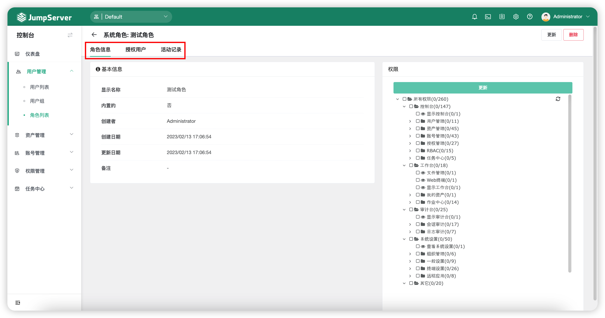
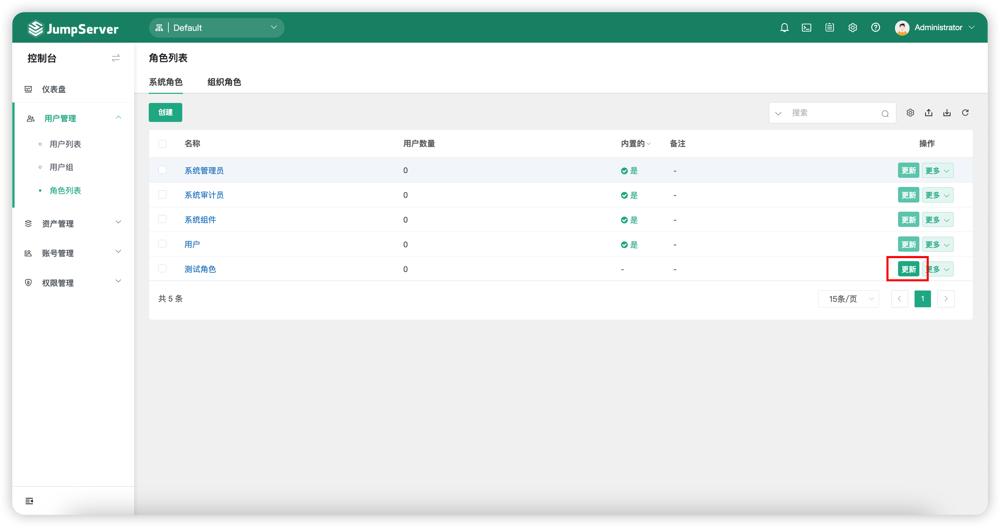
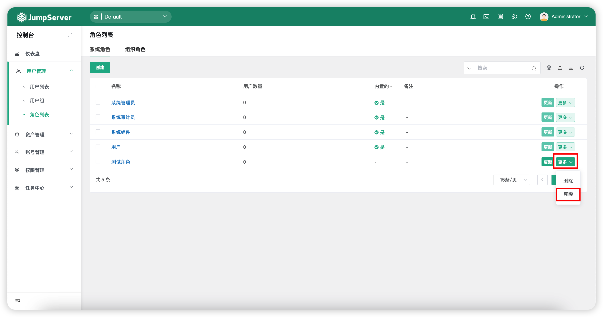
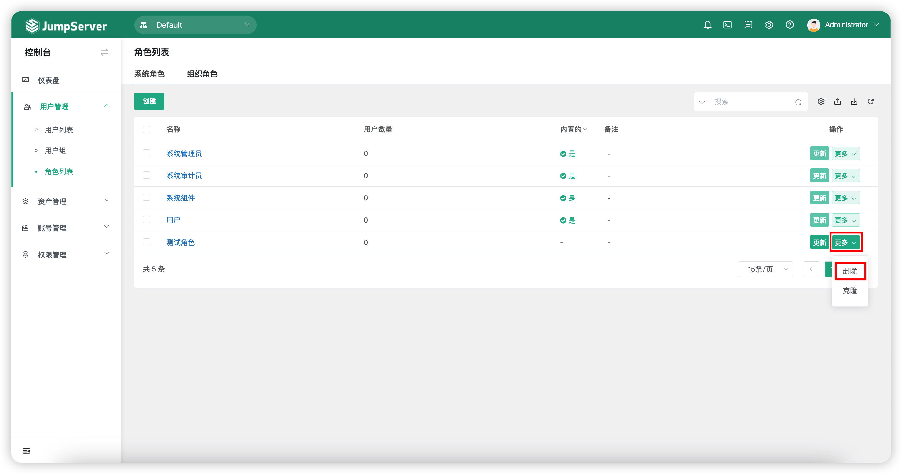

# 角色列表
## 1 功能简述
!!! tip ""
    - JumpServer 系统中角色可以分为系统角色和组织角色。
    - 系统角色默认有系统管理员、系统审计员、用户与系统组件；组织角色默认有组织管理员、组织审计员、组织用户。默认角色不可以进行删除，更新等操作。

## 2 创建角色
!!! tip ""
    - 点击`角色列表`页面左侧上方的`创建`按钮，进入角色创建页面。
    - 系统角色与组织角色均可新建。

!!! tip ""
    - 创建角色成功后，进入新创建的角色详情页，可以对该角色进行权限设置。
    - 如下图，右边部分为角色的权限设置。根据需求的权限更新设置后，点击`更新`按钮提交。

## 3 角色导入导出
!!! tip ""
    - 角色支持导入创建和已存在角色导出，支持 xlxs 和 cvs 的表格格式。
    - 首次导入，可点击`导入`按钮下载模板后根据提示填写信息后导入。

## 4 角色详情
!!! tip ""
    - 在`角色列表`页面点击`角色名称`，进入`角色详情`页面。
    - 角色详情页包含的信息包括角色基本信息、角色权限、授权用户以及角色活动记录。

!!! tip ""
    - 详细参数说明：

!!! tip ""

    | 参数    |                说明                  |
    | -------| ------------------------------------ |
    | 基本信息 | 基本信息页面显示该角色的详细信息，包括名称、是否内置、创建者等信息。 |
    | 权限 | 该选项用来设置当前角色的权限，是否可以使用目前这些功能。 |
    | 授权用户 | 该页面用来绑定角色与用户，即给某个用户赋于该角色的权限。 |
    | 活动记录 | 该页面显示当前角色的活动记录。 |

## 5 更新角色
!!! tip ""
    - 当需求对某个角色的信息进行更新时，可在`角色列表`页面中，点击角色后方的`更新`按钮进行角色信息更新。

## 6 克隆角色
!!! tip ""
    - 点击角色后方的`更多`按钮选择`克隆`按钮，进入角色创建界面，修改相关信息后，提交后修改角色权限即克隆完成。
    - 所有角色均支持克隆，克隆后，在角色详情页可以选择进行该角色的权限。

## 7 删除角色
!!! tip ""
    - 系统默认角色不允许删除，非内置角色可进行删除。
    - 点击角色后方的`删除`按钮，删除角色。
 