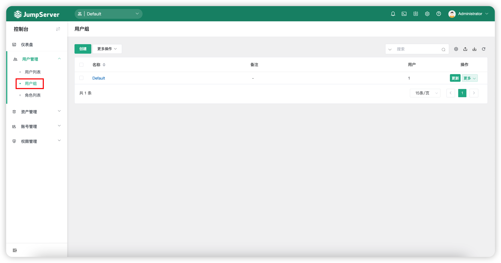
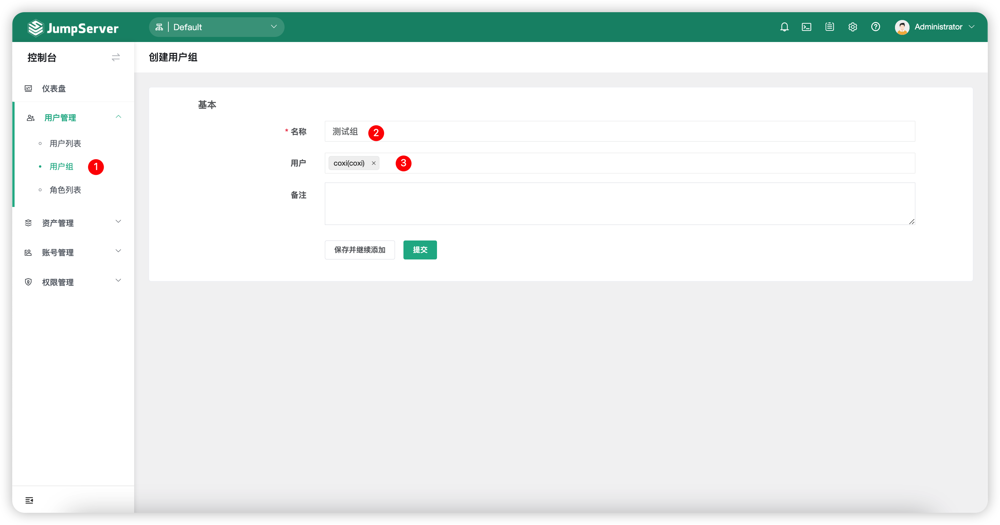
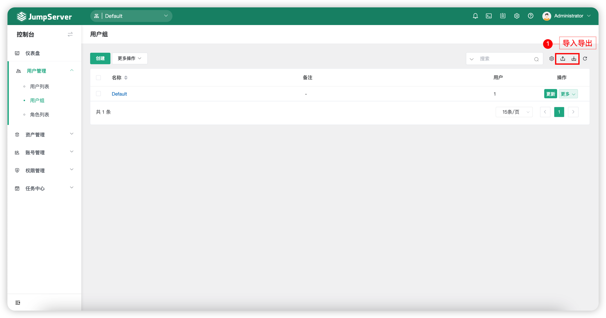
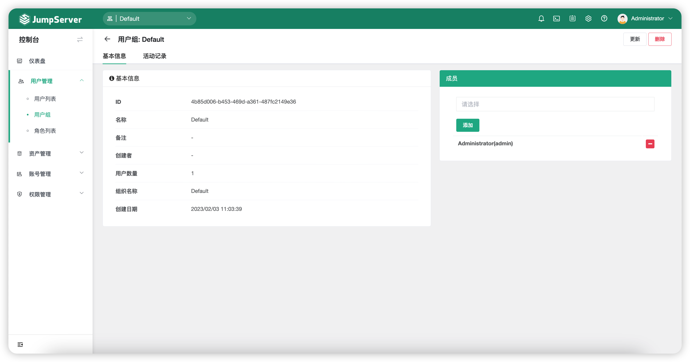
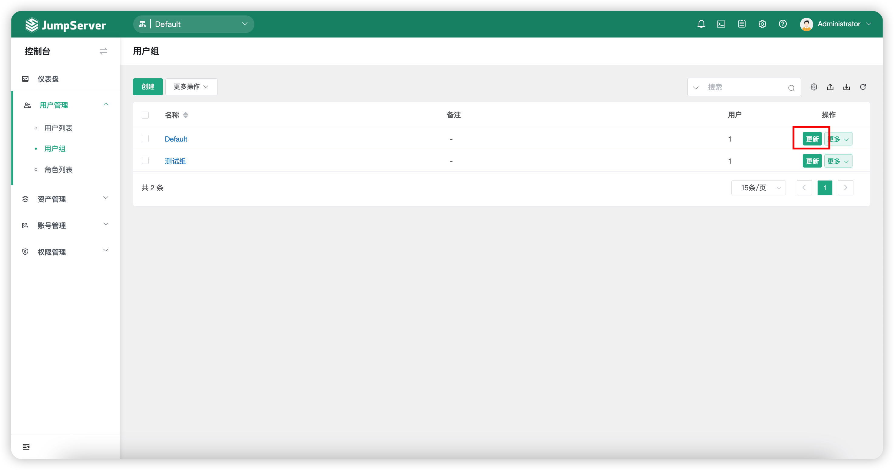
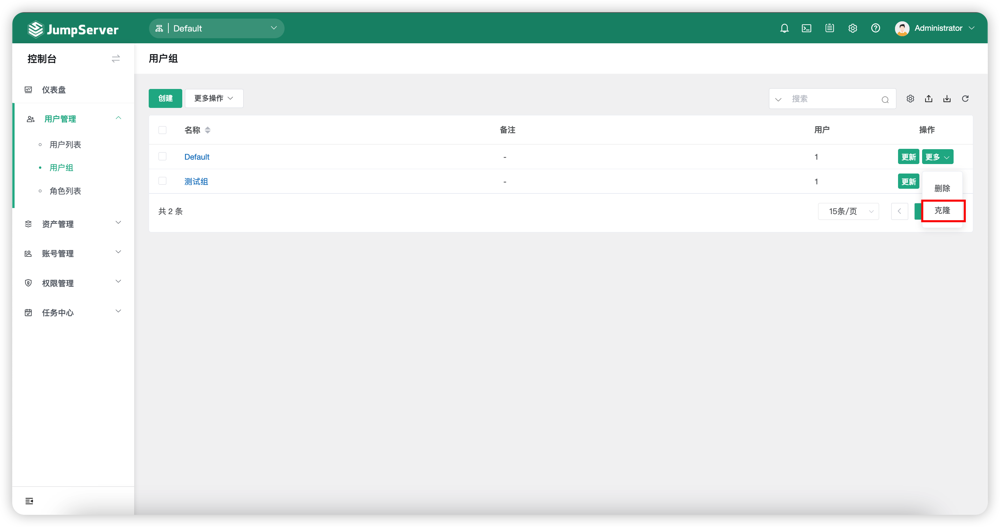
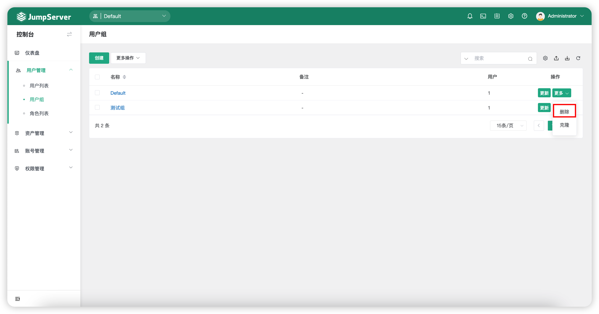

# 用户组
## 1 功能简述
!!! tip ""
    - 点击`用户管理`-`用户组`按钮，进入用户组页面。
    - 该页面主要针对于用户组，包括用户组的创建、删除、更新、查看。
    - 用户组是对用户进行分组管理，在分配资产权限的时候，可针对用户组进行授权，一个用户支持加入多个用户组。

## 2 创建用户组
!!! tip ""
    - 点击`用户组`页面的`创建`按钮，进入用户组创建页面。
    - 填写用户组相关信息，点击`提交`按钮后创建用户组完成。

!!! tip ""
    - 详细参数说明：

!!! tip ""

    | 参数    |                说明                  |
    | -------| ------------------------------------ |
    | 名称 | 用户组名称。  |
    | 用户 | 将用户添加到该用户组中。 |

## 3 用户组导入导出
!!! tip ""
    - 用户组支持导入创建和已存在用户组导出，支持 xlxs 和 cvs 的表格格式。
    - 首次导入，可点击`导入`按钮下载模板后根据提示填写信息后导入。

## 4 用户组详情
!!! tip ""
    - 在`用户组列表`页面点击`用户组名称`，进入`用户组详情`页面。
    - 用户组详情页包含的信息包括用户组基本信息以及活动记录。

!!! tip ""
    - 详细参数说明：

!!! tip ""

    | 参数    |                说明                  |
    | -------| ------------------------------------ |
    | 基本信息 | 基本信息页面显示该用户组的详细信息，包括ID、名称、用户数量、创建者等信息。 |
    | 成员 | 该选项可增加或删除该用户组中的成员。 |
    | 活动记录 | 该选项记录该用户组的活动记录，创建时间、创建人等等信息。 |

## 5 更新用户组
!!! tip ""
    - 对于用户组信息变动情况，可以对用户组信息进行更新。点击`对应用户组`后方的`更新`按钮，进入用户信息页，改动后点击`提交`按钮即可。

## 6 克隆用户组
!!! tip ""
    - 当需要删除用户组时，可以点击相应的用户组后方的`更多`按钮，选择`删除`按钮，点击删除即可。

## 7 删除用户组
!!! tip ""
    - 当需要删除用户组时，可以点击相应的用户组后方的`更多`按钮，选择`删除`按钮，点击删除即可。
 