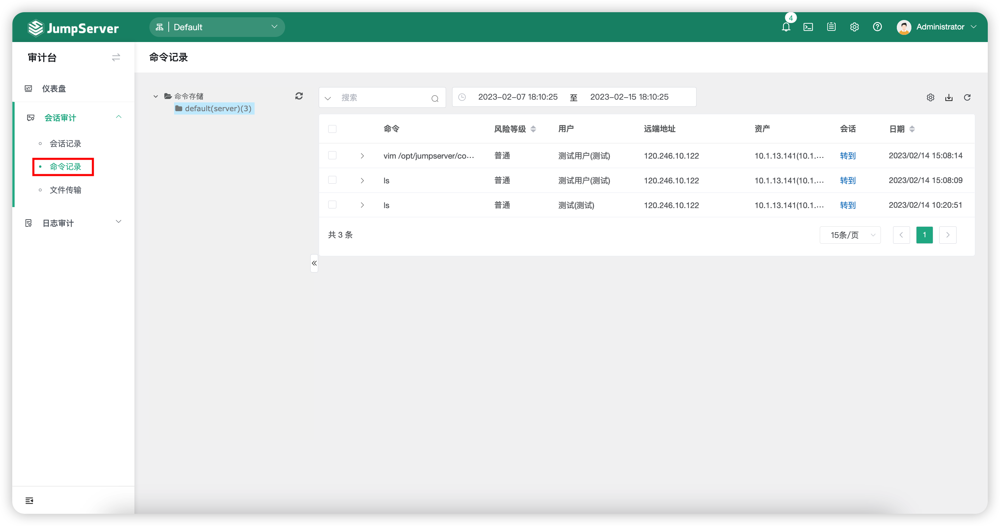
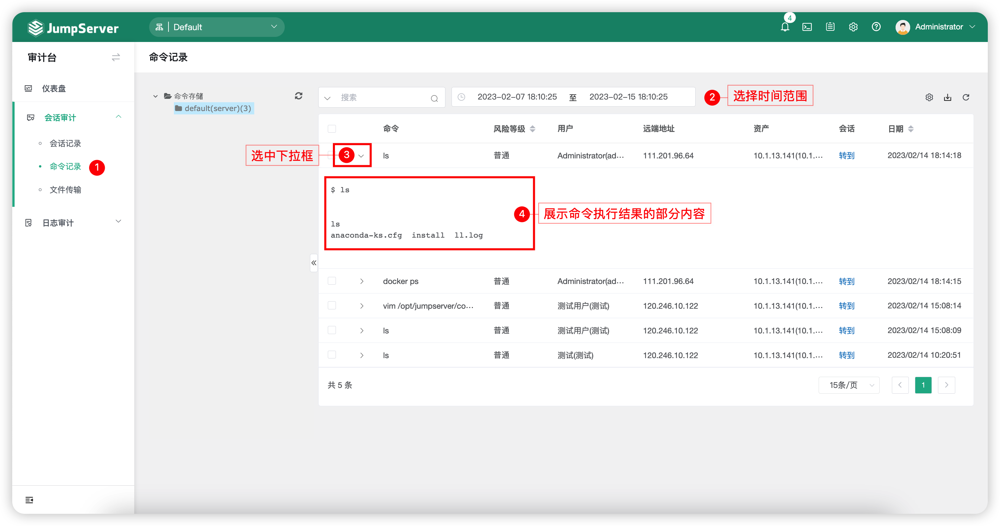
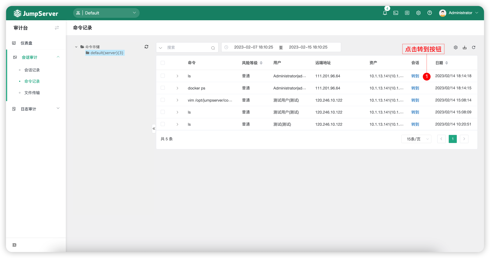
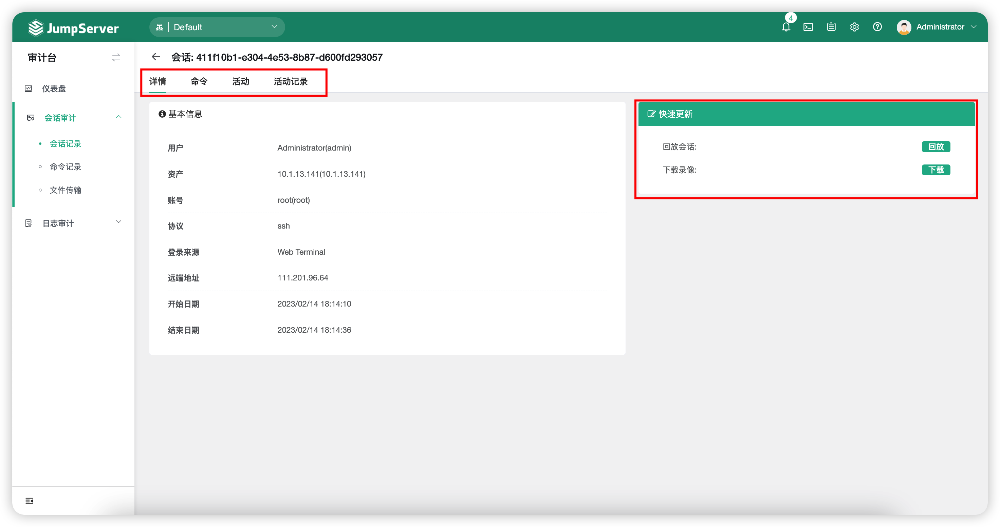

# 命令记录
## 1 功能简述
!!! tip ""
    - 命令记录主要显示用户在资产连接后执行的命令，单击某一行记录，可以查看命令执行的详细结果。

## 2 页面功能
!!! tip ""
    - 点击切换至`命令记录`页面。
    - 点击图示下拉框，可以展示命令执行结果的部分内容输出。

!!! tip ""
    - 点击`转到`连接，会跳转到详细的会话页面，如果会话已结束可以查看会话录像。 

