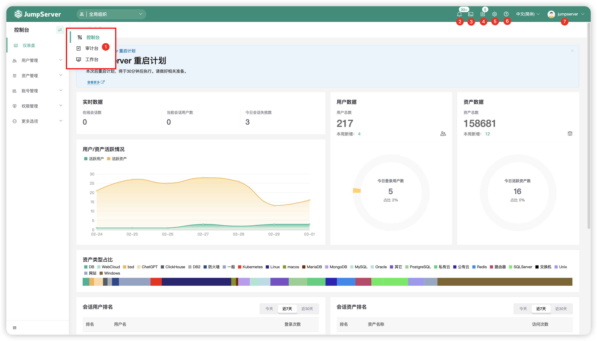

# 页面说明

!!! warning "注意"
    - 带有 X-Pack 标识的功能为 JumpServer 堡垒机企业版功能。

## 1 页面展示
!!! tip ""
    - 页面左侧为功能菜单区，第一次登录默认展示仪表盘界面。
    - 右上方区域为功能按钮，可以快速跳转 站内信、Web 终端、工单、系统设置等功能。
    - 可以在图示序号1的位置，进行功能视图的切换。

## 2 功能说明
!!! tip ""

    | 序号  |   名称   |                                   说明                                                         |
    | :------ | :------- | :------------------------------------------------------------------------------------------------ |
    |    1    |   控制台 | 管理员操作入口，通过控制台，管理员可进行用户管理、资产管理、应用管理、账号管理、权限管理、访问控制等配置。 |
    |         |   审计台  | 审计员操作入口，通过审计台，审计员可查看各会话的连接详细信息及各类型日志,组织审计员只能够看到该组织下的相关数据。 |
    |         |   工作台  | 普通用户操作入口，通过工作台，普通用户可以通过工作台看到自己有权限操作运维的资产。 |
    |    2    |   站内信  | 站内消息通知中心，接收工单处理提醒，高危命令告警等通知。 |
    |    3    |  Web 终端 | 资产运维操作入口，通过Web 终端进入资产运维页面，进行资产正常运维操作。 |
    |    4    |    工单   | 工单入口，通过该按钮进入工单页面，查看提交的工单及待审批的功能等。 |
    |    5    |  系统设置  | 系统设置入口，通过该按钮进入系统设置中，配置认证，安全等各类型系统参数。 |
    |    6    |   帮助    | 帮助入口，通过该按钮进入帮助页面，可访问产品官网或下载系统工具。 |
    |    7    |  个人信息  | 个人信息入口，点击该按钮，查看个人账号信息，用于API 调用的APIKey，当前用户连接资产使用的资产令牌以及退出登录的按钮等。 |