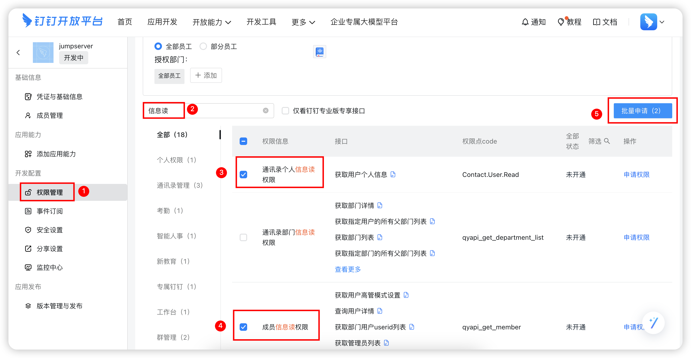

# 钉钉认证
!!! note "注：钉钉认证为 JumpServer 企业版功能。"

!!! tip "提示"
    - 使用`阿里钉钉`的用户作为 JumpServer 登录用户

## 1 创建钉钉应用
!!! tip ""
    - 打开 [钉钉开发平台](https://developers.dingtalk.com/)，用管理员权限用户登录；
    - 点击 `企业内部开发` — `创建应用`，应用类型：H5微应用、小程序都可以，开发方式：企业自主开发。

!!! tip ""
    - 在创建应用成功后可以查看到应用凭据。

## 2 配置 JumpServer 钉钉认证
!!! tip ""
    - 把钉钉获取到的应用凭据 `AgentId`、`AppKey`、`AppSecret` 对应的值填到 JumpServer 钉钉认证里面。
    - 填写完成后可以点击`测试`确认状态。

## 3 设置钉钉应用
### 3.1 配置回调域名
!!! tip ""
    - 点击钉钉的 `登录与分享` 模块页面，配置 `接入登陆` 的 `回调域名` 为 JumpServer 的 Url 地址。

### 3.2 钉钉出口配置
!!! tip ""
    - 点击钉钉的 `开发管理` 模块页面，配置 `服务器出口IP` 和 `应用首页地址`；

!!! tip ""
    - 详细参数说明：

!!! tip ""

    | 参数     | 说明                  |
    | ------- | --------------------- |
    | 服务器出口IP | JumpServer 实际对外的公网地址。钉钉的白名单限制，你设置此 ip 后，只能通过此 ip 与钉钉 api 通信。 |
    | 应用首页地址 | http 或 https 开头的 JumpServer 链接地址。 |

### 3.3 配置权限管理
!!! tip ""
    - 点击钉钉的 `权限管理` 模块页面，搜索 `成员信息读权限`。
    - 选中 `通讯录管理` - `成员信息读权限`，点击批量申请。

## 4 钉钉账号登陆 JumpServer
!!! tip ""
    - 用户正常使用账号密码登录 JumpServer 后，在`个人信息`里面绑定钉钉账号，绑定完成后就可以使用钉钉账号登录 JumpServer。
