# 飞书认证
!!! note "注：飞书认证为 JumpServer 企业版功能。"

!!! tip "提示"
    - 使用 飞书 的用户作为 JumpServer 登录用户

## 1 创建飞书应用
!!! tip ""
    - 打开 [飞书开放平台](https://open.feishu.cn/app/)，用管理员权限用户登录;
    - 点击 `创建企业自建应用`。

!!! tip ""
    - 输入 `应用名称` 和 `应用描述` 后点击创建。
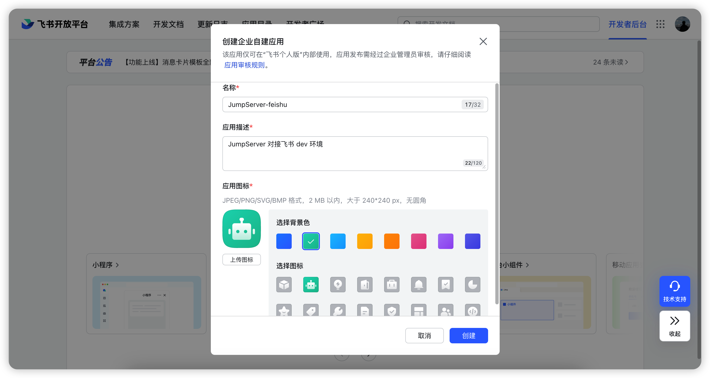

## 2 设置飞书应用
!!! tip ""
    - 点击刚创建的应用，进入应用详情页。
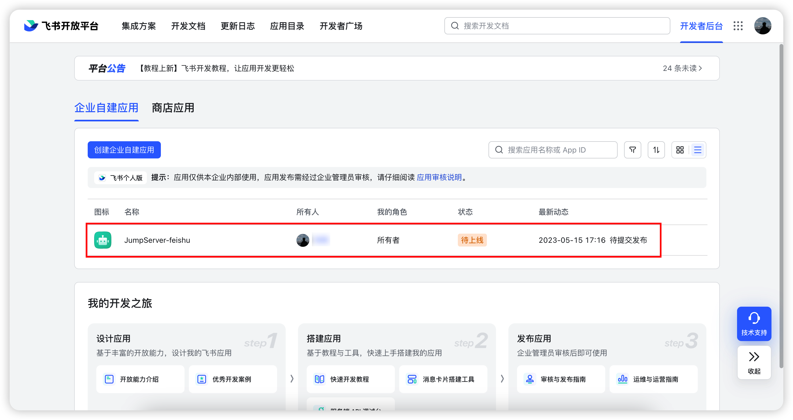

### 2.1 配置机器人
!!! tip ""
    - 点击左侧菜单 `添加应用能力` 模块页面，添加机器人能力。
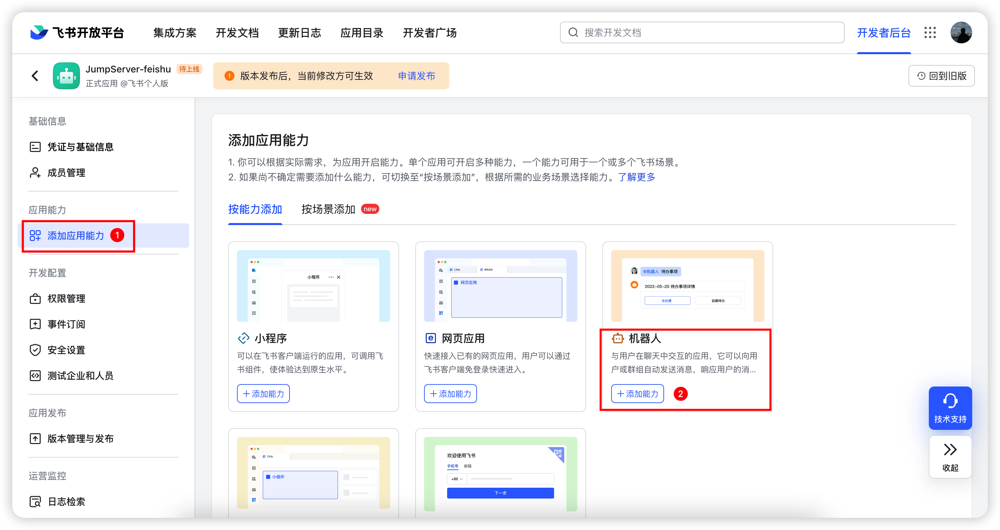

### 2.2 配置安全设置
!!! tip ""
    - 点击左侧菜单 `安全设置`，添加重定向 URL 和 IP 白名单。
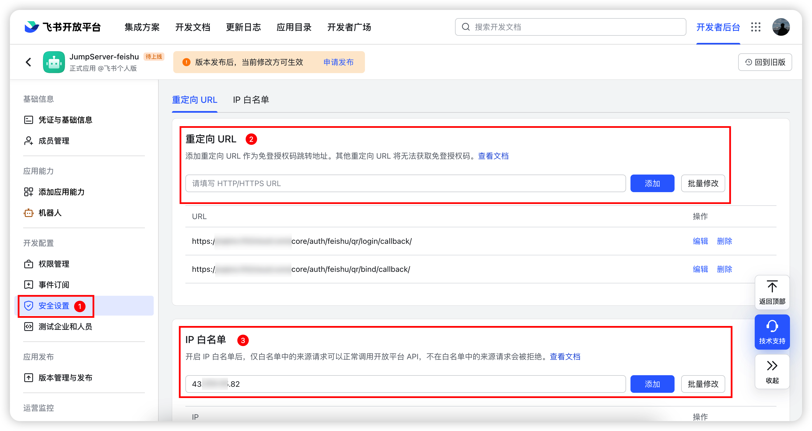

!!! tip ""
    - 详细参数说明：

!!! tip ""

    | 参数     | 说明                  |
    | ------- | --------------------- |
    | 重定向 URL | 注：jumpserver_host 改成你自己的 JumpServer 域名。   https://`jumpserver_host`/core/auth/feishu/qr/bind/callback/   https://`jumpserver_host`/core/auth/feishu/qr/login/callback/ |
    | IP 白名单 | JumpServer 服务器的公网 IP。 |

### 2.3 配置权限管理
!!! tip ""
    - 点击左侧菜单 `权限管理`，搜索选中 `获取用户 user ID`、`获取与发送单聊、群组消息` 的权限，点击批量开通。

### 2.4 配置版本管理
!!! tip ""
    - 点击左侧菜单 `版本管理与发布`，选中页面右上角 `创建版本`。
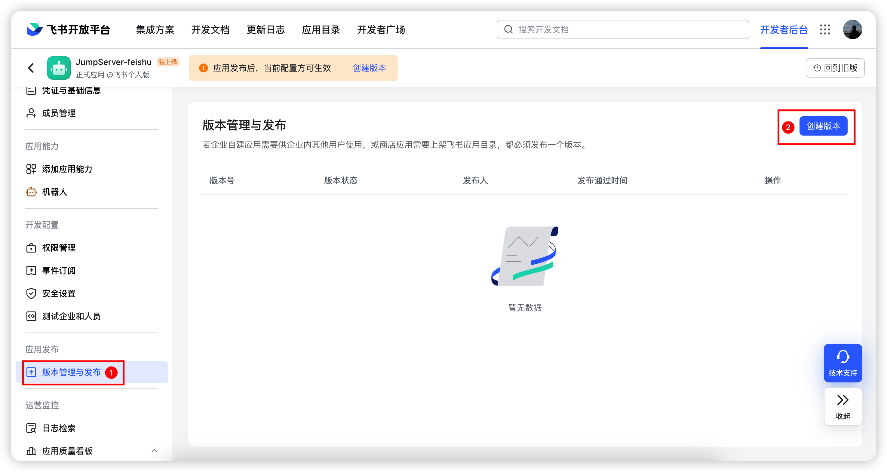

!!! tip ""
    - 应用功能选择 `机器人`，输入 `应用版本号` 等必要信息后点击保存。
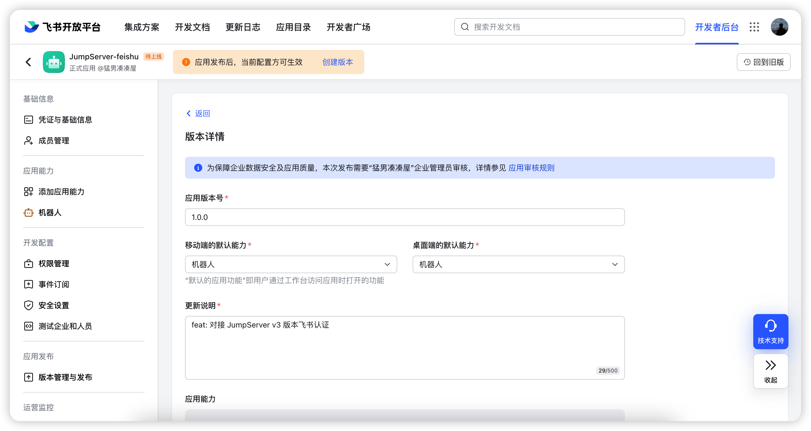

!!! tip ""
    - 在页面右上角选中 `申请线上发布`。
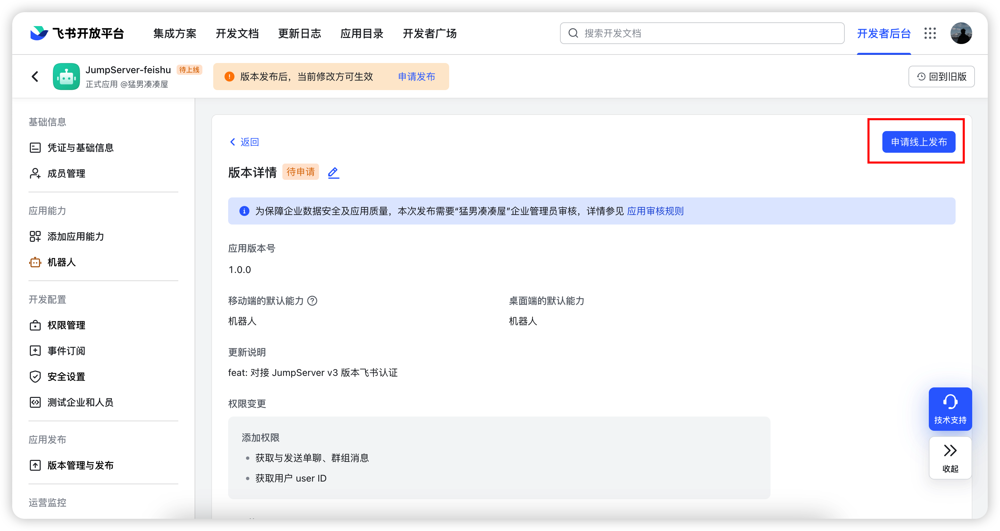

!!! tip ""
    - 打开 `飞书管理后台` 页面，在左侧菜单 `工作台` 中，点击 `应用审核` ，找到刚才提交的应用，点击 `审核` 通过。
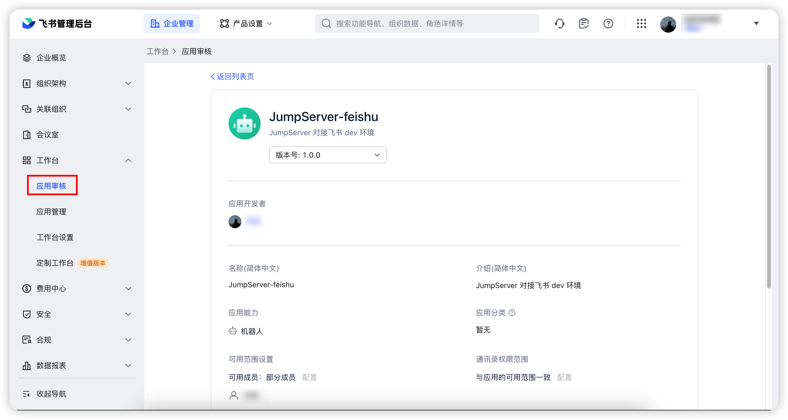

!!! tip ""
    - 确定 `应用列表` 的应用已经处于 `已启用` 状态。

## 3 查看凭据
!!! tip ""
    - 点击应用名称进入应用详情，选中左侧菜单 `凭证与基础信息`，可以看到应用凭据。
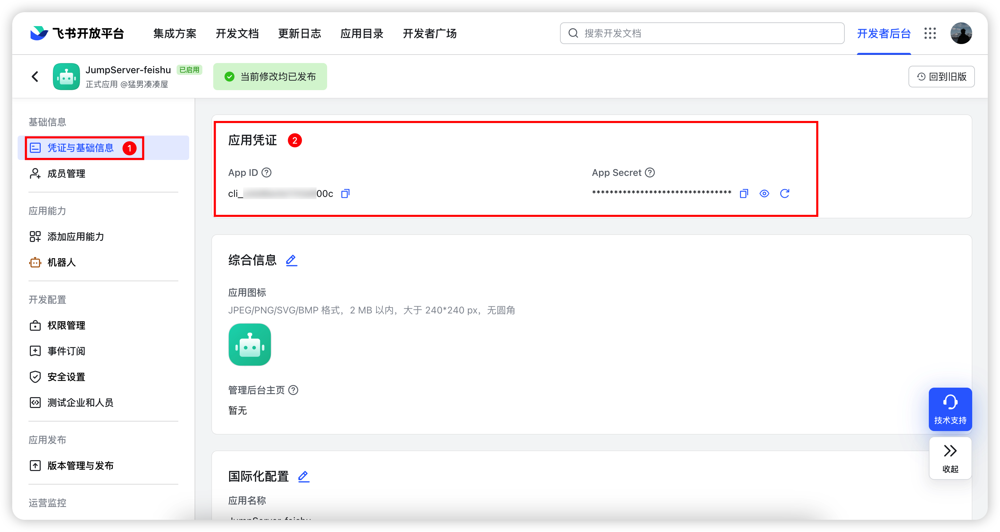

## 4 配置 JumpServer 飞书认证
!!! tip ""
    - 把飞书获取到的应用凭据 `App ID` 与 `App Secret` 对应的值，填到 JumpServer 飞书认证中。
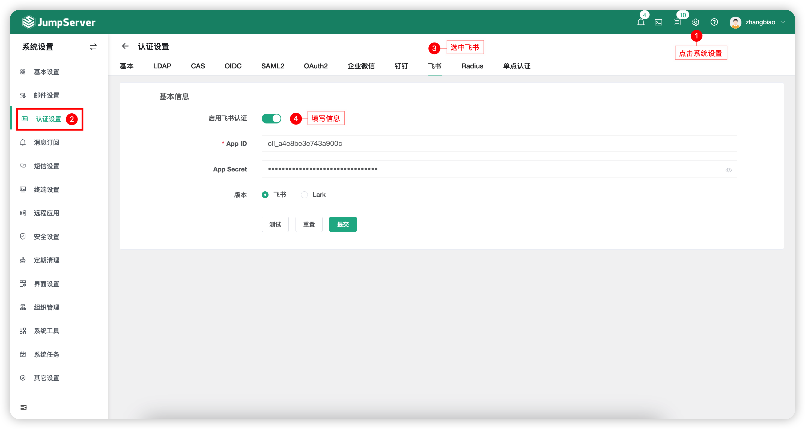

## 5 飞书账号登陆 JumpServer
!!! tip ""
    - 用户正常使用账号密码登录 JumpServer 后，在`个人信息`里面绑定飞书账号，绑定完成后就可以使用飞书账号登录 JumpServer。
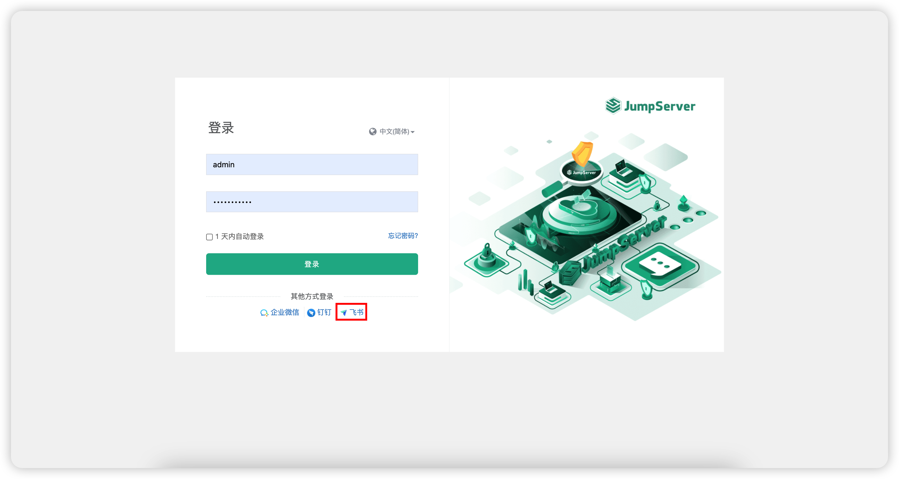