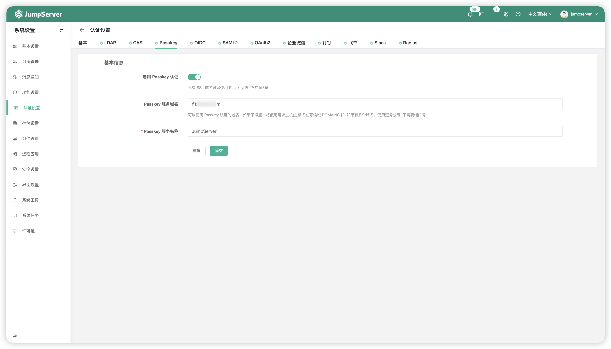

# Passkey 认证

## 1 操作过程
!!! tip "设置 Passkey 认证配置的前提条件如下" 
    - JumpServer 开启 HTTPS 登录，且配置安全的 SSL 证书；
    - JumpServer 的配置文件中配置了可信任域名，即 DOMAINS；
    - 个人 PC 或其他设备支持设备生物认证。

!!! tip ""
    - 点击页面上方的`Passkey`按钮，即进入 Passkey 设置页面。

!!! tip ""
    - 启用 Passkey 认证后，在[个人信息页面](./../../user/personal_information/passkey.md)录入 Passkey 凭证，即可在登录时选择 Passkey进行认证登录。