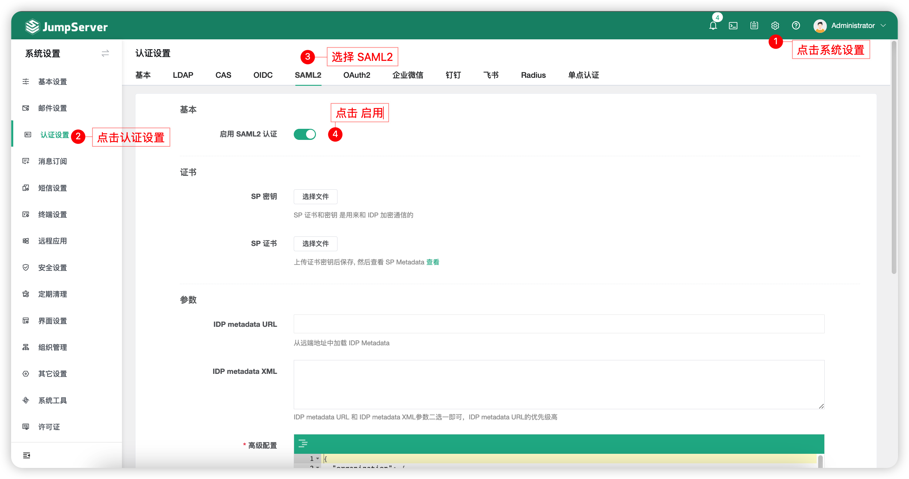
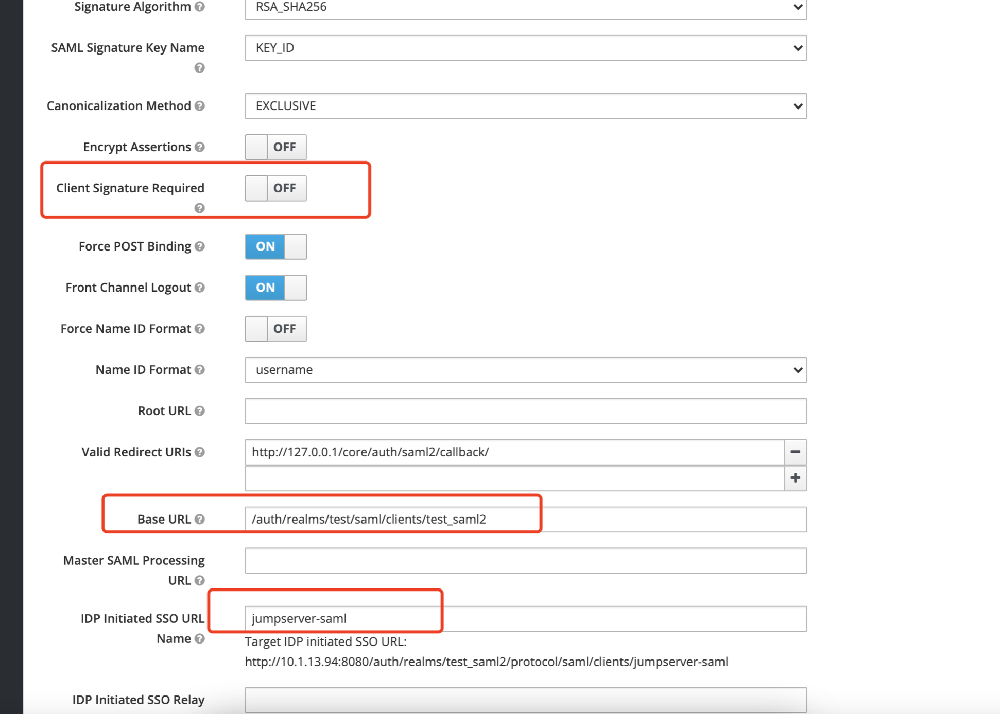
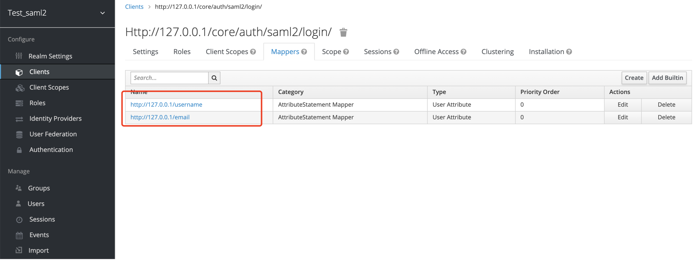
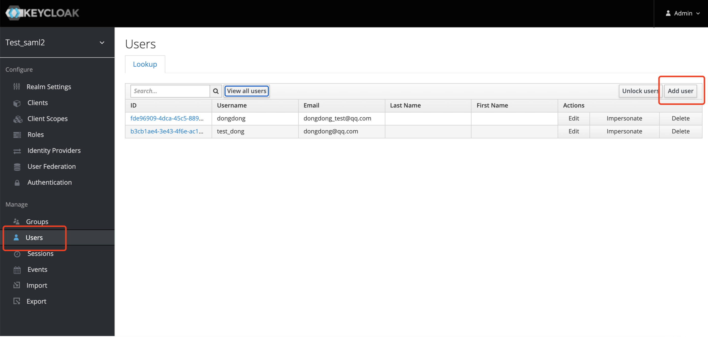
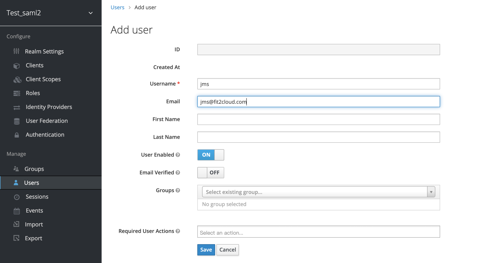
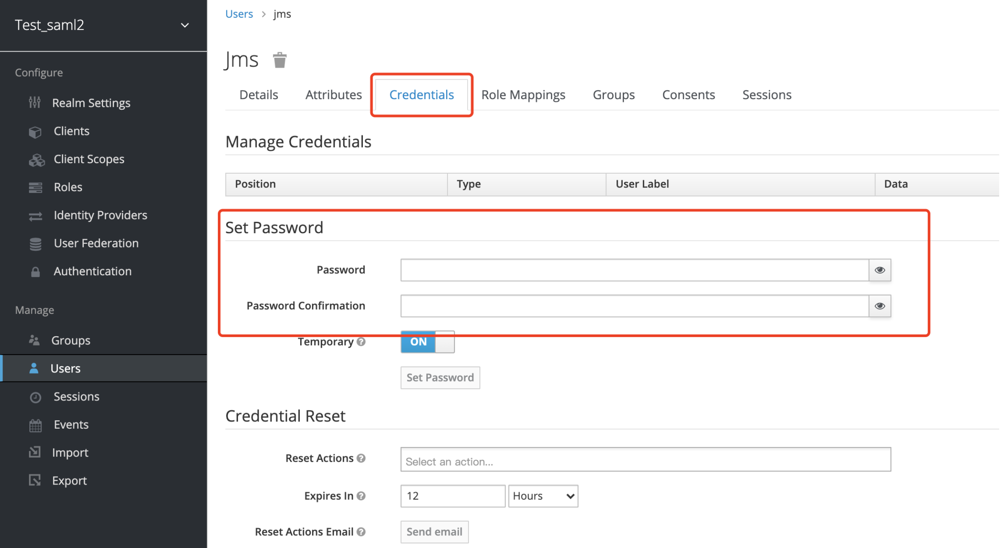
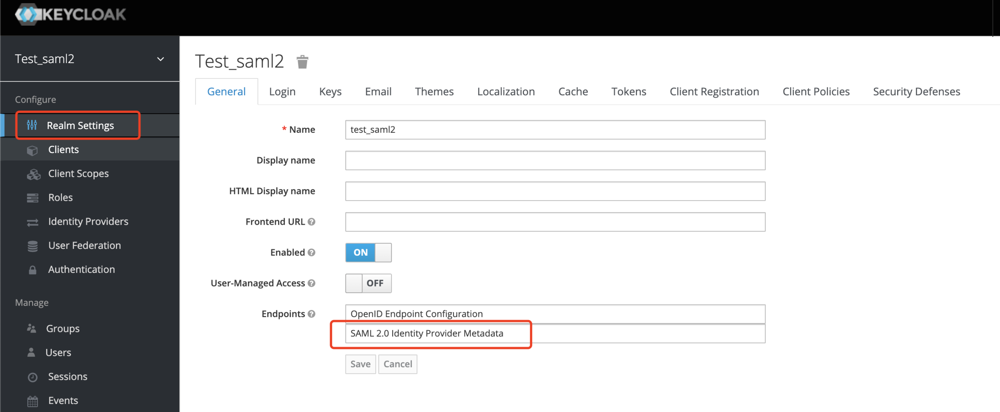

# SAML2 认证
!!! note "注：SAML2 认证为 JumpServer 企业版功能。"

!!! tip "提示"
    - SAML2 协议的单点登录。

## 1 配置认证
!!! tip ""
    - 点击左侧菜单 `设置` 界面中的 `认证设置`，点击 SAML2 认证 后面的 `启用` 按钮。



!!! warning "注意"
    - 如果没有可信任的证书，需要手动生成。

    ```bash
    openssl genrsa -out server.key 2048  # 这个生成的是 私钥
    openssl req -new -x509 -days 3650 -key server.key -out server.crt -subj "/C=CN/ST=mykey/L=mykey/O=mykey/OU=mykey/CN=domain1/CN=domain2/CN=domain3"  # 这个是证书
    ```

!!! tip ""
    - 获取 SP metadata 信息。
    - 访问 http://your_jms_url/core/auth/saml2/metadata/ 保存 metadata 内容(可保存成文件，到 idp 中直接导入)


## 2 配置 IDP
!!! tip "提示"
    - 以 keycloak 为例。

!!! tip ""
    - 新建 realm，`Name` 自定义，然后点击 `Save` 保存。


!!! tip ""
    - 点击左侧 `Client`，点击右上角 `Create` 新建 client。


!!! tip ""
    - 导入刚才保存的 SP metadata 文件，然后点击 `Save` 保存。


!!! tip ""
    - 点击 `Client` 菜单的子菜单 `Settings` 界面进行配置修改。
    - `Client Signature Required` 修改为 `OFF`。
    - `IDP Initiated SSO URL Name` 修改为 `Target IDP initiated SSO URL` 地址中提供的信息。


!!! tip ""
    - 点击子菜单 `Roles` 中的 `Add Role`，其中名称可自定义。


!!! tip ""
    - 点击子菜单 `Mappers`，创建如下属性映射。



!!! tip ""
    - 点击子菜单 `Scope`，设置如下。


!!! tip ""
    - 点击左侧菜单 `Users`，并在右上角新建用户。



!!! tip ""
    - 点击 `Credentials` 子菜单，设置刚才新建用户的密码。


!!! tip ""
    - 点击左侧菜单 realm settings 的子菜单 general，并点击下图所示位置，获取 IDP 的 Metadata 内容，也可根据官方文档根据 api 获取。


## 3 配置 SAML2
!!! tip ""
    - 将获取到的 IDP Metadata 放到 JumpServer 的 SAML2 认证设置中，并开启 SAML2 认证即可。

