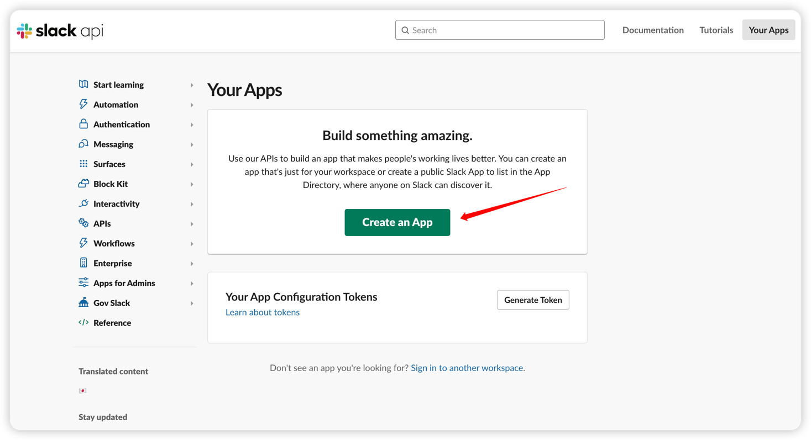
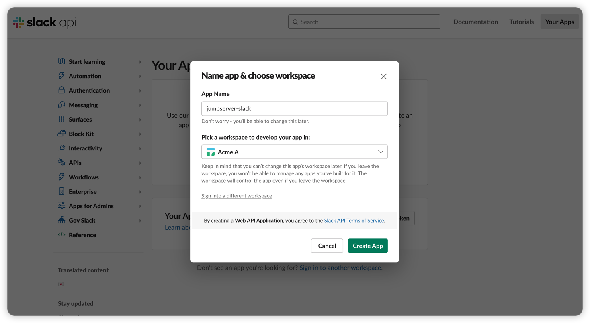
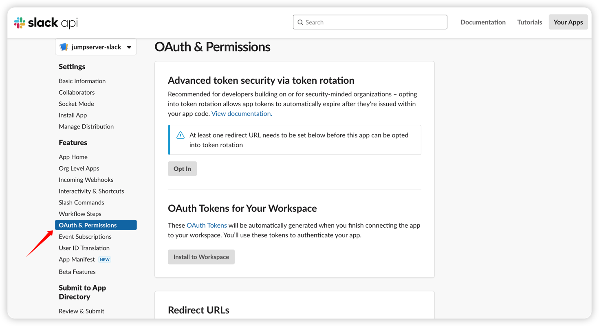
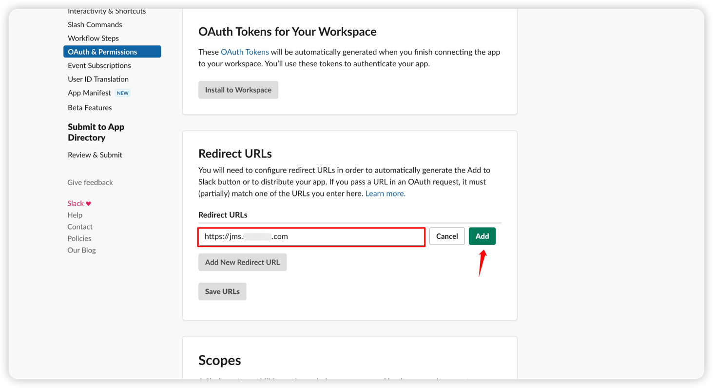
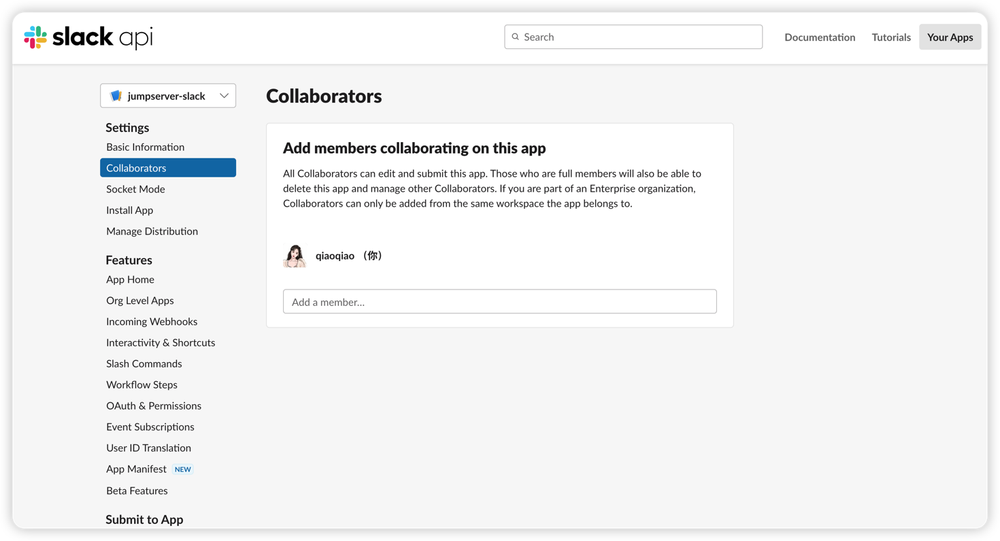
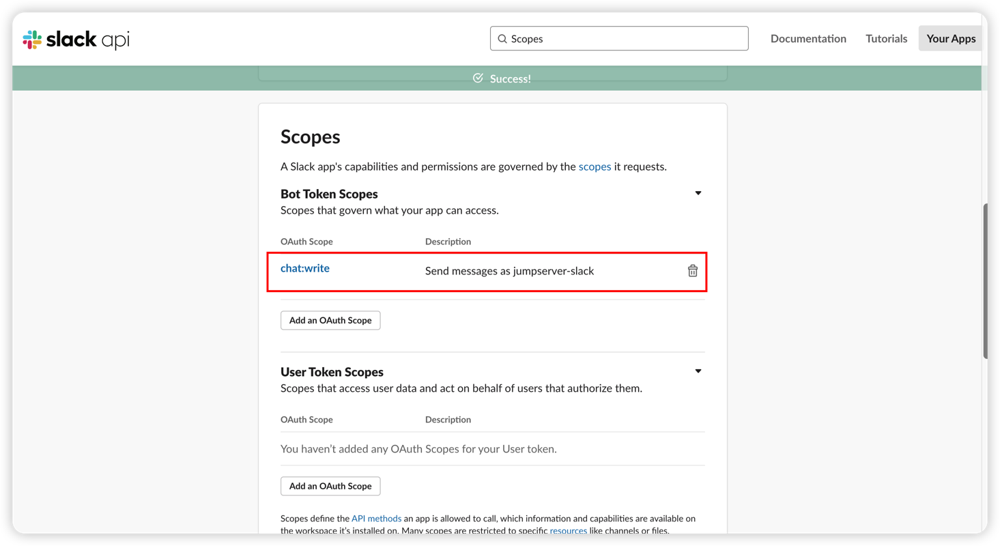
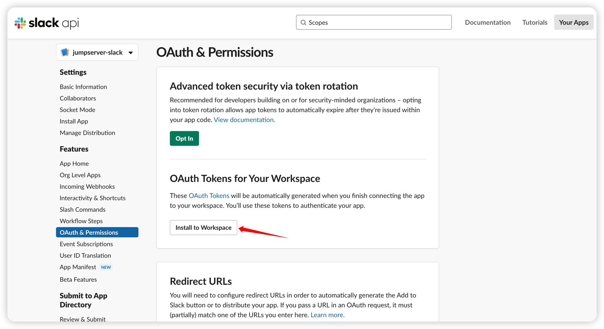
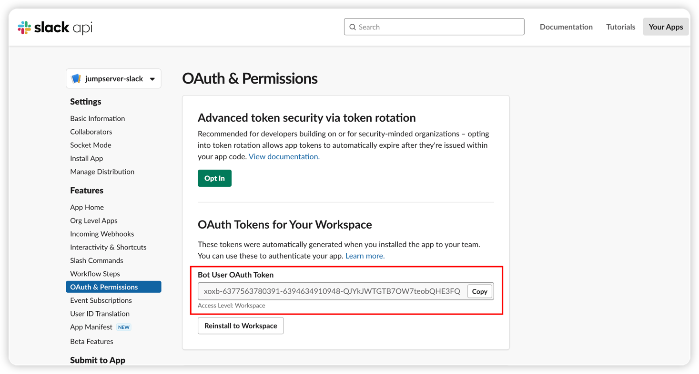
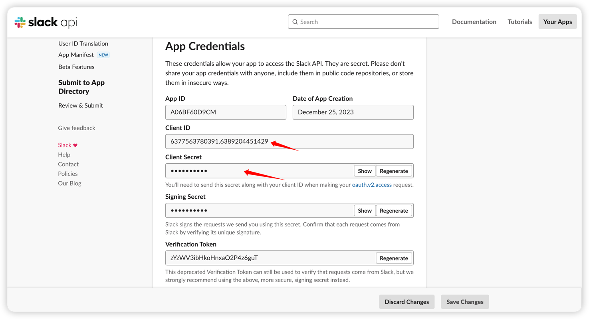
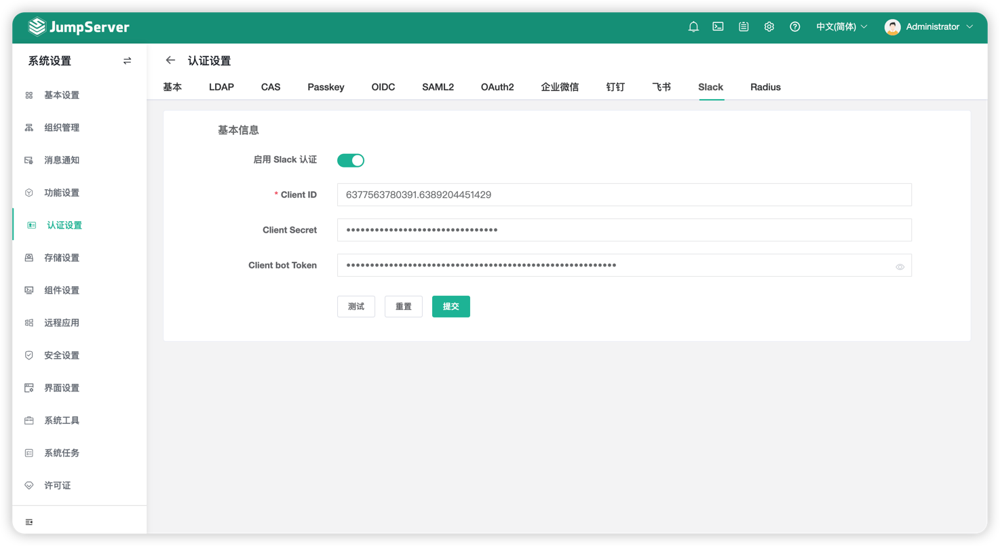

# Slack 认证
!!! note "注：Slack 认证为 JumpServer 企业版功能。"

!!! tip "提示"
    - 使用 `Slack` 的用户作为 JumpServer 登录用户

## 1 创建应用
!!! tip ""
    - 使用 Google 邮箱申请 Slack 账号；
    - 访问此链接创建对接 JumpServer 的 Slack App [https://api.slack.com/apps]
    - 点击 `Create New App`

!!! tip ""
    - 选择 `From scrach` 创建应用即可。

!!! tip ""
    - 根据提示输入应用名和工作区，然后点击 `Create App` 创建应用。

## 2 添加权限
!!! tip ""
    - 在应用配置界面找到 `OAuth & Permissions` 进行 JumpServer 相关配置。

!!! tip ""
    - 找到 `Redirect URLs` 配置处，将 JumpServer 的域名加入到下方（域名只支持https协议）。

!!! tip ""
    - 切换到菜单 `Collaborators`，添加用户到此应用中，用户方可登录。

!!! tip ""
    - 切换到菜单 `Oauth & Permissions` 处，更改 `Scopes` 权限范围配置，增加 `chat:write` 权限。

!!! tip ""
    - `Scopes` 权限添加完成后，拉到此菜单最上边，点击 `Install to Workspace`。

## 3 查看凭据
!!! tip ""
    - 点击 `Install to Workspace` ，应用安装到工作区后，会显示机器人使用的 `Bot User OAuth Token`。

!!! tip ""
    - 切换到菜单 `Basic Information` ，找到 `App Credentials`。

## 4 配置 Jumpserver Slack 认证
!!! tip ""
    - 将上述获取到的 `Bot User OAuth Token`、`Client ID`、`Client Secret` 填入到 JumpServer 中即配置完成。
