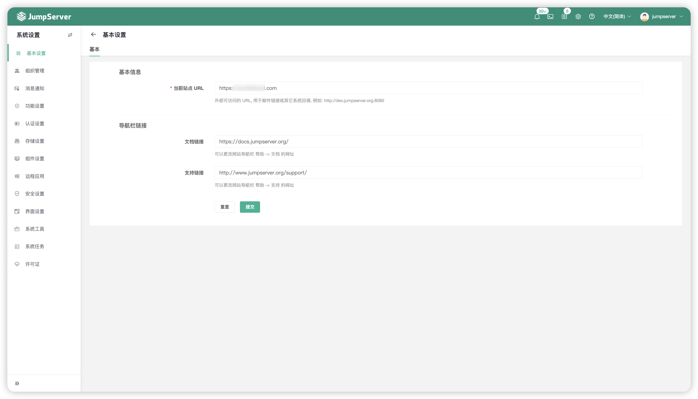

# 基本设置
## 1 功能简述
!!! tip ""
    - 点击页面左侧菜单的`基本设置`按钮，进入基本设置页面。
    - 可以编辑基本信息，包含当前站点 URL，以及导航栏链接的配置。

## 2 基本信息
!!! tip ""
    - 在此页面可以配置当前站点 URL（用户通过外部链接，如邮件跳转到堡垒机的 URL，此处可以填写域名或 IP）
    - 支持配置导航栏链接。

