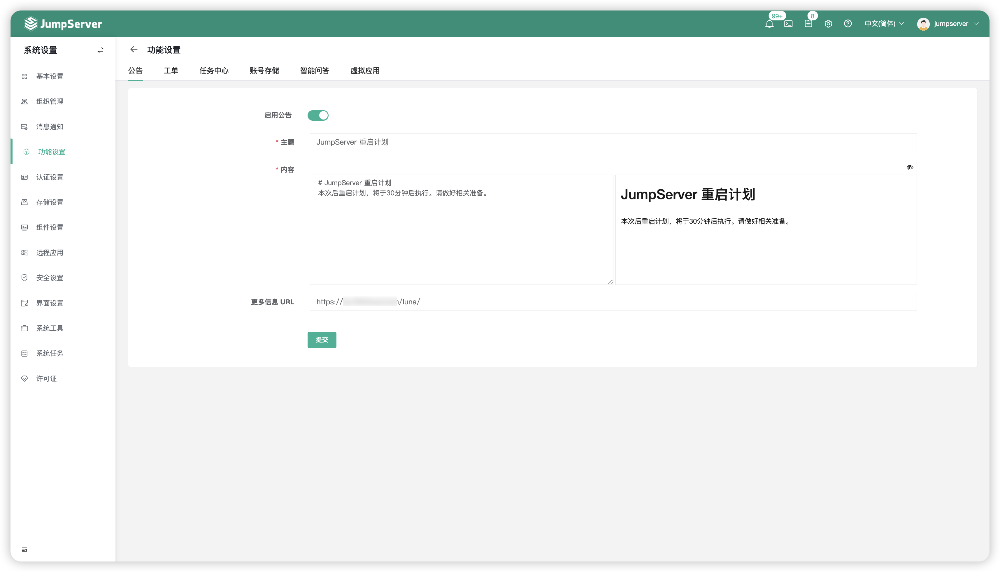
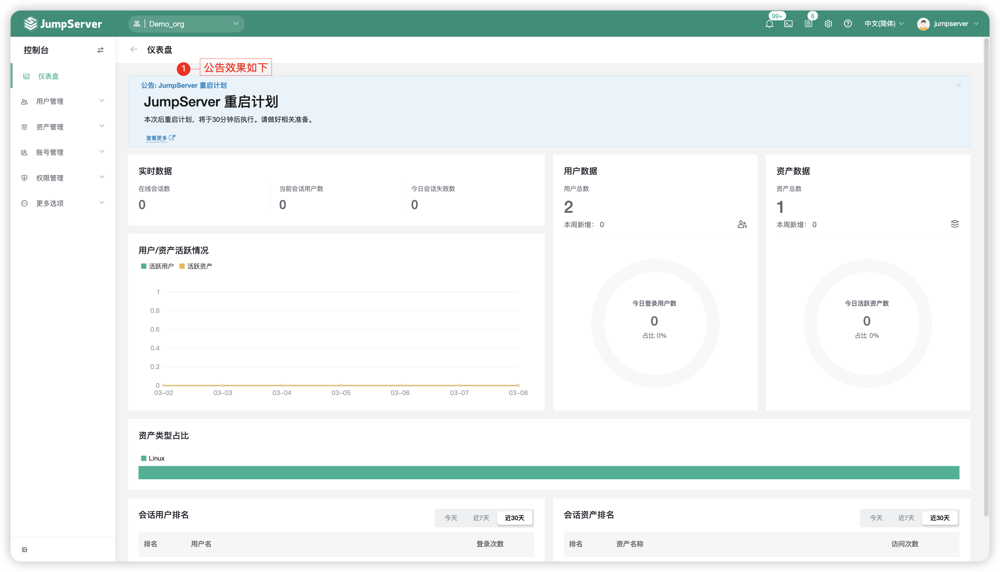
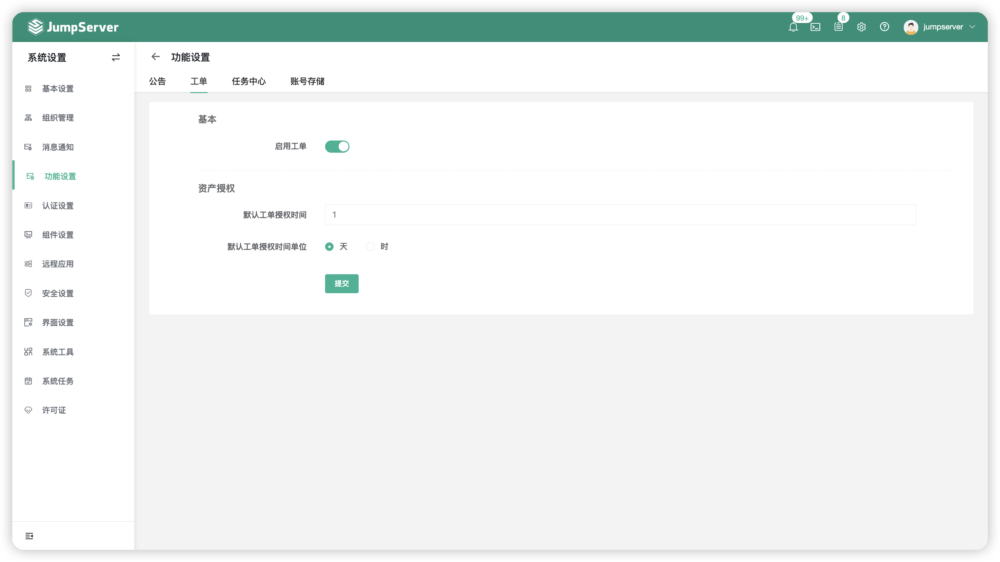
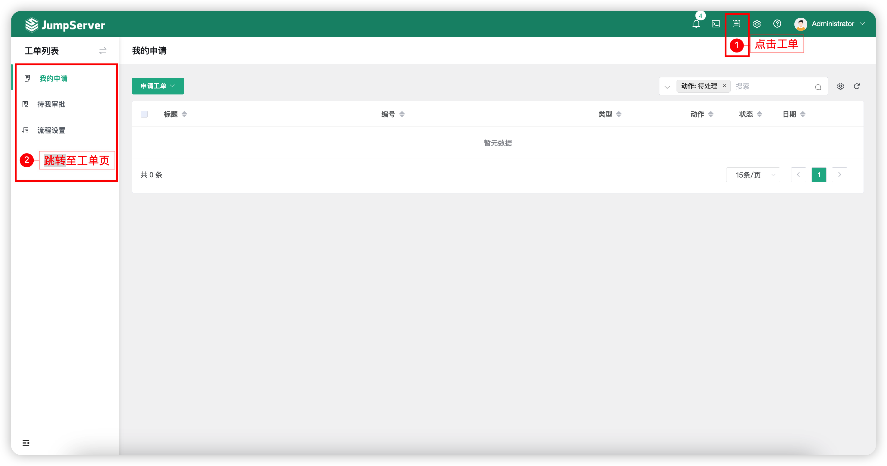
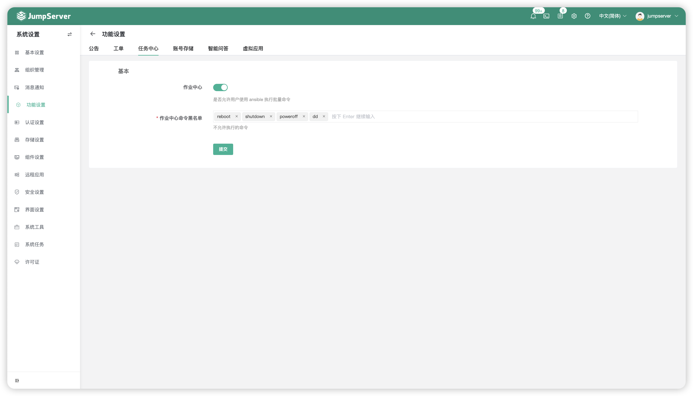
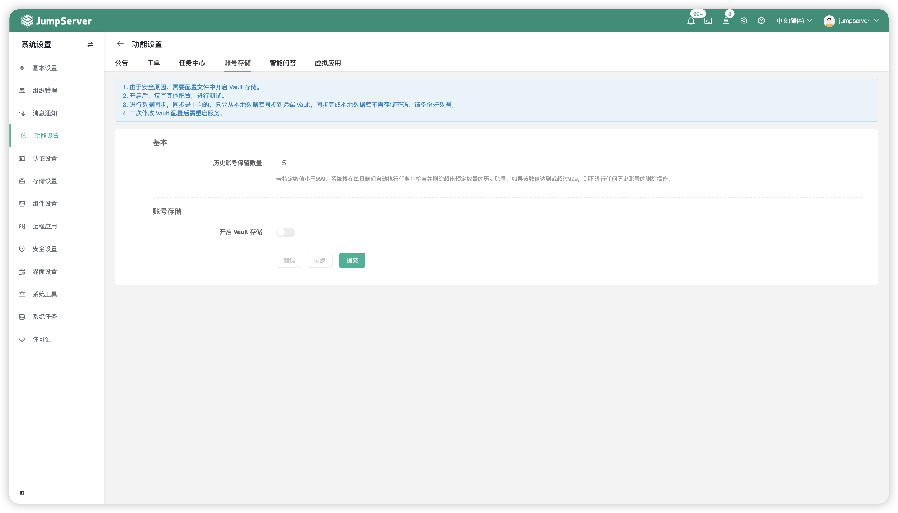
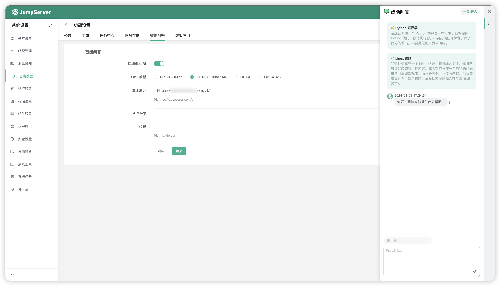
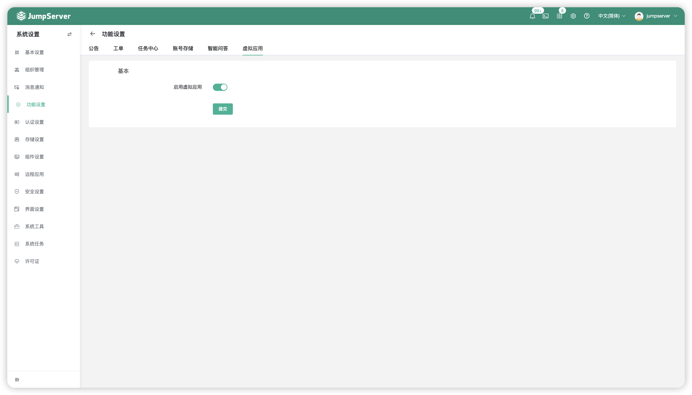

# 功能设置

## 1 公告
!!! tip ""
    - 点击页面上方的`公告`按钮，即进入公告设置页面。
    - 该页面可以自定义是否启用`公告`功能，并设置`公告内容`，在 JumpServer 页面全局展示。

!!! tip ""
    - 启用公告后，公告页面效果如下：

## 2 工单
!!! tip ""
    - 点击页面上方的`工单`按钮，即进入工单设置页面。
    - 在此页面，可以自定义是否启用`工单`功能，用户可以通过`工单`功能来申请资源授权。

!!! tip ""
    - 启用工单后，工单页面效果如下：

## 3 任务中心
!!! tip ""
    - 点击页面上方的`任务中心`按钮，即进入任务中心设置页面。
    - 在此页面，可以自定义是否启用`作业中心`功能，并且可以配置`作业中心命令黑名单`，用户可以通过`作业中心`功能来执行任务作业。

## 4 账号存储(X-Pack)
!!! note "注：账号存储为 JumpServer 企业版功能。"

!!! tip ""
    - 点击页面上方的`账号存储`按钮，即进入账号存储设置页面。
    - 在此页面，账号密钥支持对接 HashiCorp Vault 第三方密钥存储系统，用户需要在`config.txt`配置文件中修改参数`VAULT_ENABLED`为`true`，然后回到页面进行配置即可。
    - 进行数据同步，同步是单向的，只会从本地数据库同步到远端 Vault，同步完成本地数据库不再存储密码，请备份好数据。
    - 二次修改 Vault 配置后需重启服务。

## 5 智能问答
!!! tip ""
    - 点击页面上方的`智能问答`按钮，即进入智能问答设置页面。
    - 在此页面，智能问答支持对接 ChatGPT 服务，启动 Chat AI 小助手功能让用户在 JumpServer 系统右侧页面进行智能问答。

## 6 虚拟应用
!!! tip ""
    - 点击页面上方的`虚拟应用`按钮，即进入虚拟应用设置页面。
    - JumpServer 支持使用 Linux 系统为远程应用功能的运行载体，在此页面开启以 Linux 系统为底层的虚拟应用功能。
