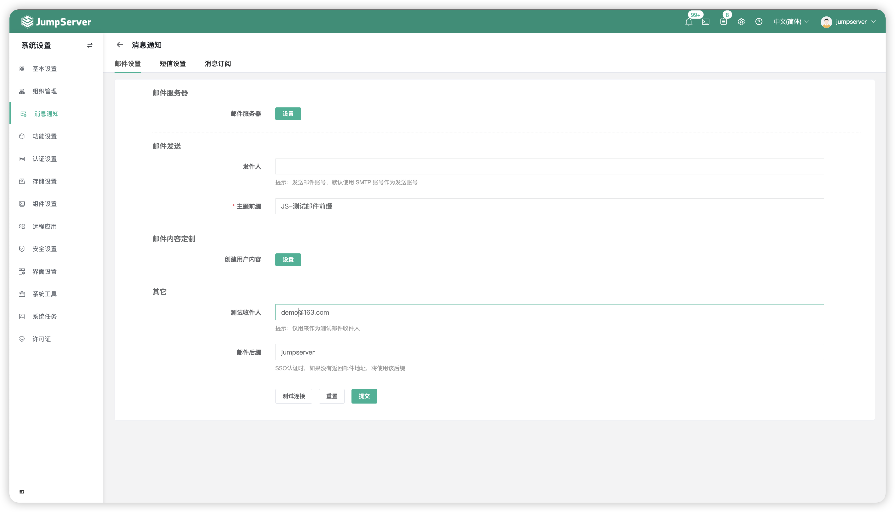
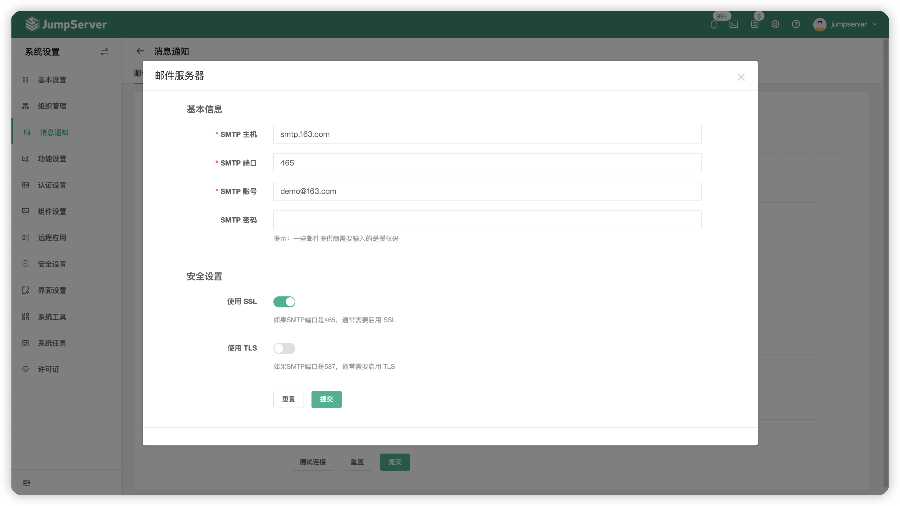
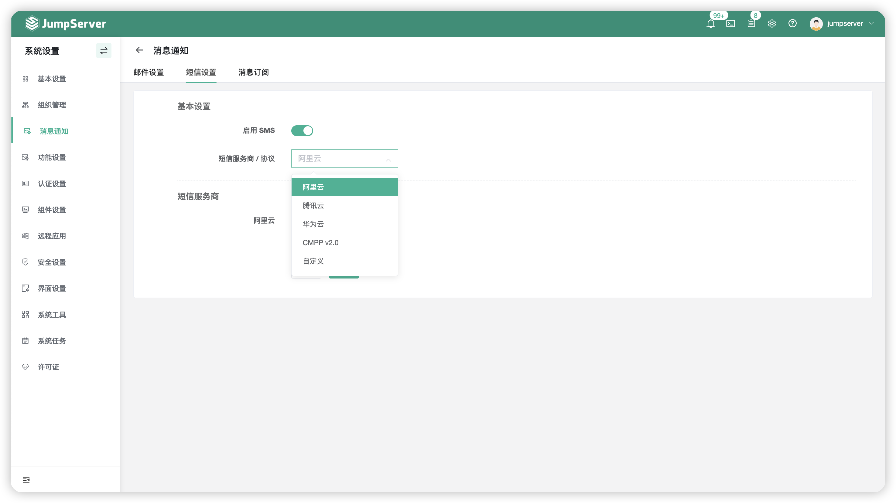
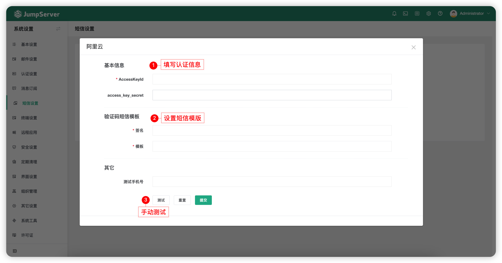
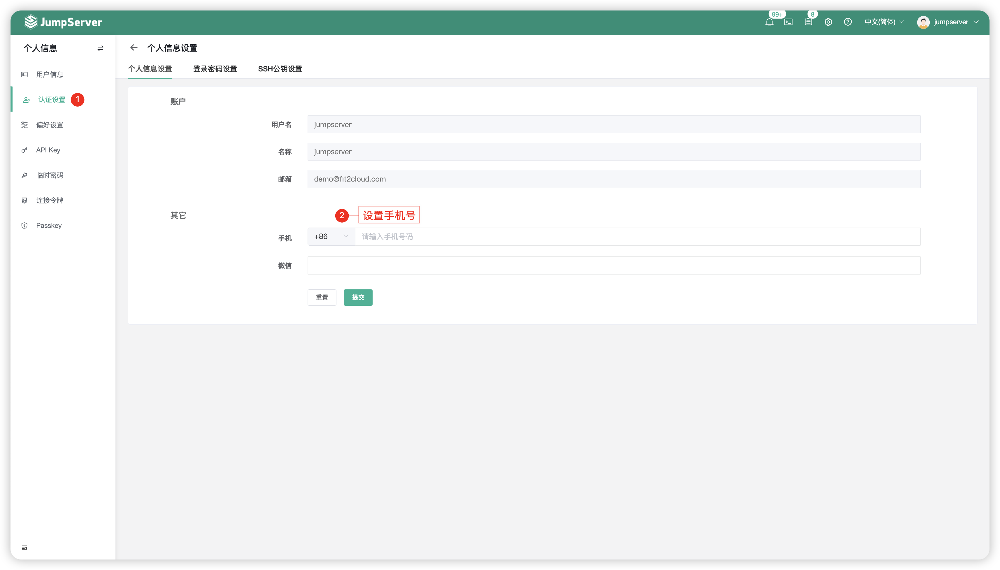
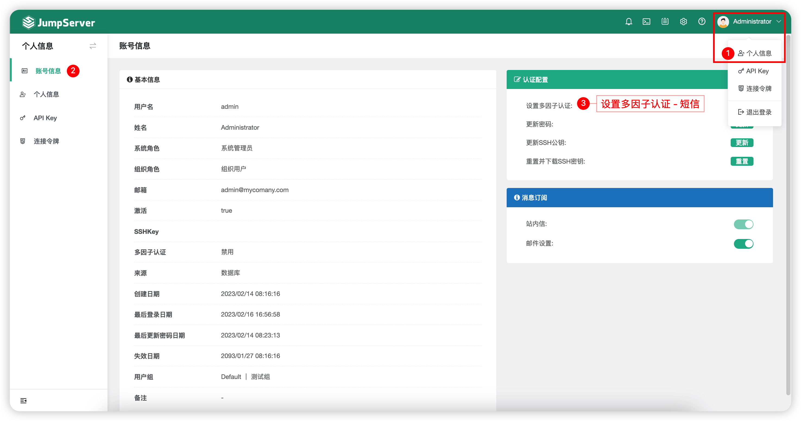
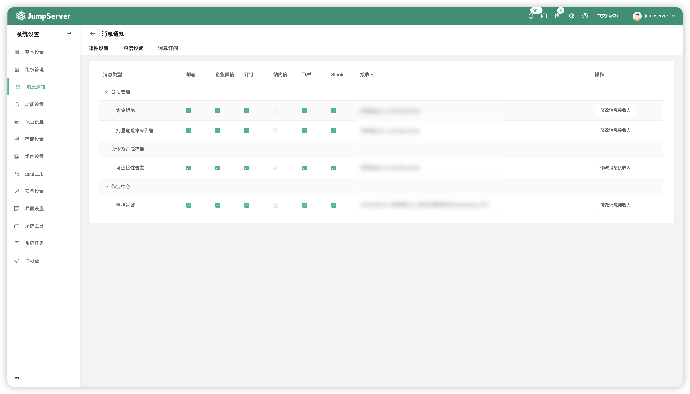

# 消息通知
## 1 邮件设置
!!! tip ""
    - 点击页面上方的`邮件设置`按钮，即进入邮件设置页面。
    - 邮件设置界面主要配置邮件的发件邮箱信息，用于发送创建用户密码设置邮件、危险命令邮件、授权过期邮件等邮件到 JumpServer 用户邮箱。

### 1.1 配置说明
!!! tip ""
    - 以163邮箱为例说明。
    - SMTP 主机是 smtp.163.com。 
    - SMTP 端口默认是25，使用 SSL 时端口为465/994，使用 TLS 时端口为587。
    - SMTP 账号密码是登录邮箱的账号密码或账号授权码。
    - 配置邮件服务器与邮件发送后，可添加测试收件人并点击`测试连接`按钮，如果配置正确，页面出现提示信息，同时 JumpServer 会发送一条测试邮件到 SMTP 账号邮箱。

## 2 短信设置(X-Pack)
!!! note "注：短信（阿里云、腾讯云）认证为 JumpServer 企业版功能。"

### 2.1 功能简述
!!! tip ""
    - 点击页面上方的`短信设置`按钮，可以设置短信 MFA 认证方式（目前支持阿里云、腾讯云、华为云、CMPP v2.0 和自定义方式对接）
    - JumpServer 还支持使用手机短信找回用户密码，管理员需要开启 SMS 服务，且用户信息需要配置手机号。

### 2.2 配置说明
!!! tip ""
    - 选择对应的短信服务商，填入服务商平台认证相关信息，点击`测试`按钮可测试配置是否正确。

### 2.3 用户侧配置
!!! tip ""
    - 点击用户头像 - `个人信息` - 左侧栏`个人信息`配置用户个人手机号信息。

!!! tip ""
    - 点击用户头像 - `个人信息` - 左侧栏`账号信息`配置多因子认证为短信认证。

## 3 消息订阅
!!! tip ""
    - 点击页面上方的`消息订阅`按钮，即进入消息订阅页面。
    - 消息订阅界面主要可配置监控告警信息、危险命令告警、批量危险命令告警等信息的接收人。
    - 消息订阅模式中默认只拥有`站内信`，该功能支持与其他平台进行对接（例如企业微信）

### 3.1 设置消息接收人
!!! tip ""
    - 点击`修改消息接收人`按钮，进入消息接收人设置界面。
    - 根据步骤① 选择需要接受消息的人，步骤② 加入消息接收人行列，点击步骤③ 确认。

