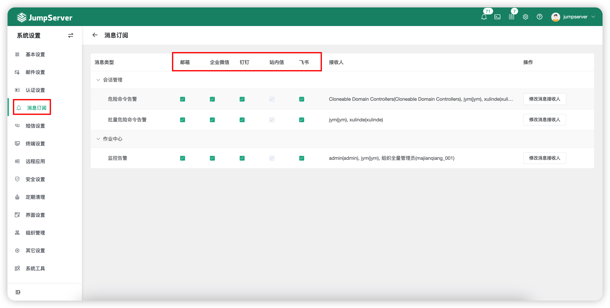
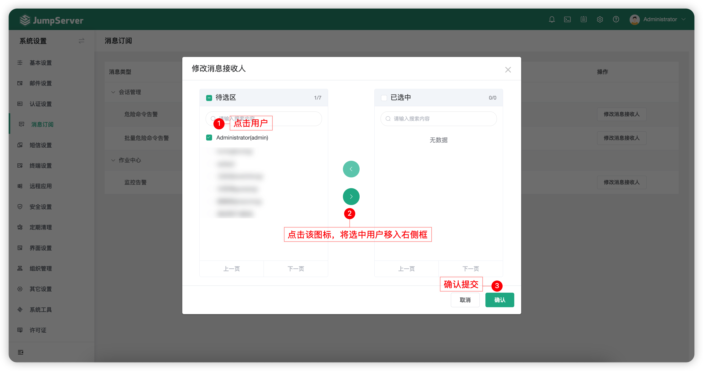

# 消息订阅
## 1 功能简述
!!! tip ""
    - 点击页面左侧的`消息订阅`按钮，即进入消息订阅页面。
    - 消息订阅界面主要可配置监控告警信息、危险命令告警、批量危险命令告警等信息的接收人。
    - 消息订阅模式中默认只拥有`站内信`，该功能支持与其他平台进行对接（例如企业微信）

## 2 设置消息接收人
!!! tip ""
    - 点击`修改消息接收人`按钮，进入消息接收人设置界面。
    - 根据步骤①选择需要接受消息的人，步骤②加入消息接收人行列，点击步骤③确认。

