# 远程应用
!!! note "注：社区版只支持 Website 方式。"

## 1 功能简述
!!! tip ""
    - 远程应用（RemoteApp）功能是微软在 Windows Server 2008之后，在其系统中集成的一项服务功能，使用户可以通过远程桌面访问远端的桌面与程序，客户端本机无须安装系统与应用程序的情况下也能正常使用远端发布的各种的桌面与应用。
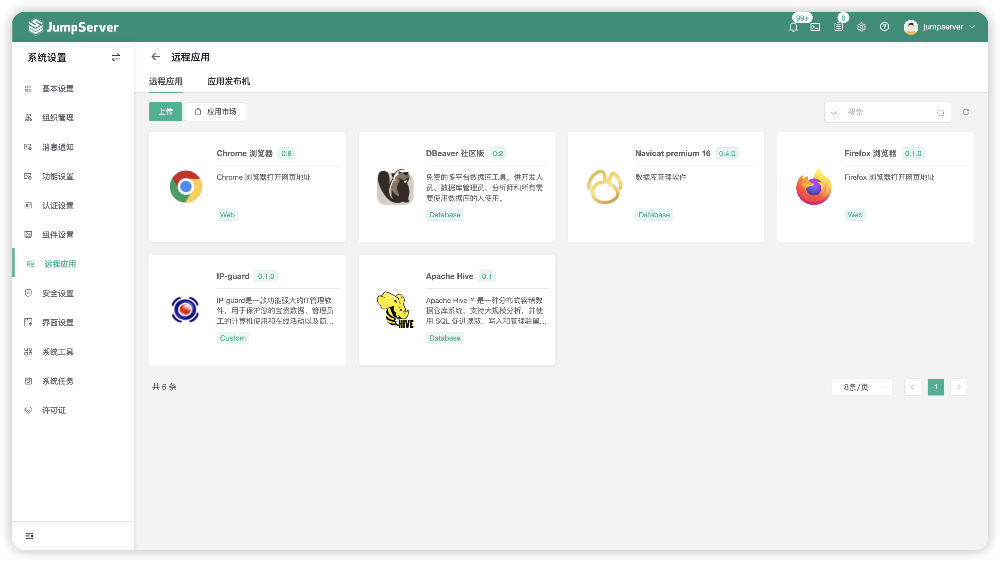

## 2 应用发布机
!!! tip ""
    - RemoteApp 功能需准备应用发布机环境来进行支持。
    - 应用发布机是用来运行 Web 页面资产或者使用远程应用 Navicat 连接数据的程序运行主体。

### 2.1 版本要求
!!! tip ""
    - 应用发布机为 Windows Server 服务器，具体版本要求如下：

!!! tip ""

    | :fontawesome-brands-windows: Windows Server 2016 | :fontawesome-brands-windows: Windows Server 2019 |
    | ------------------------------------------------ | ----------------------------------------------- |
    | :material-check:                                  | :material-check:                                |

### 2.2 创建应用发布机
!!! tip ""
    - 点击应用发布机页面的`创建`按钮即新建一个应用发布机。
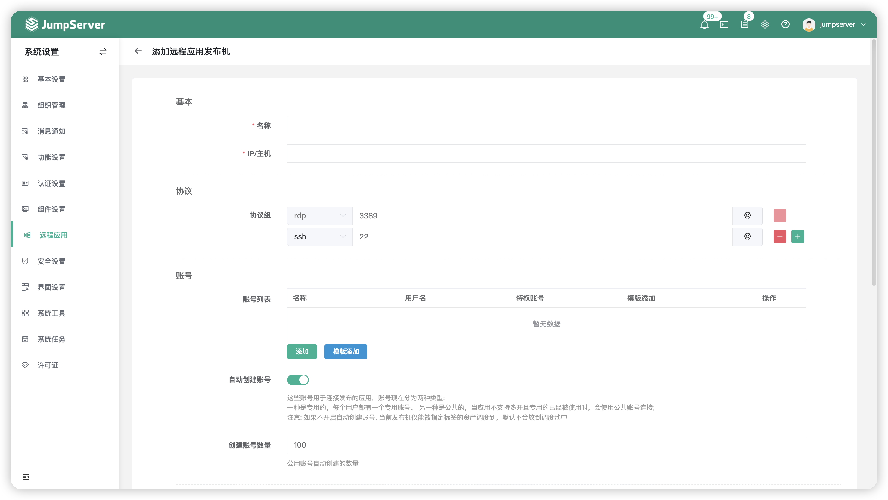

!!! tip ""
    - 我们支持通过 WinRM 和 OpenSSH 的协议进行应用发布机的部署（推荐使用 Windows-Server 自带的 WinRM 服务）

=== "WinRM"
    !!! tip ""
        - 通过 WinRM 协议部署应用发布机，在创建应用发布机页面新增 WinRM 协议即可。
    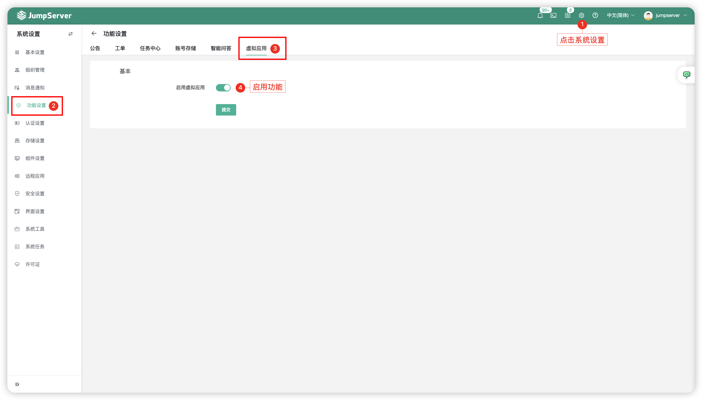

    !!! tip ""
        - WinRM 配置完成。

=== "OpenSSH"
    !!! tip ""
        - 通过 OpenSSH 协议部署应用发布机需要安装 OpenSSH 协议，可以在 JumpServer 页面 - `Web终端` - `帮助` - `下载` 页面找到 OpenSSH 安装包。
    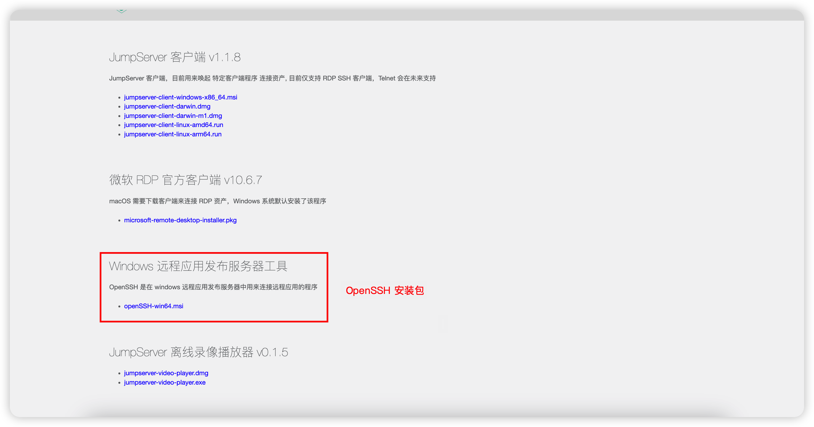

    !!! tip ""
        - OpenSSH 安装包传到应用发布机桌面后，双击进行安装。
    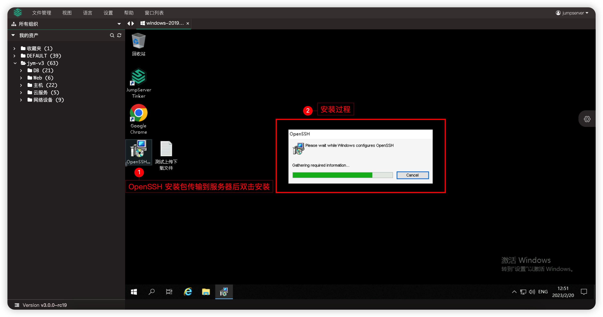

    !!! tip ""
        - OpenSSH 配置完成。

!!! tip ""
    - 详细参数说明：

    | 参数     | 说明                  |
    | ------- | --------------------- |
    | 名称 | 远程应用发布机的名称，识别信息。 |
    | IP/主机 | 远程应用发布机的IP信息。 |
    | 协议组 | 远程应用发布机支持的协议族以及协议组的端口。 |
    | 账号列表 | 远程应用发布机的连接账号信息，例如 `Administrator` 用户。 |
    | 自动创建帐号 | 该选项创建的帐号用于连接发布的应用。 |
    | 创建帐号数量 | 公用帐号创建的数量。 |
    | Core服务地址 | 远程应用发布机的 Agent 与 JumpServer 后端 Core 组件服务的通信地址。 |
    | RDS 许可证 | RDS 许可证启用选项。 |
    | RDS 许可服务器 | RDS 许可服务器信息。 |
    | RDS 授权模式 | 选择"设备"或"用户"设置授权模式。 <br> A.设备：允许一台设备（任何用户使用的）连接到远程应用发布机。 <br> B.用户：授予一个用户从无限数目的客户端计算机或设备访问远程应用发布机。 |
    | RDS 单用户单会话 | 选择"禁用"或"启用"设置单用户单会话模式。 <br> A.禁用：允许每个用户可以同时多台客户端电脑连接服务器远程桌面。 <br>  B.启用：禁止每个用户可以同时多台客户端电脑连接服务器远程桌面。 |
    | RDS 最大断开时间 | 如果某个会话连接达到了此最大时间，连接即断开。 |
    | RDS 远程应用注销时间限制 | 远程应用会话断开后的注销时间。 |

### 2.3 部署应用发布机
!!! tip ""
    - 创建应用发布机后需手动执行应用发布机部署，安装 Python、Chrome、Navicat、DBeaver 或自定义远程应用。
    - 点击`应用发布机名称`按钮进入应用发布机详情页中，选择`发布机部署`页签，点击快速更新模块的`初始化部署`按钮，初始化应用发布机。
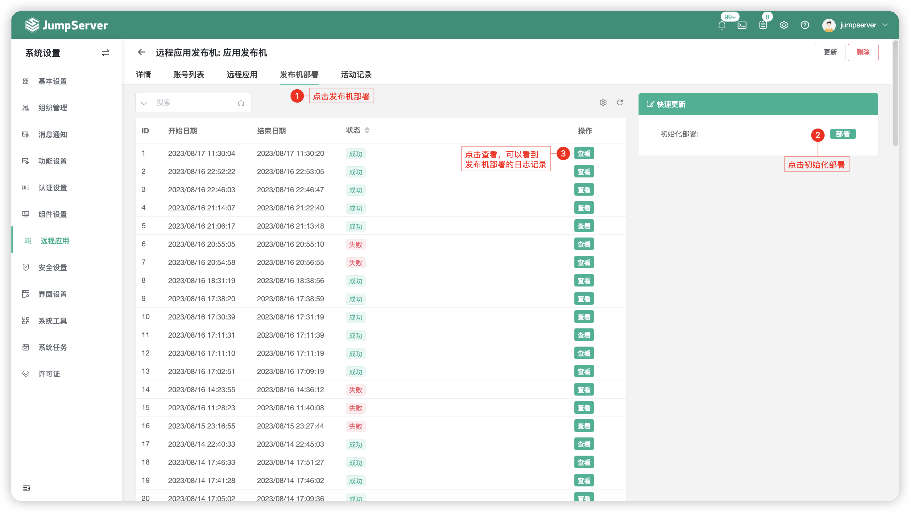

### 2.4 查看应用发布机详情
!!! tip ""
    - 点击`应用发布机名称`按钮进入应用发布机详情页中。
    - 此页面包含应用发布机详情信息，包括：远程应用发布机帐号列表、远程应用、发布机部署记录等。
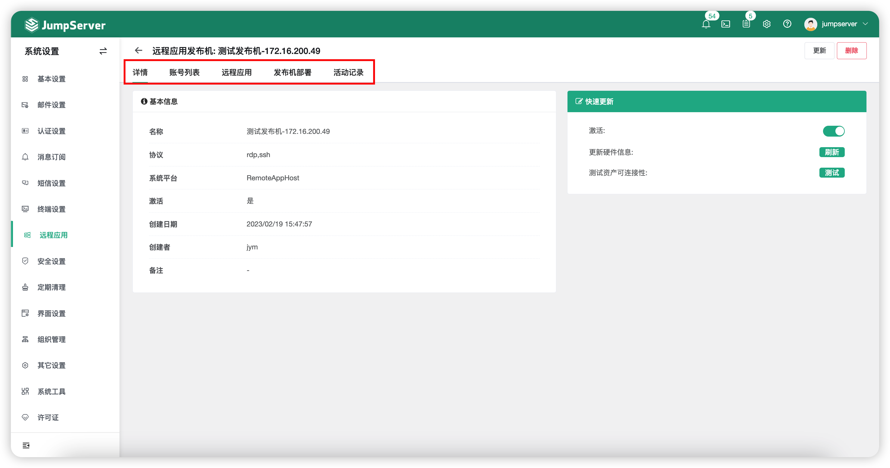

!!! tip ""
    - 详细参数说明：

    | 模块     | 说明                  |
    | ------- | --------------------- |
    | 详情 | 该模块主要包含远程应用发布机的基本信息以及简单的自动化任务，更新硬件信息、测试可连接性等。 |
    | 账号列表 | 该模块主要操作远程应用发布机的账号，默认创建初 JumpServer 会创建100个系统用户支持远程应用会话。 |
    | 远程应用 | 该模块中包含默认的远程应用与自建的远程应用信息，在该模块可直接对远程应用进行部署。 |
    | 发布机部署 | 该模块中主要用于远程应用发布机的初始化部署，以及部署日志的查看。 |
    | 活动记录 | 该模块中记录了远程应用发布机的活动记录信息，点击可查看活动详情。 |

## 3 远程应用
!!! tip ""
    - 支持 Windows-Server 系统作为远程应用发布机。
    - 创建远程应用资源，实现远程访问目标资源，并实现密码代填功能。
    - 当前举例访问 JumpServer 页面过程（实现密码代填）

### 3.1 创建 Website 资产
!!! tip ""
    - 点击切换至`控制台`视图`资产管理` - `资产列表` 页面中。
    - 选中 `Web` 页签，点击创建 Website 资产。
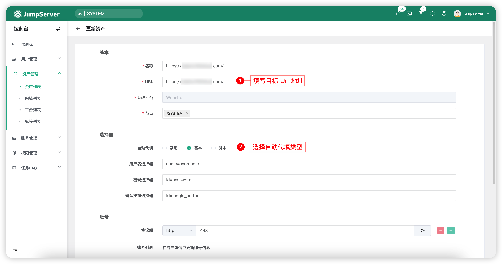

!!! tip ""
    - 其中 `选择器` 参数，需要根据目标 Url 页面中的代码参数中获取。
    - 我们通过 `F12` 打开目标 Url 的开发者工具页面，步骤如下图：


!!! tip ""
    - 把获取到的参数填写至创建的目标 Website 资产，参考当前页面`3.1 标题`第一张图片。

### 3.2 创建资产授权规则
!!! tip ""
    - 点击切换至`权限管理` - `资产授权` 页面中。
    - 创建新的授权规则，如下图：
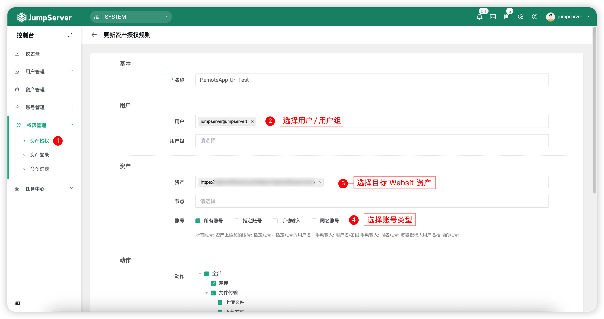

### 3.3 访问 Website 资产
!!! tip ""
    - 支持通过 `Web终端` 选中目标 Website 资产访问。
    - 支持通过本地客户端方式访问 Website 资产，安装 JumpServer 客户端程序，可在 JumpServer 页面 - `Web终端` - `帮助` - `下载` 页面找到安装包。
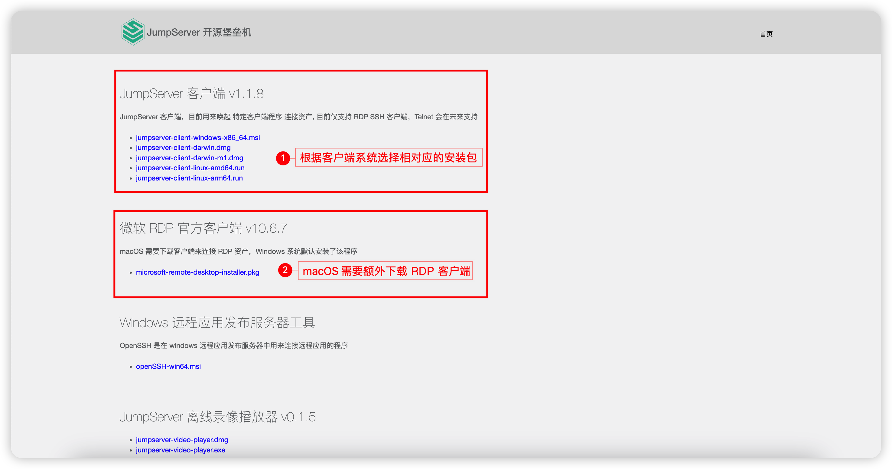

### 3.4 页面效果
!!! tip ""
    - 当前为远程应用页面访问效果图：
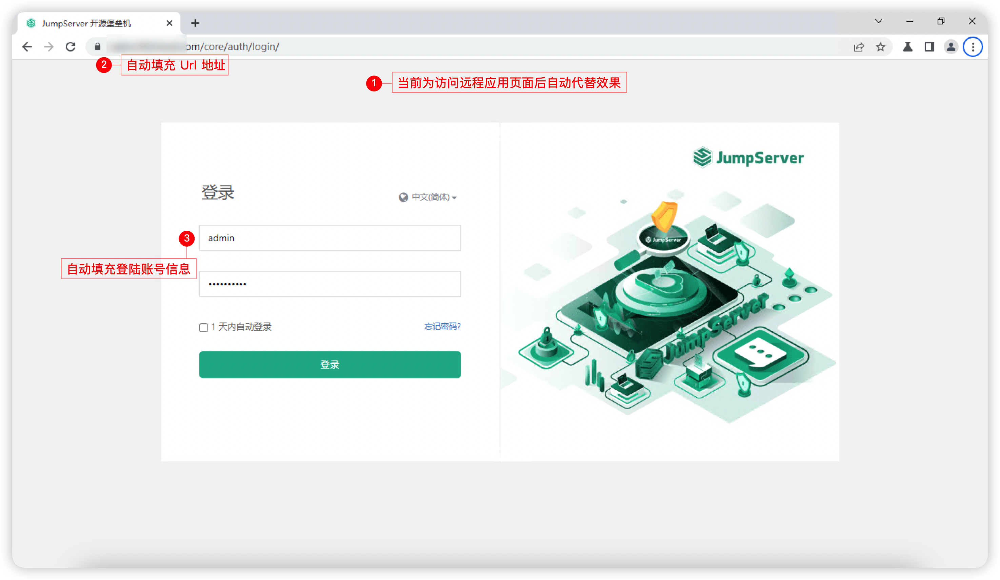

## 4 虚拟应用
!!! tip ""
    - 支持 Linux 系统作为远程应用发布机。
    - 创建远程应用资源，实现远程访问目标资源，并实现密码代填功能。
    - 当前举例访问 JumpServer 页面过程（实现密码代填）

### 4.1 功能启用
!!! tip ""
    - 点击`系统设置` - `功能设置` - `虚拟应用`页签启用虚拟应用功能。


!!! tip ""
    - 功能启用后，可以在`系统设置` - `远程应用`模块中看到`虚拟应用`和`应用提供者`页签。
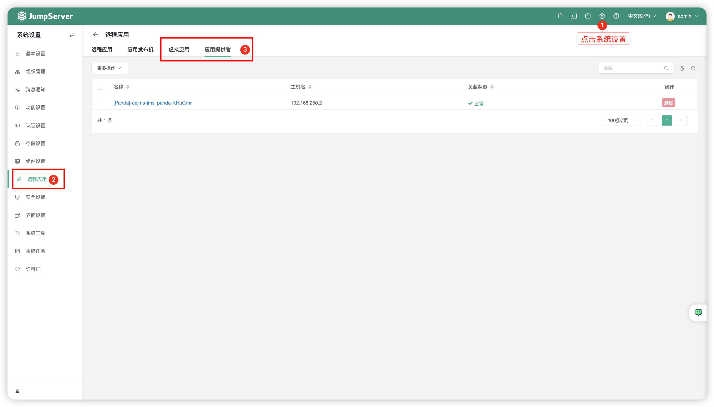

### 4.2 上传应用
!!! tip ""
    - 点击`虚拟应用`的页签，上传需要发布的应用，当前举例应用为 Chrome。
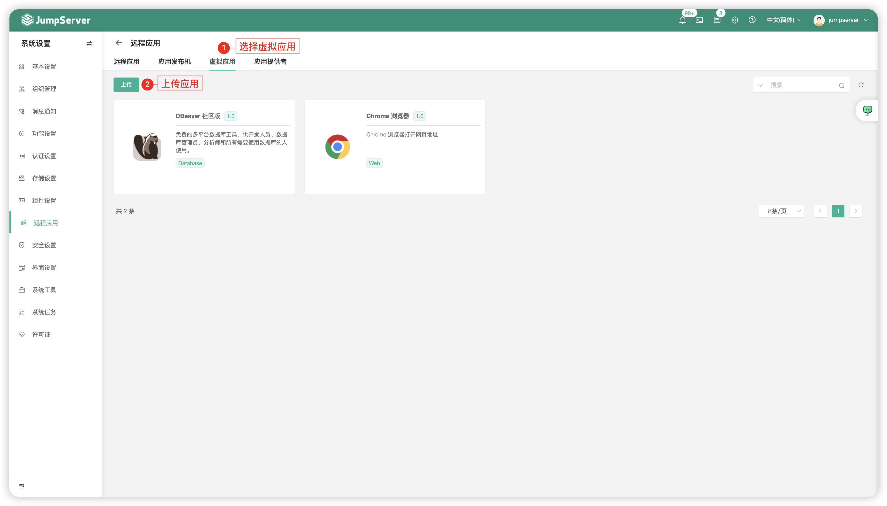

!!! tip ""
    - 上传虚拟应用后，Panda 组件会同步这个应用配置的镜像，目前同步方式为自动同步，默认每5分钟一次，支持修改时间间隔。
    - 点击`应用提供者`页签中的列表名称后跳转同步状态页。
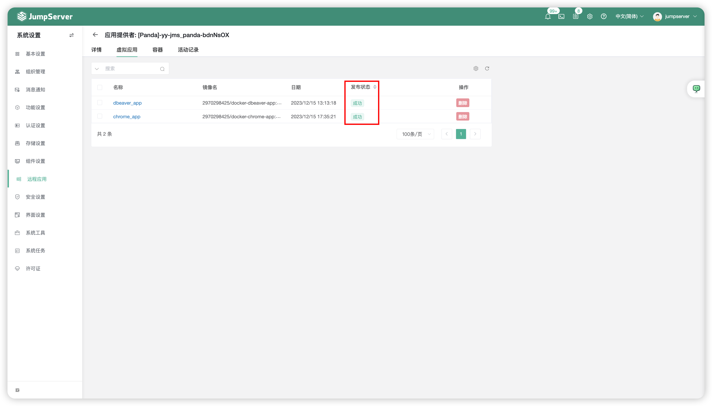

### 4.3 创建 Website 资产
!!! tip ""
    - 点击切换至`控制台`视图`资产管理` - `资产列表` 页面中。
    - 选中 `Web` 页签，点击创建 Website 资产。


### 4.4 创建资产授权规则
!!! tip ""
    - 点击切换至`权限管理` - `资产授权` 页面中。
    - 创建新的授权规则，如下图：


### 4.5 访问 Website 资产
!!! tip ""
    - 支持通过 `Web终端` 选中目标 Website 资产访问（如下图）。
    - 支持通过本地客户端方式访问 Website 资产，安装 JumpServer 客户端程序，可在 JumpServer 页面 - `Web终端` - `帮助` - `下载` 页面找到安装包。
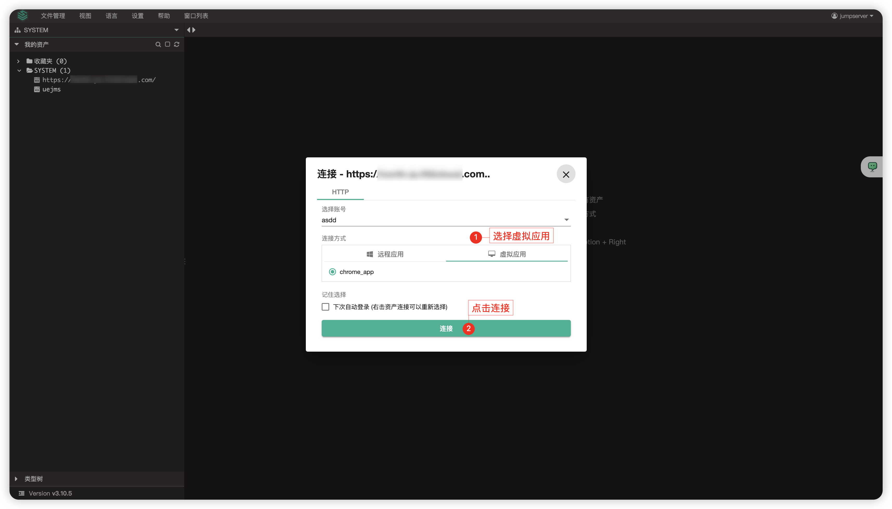
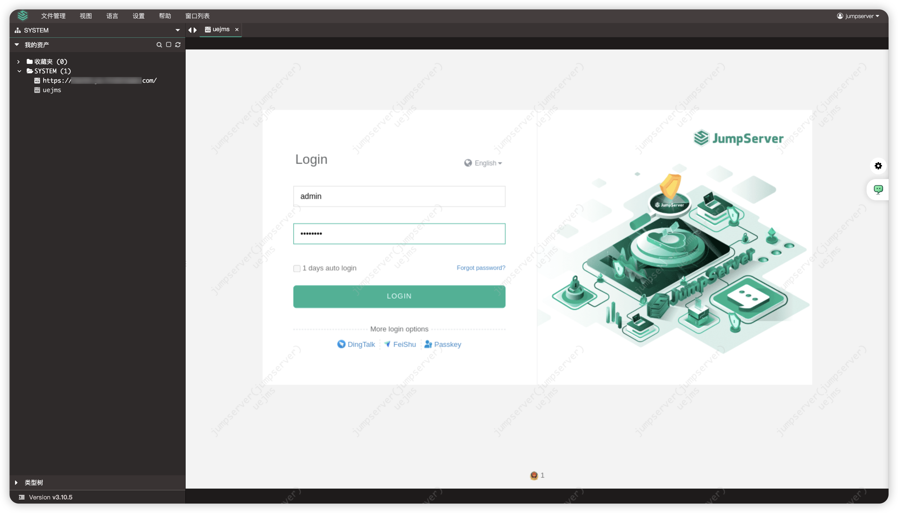

## 5 自定义 Applet
### 5.1 Applet 介绍
!!! tip ""
    - Applet 是一个包含 Python 脚本的目录，必须至少包含以下文件：
    
    ```sh
    ├── i18n.yml
    ├── icon.png
    ├── main.py
    ├── manifest.yml
    └── setup.yml
    ```

!!! tip ""
    - 文件名称作用说明：

    | 文件名称 | 说明                  |
    | ------- | --------------------- |
    | main.py | Python 代填的执行脚本。 |
    | icon.png | Applet 的图标 |
    | manifest.yml | Applet 的元数据。 |
    | setup.yml | 拉起程序的安装描述。 |
    | i18n.yml | 对 manifest.yml 的国际化文件。 |


### 5.2 元数据 manifest.yml
!!! tip ""
    - manifest.yml 定义了 Applet 的元数据，如名称、作者、版本、支持的协议。

    ```yml
    name: mysql_workbench8 （required）
    display_name: MySQL Workbench8
    comment: A tool for working with MySQL, to execute SQL and design tables (required）
    version: 0.1 (required）
    exec_type: python (reserved，暂未使用)
    author: Eric (required）
    type: general (required）
    update_policy: none (暂未使用)
    tags: (required）
      - database
    protocols: (required）
      - mysql
    ```

!!! tip ""
    - 详细字段说明：

    | 字段 | 说明                  |
    | ------- | --------------------- |
    | name | 名称最好是字母数字，不要包含特殊字符。 |
    | protocols | 此 Applet 脚本支持的协议。 |
    | tags | 一些标签。 |
    | type | 主要是 General 或 Web。 |
    | i18n.yml | 对 manifest.yml 的国际化文件。 |

### 5.3 安装条件 setup.yml
!!! tip ""
    - setup.yml 定义了 Applet 拉起程序的安装方式。

    ```yml
    type: msi # exe, zip, manual
    source: https://jms-pkg.oss-cn-beijing.aliyuncs.com/windows-pkgs/mysql-workbench-community-8.0.31-winx64.msi
    arguments:
      - /qn
      - /norestart
    destination: C:\Program Files\MySQL\MySQL Workbench 8.0 CE
    program: C:\Program Files\MySQL\MySQL Workbench 8.0 CE\MySQLWorkbench.exe
    md5: d628190252133c06dad399657666974a
    ```

!!! tip ""
    - 详细字段说明：

    | 字段 | 说明                  |
    | ------- | --------------------- |
    | type | 是软件安装的方式。 <br> msi：安装软件。 <br> exe：安装软件。 <br> zip：解压安装方式。 <br> manual：手动安装方式。  |
    | source | 软件下载地址。 |
    | arguments | msi 或者 exe 安装程序需要的参数，使用静默安装。 |
    | destination | 程序安装目录地址。 |
    | program | 具体的软件地址。 |
    | md5 | program 软件的 md5 值，主要用于校验安装是否成功。 |

!!! tip ""
    - 如果选择 manual 的方式，source 等保持为空，可不校验 MD5 值，需要手动登录 Applet host（应用发布机）上安装软件。

### 5.4 脚本执行 main.py
!!! tip ""
    - main.py 是 Python 脚本主程序。
    - JumpServer 的 Remoteapp 程序 tinker 将通过调用 python main.py base64_json_data 的方式执行。
    - base64_json_data 是 JSON 数据进行 base64 之后的字符串，包含资产、账号等认证信息。数据格式大致如下，依据 api 变化做相应调整：

    ```py
    {
      "app_name": "mysql_workbench8",
      "protocol": "mysql",
      "user": {
        "id": "2647CA35-5CAD-4DDF-8A88-6BD88F39BB30",
        "name": "Administrator",
        "username": "admin"
      },
      "asset": {
        "asset_id": "46EE5F50-F1C1-468C-97EE-560E3436754C",
        "asset_name": "test_mysql",
        "address": "192.168.1.1",
        "protocols": [
          {
            "id": 2,
            "name": "mysql",
            "port": 3306
          }
        ]
      },
      "account": {
        "account_id": "9D5585DE-5132-458C-AABE-89A83C112A83",
        "username": "root",
        "secret": "test"
      },
      "platform": {
        "charset": "UTF-8"
      }
    }
    ```