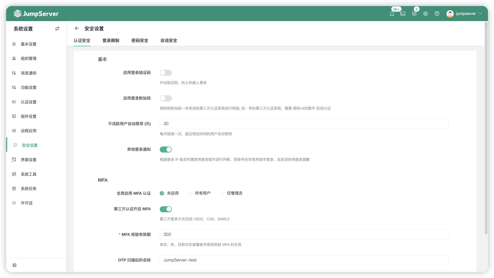
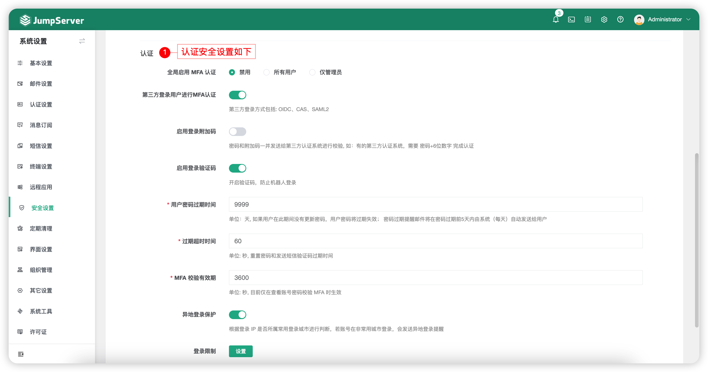
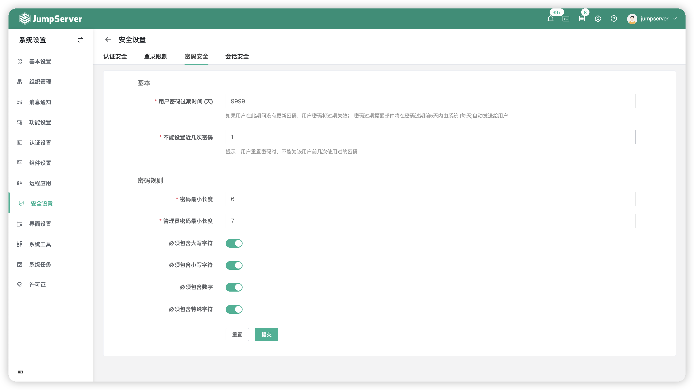
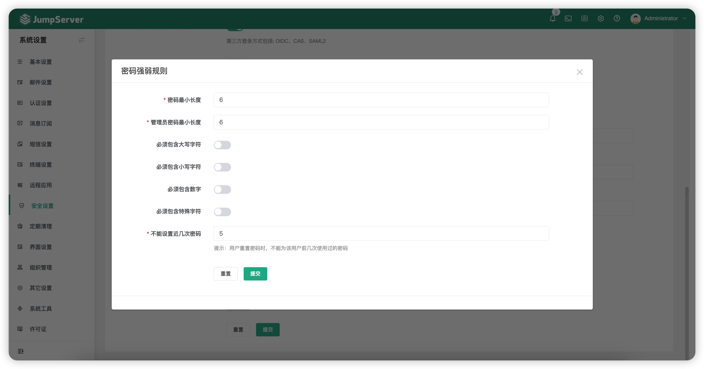

# 安全设置
## 1 认证安全
!!! tip ""
    - 点击页面上方的`认证安全`按钮，进入认证安全页面。
    - 认证安全页面主要配置 JumpServer 用户的认证安全配置，比如 MFA 设置以及用户异地登录通知等配置

!!! tip ""
    - 详细参数说明：

!!! tip ""

    | 参数     | 说明                  |
    | ------- | --------------------- |
    | 启动登录验证码 | 开启验证码，防止机器人登录。 |
    | 启用登录附加码 | 密码和附加码一并发送给第三方认证系统进行校验, 如：有的第三方认证系统，需要密码+6位数字完成认证。 |
    | 不活跃用户自动禁用 (天) | 每天检测一次，超过预设时间的不活跃用户自动禁用。 |
    | 异地登录通知 | 根据登录 IP 判断是否属常用登录城市，如果不是，会发送异地登录提醒邮件到用户邮箱。 |
    | 全局启用MFA认证 | 可以设置禁用 MFA，或所有用户启用 MFA、或仅管理员启用 MFA。 |
    | 第三方认证开启 MFA | 支持 OIDC、CAS、SAML2 认证方式的用户进行 MFA 认证。 |
    | 用户密码过期时间 | 用户每隔多少天需要强制更新密码，单位：天。   如果用户在此期间没有更新密码，用户密码将过期失效；   密码过期提醒邮件将在密码过期前5天内由系统（每天）自动发送给用户。 |
    | MFA校验有效期 | 查看账号密码校验 MFA 时的 MFA 有效期。 |
    | 登录限制 | 用户登录策略的相关配置，见下文。 |
    | 密码强弱规则 | 密码强弱规则的相关配置，见下文。 |

## 2 登录限制
!!! tip ""
    - 点击页面上方的`登录限制`按钮，进入登录限制页面。
    - 登录限制页面是对用户登录堡垒机的一系列设置。

!!! tip ""
    - 详细参数说明：

!!! tip ""

    | 参数     | 说明                  |
    | ------- | --------------------- |
    | 限制用户登录失败次数 | 用户输错密码最多登录失败次数，之后将会被锁定一段时间。 |
    | 禁止用户登录间隔 (分) | 当用户登录失败次数达到限制后，那么在此间隔内禁止登录。 |
    | 限制 IP 登录失败次数 | 某 IP 最多登录失败次数，之后将会被禁止登录一段时间。 |
    | 禁止 IP 登录间隔 (分) | 当用户登录失败次数达到限制后，那么在此间隔内禁止登录。 |
    | IP 登录白名单 | 允许登录堡垒机的 IP。 |
    | IP 登录黑名单 | 不允许登录堡垒机的 IP。 |
    | 仅一台设备登录 | 用户在新设备登录后，其他已登录的设备会自动退出。 |
    | 仅已存在用户登录 | 如果开启，不存在的用户将不被允许登录；   如果关闭，除本地认证方式外，其他认证方式的用户都允许登录并自动创建用户 (如果用户不存在) |
    | 仅从用户来源登录 | 如果开启，用户登录时仅会向来源端进行认证；   如果关闭，用户登录时会按照一定的顺序对所有已开启的认证方式进行顺序认证，只要有一个认证成功就可以直接登录。 |

## 3 密码安全
!!! tip ""
    - 点击页面上方的`密码安全`按钮，进入密码安全页面。
    - 密码安全页面是对用户密码规则的一系列设置。

!!! tip ""
    - 详细参数说明：

!!! tip ""

    | 参数     | 说明                  |
    | ------- | --------------------- |
    | 用户密码过期时间 (天) | 如果用户在此期间没有更新密码，用户密码将过期失效；   密码过期提醒邮件将在密码过期前5天内由系统 (每天)自动发送给用户。 |
    | 不能设置近几次密码 | 用户重置密码时，不能为该用户前几次使用过的密码。 |
    | 密码最小长度 | 设置用户密码支持的最小长度。 |
    | 管理员密码最小长度 | 设置管理员密码支持的最小长度。 |
    | 必须包含大写字符 | 密码中必须包含大写字符。 |
    | 必须包含小写字符 | 密码中必须包含小写字符。 |
    | 必须包含数字 | 密码中必须包含数字字符。 |
    | 必须包含特殊字符 | 密码中必须包含特殊字符，如`#$@%`等。 |

## 4 会话安全
!!! tip ""
    - 点击页面上方的`会话安全`按钮，进入会话安全页面。
    - 会话安全页面是对资源会话做的一系列设置。

!!! tip ""
    - 详细参数说明：

!!! tip ""

    | 参数     | 说明                  |
    | ------- | --------------------- |
    | 连接最大空闲时间 (分) | 资产在空闲时间达到此配置时会自动断开。 |
    | 会话连接最大时间 (时) | 资产的会话时间达到此配置时会自动断开。 |
    | 开启水印 | 启用后，Web 会话和录像将包含水印信息。 |
    | 会话分享 | 开启后允许用户分享已连接的资产会话给他人，协同工作。 |